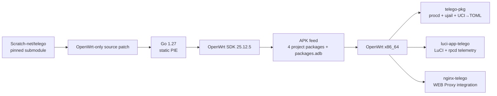
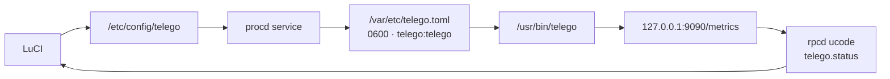

<div align="center">

# telEgo OpenWrt

**Telegram MTProxy + Native WEB Proxy для OpenWrt 25.12.x / x86_64**

[](https://github.com/Ra1nek/telEgo-openwrt/actions/workflows/build-telego.yaml)
[](https://github.com/Ra1nek/telEgo-openwrt/actions/workflows/codeql.yml)
[](https://openwrt.org/)
[](https://go.dev/)
[](#пакеты)
[](LICENSE)

**Высокопроизводительное Go-ядро · LuCI JavaScript · UCI→TOML · procd/ujail · Nginx · Prometheus · APK**

[Русский](README.md) · [English](README_EN.md) · [Документация](docs/README.md)

</div>

`telEgo-openwrt` — нативная OpenWrt-интеграция pinned-версии [Scratch-net/telego](https://github.com/Scratch-net/telego). Репозиторий добавляет APK-пакеты, UCI/procd/ujail, LuCI, локальную rpcd-телеметрию, Nginx-интеграцию, installer и CI/CD, не превращая upstream Go source в отдельный независимый fork.

> [!IMPORTANT]
> Production Go source находится в git submodule `telego-src/`. OpenWrt-специфичная интеграция живёт в этом репозитории. Актуальное поведение сборки определяют `.github/workflows/` и `package/*/Makefile`.

> [!NOTE]
> telEgo содержит FakeTLS, DRS, Split-TLS, probe/splice handling, profile matching и другие механизмы уменьшения устойчивых сетевых fingerprint. Это не обещание абсолютной невидимости для любого DPI/ТСПУ: реальные возможности классификатора зависят от сети и меняются со временем.

## В двух словах

| | Текущее состояние |
|---|---|
| OpenWrt | `25.12.x`; CI target — `25.12.5` |
| Архитектура | `x86_64` |
| Package manager | `apk` |
| Upstream telEgo | pinned submodule, `v0.6.1` |
| Go в CI | `1.27` |
| LuCI | JavaScript + UCI + ucode/rpcd |
| Service manager | procd + required ujail |
| WEB Proxy | private HTTP listener + Nginx real-TLS integration |
| Middle-End | 4 persistent gnet links per signed DC in active generation |
| Metrics | Prometheus-compatible endpoint, loopback by default |
| License | Apache-2.0 |

## Почему этот стек отличается от обычного MTProxy

> Сравнение ниже описывает типичный legacy deployment, а не каждый существующий MTProxy-проект.

| Возможность | Типичный MTProxy deployment | **telEgo OpenWrt** |
|---|---|---|
| Data plane | daemon + внешняя обвязка | единое Go/gnet ядро |
| `ee` FakeTLS + `dd` raw | зависит от реализации | auto-detection на одном listener |
| Anti-fingerprint shaping | часто отсутствует | DRS, Split-TLS, profile-matched cert record |
| Post-quantum handshake parity | обычно нет | matching `X25519MLKEM768` key-share при offer клиента |
| Probe handling | зависит от сборки | mask/splice + optional SNI-following safelist |
| Telegram Middle-End | не всегда | persistent pools, Link Repair, Link Refresh |
| Native WEB Proxy | отдельный сервис/нет | встроенный WEB frontend |
| Lanes | обычно нет | HTTPS Lanes / WebSocket Lanes |
| OpenWrt UI | сторонняя/нет | нативный LuCI JavaScript |
| Config lifecycle | ручной файл | UCI → atomic runtime TOML |
| Runtime privilege | нередко root | `telego:telego` + ujail + `no_new_privs` |
| Port 443 без root | зависит от setup | только `CAP_NET_BIND_SERVICE` |
| Telemetry | logs | rpcd/ubus + Prometheus |
| Distribution | scripts/IPK/ручная сборка | OpenWrt 25.12 native APK feed |

## Архитектура



Подробные build/runtime/network схемы, Middle-End pools, Link Repair/Refresh и WEB Lanes: **[Architecture](docs/ARCHITECTURE.md)**.

## Пакеты

| Пакет | Архитектура | Назначение |
|---|---:|---|
| `telego-pkg` | x86_64 | `/usr/bin/telego`, UCI, procd/ujail service, capability profile |
| `luci-app-telego` | all | LuCI JavaScript UI и read-only rpcd telemetry backend |
| `luci-i18n-telego-ru` | all | Русский перевод LuCI |
| `nginx-telego` | all | Nginx `http {}` definitions и WEB Proxy location snippet |

# Быстрая установка

На OpenWrt 25.12.x x86_64 под `root`:

```sh
wget -O /tmp/telego-install.sh \
  https://raw.githubusercontent.com/Ra1nek/telEgo-openwrt/develop/install.sh
sh /tmp/telego-install.sh
```

Установщик ведёт по шагам, предлагает русский/английский интерфейс, опциональный русский перевод LuCI и по умолчанию использует preview-канал `develop-latest`.

> [!TIP]
> Для обычной установки достаточно команды выше. Детали APK trust, preview/stable channels и unattended mode спрятаны ниже, чтобы не перегружать первый запуск.

<details>
<summary><b>⚡ Как работает OpenWrt APK и --allow-untrusted (кликни для раскрытия)</b></summary>

OpenWrt 25.12 использует пакетный менеджер `apk`. Installer скачивает согласованный комплект проекта, проверяет SHA-256, делает package preflight и устанавливает выбранные APK вместе с зависимостями из настроенных OpenWrt repositories.

Preview channel может не иметь signing key, которому уже доверяет конкретный router. В этом случае bypass **не включается автоматически**.

Для явно доверенного develop preview:

```sh
sh /tmp/telego-install.sh \
  --lang ru \
  --ru \
  --yes \
  --allow-untrusted
```

English installer без русского LuCI:

```sh
sh /tmp/telego-install.sh \
  --lang en \
  --no-ru \
  --yes \
  --allow-untrusted
```

Для signed stable release, когда он опубликован и его key доверен router:

```sh
sh /tmp/telego-install.sh --release latest
```

> [!CAUTION]
> SHA-256 подтверждает целостность файла, но сам по себе не аутентифицирует издателя. `--allow-untrusted` используйте только для build, происхождение которого вы осознанно проверили и приняли.

Ручная установка matching APK set:

```sh
apk update
apk add ./telego-pkg-*.apk \
        ./luci-app-telego-*.apk \
        ./luci-i18n-telego-ru-*.apk \
        ./nginx-telego-*.apk
/etc/init.d/rpcd restart
```

Для осознанно доверенного unsigned/untrusted preview добавьте `--allow-untrusted` к `apk add`.

</details>

Полная инструкция: **[Installation](docs/INSTALL.md)**.

## После установки

1. Откройте **Services → telEgo** в LuCI.
2. Создайте пользователя/secret.
3. Настройте MTProxy listener и TLS Fronting.
4. WEB Proxy включайте только после настройки публичного TLS/Nginx.
5. Нажмите **Save & Apply** — OpenWrt пересоберёт `/var/etc/telego.toml` и при необходимости перезапустит daemon.

Проверка:

```sh
/etc/init.d/telego status
ubus call telego status
logread -e telego
```

## Конфигурация и телеметрия



- Пошаговый UX-гайд по каждому полю LuCI: **[Configuration](docs/CONFIGURATION.md)**.
- Локальный интерфейс интеграции: **[Telemetry / ubus API](docs/API.md)**.
- В этом fork **нет публичного REST management API** на `9091`; управление выполняется через UCI/LuCI/procd.

## FakeTLS: DRS, Split-TLS и PQ parity

Pinned upstream `v0.6.1` включает:

- **DRS** — ранние outbound TLS records `1369` bytes с ramp до `16384` после 8 records или 128 KiB;
- **Split-TLS** — первый outbound `ApplicationData` record размером 1 byte;
- **profile-matched fake certificate record**;
- **X25519MLKEM768 (`0x11ec`) key-share parity** в synthetic ServerHello, если клиент предложил hybrid group;
- replay protection и probe/splice mechanics.

> [!IMPORTANT]
> PQ key-share здесь прежде всего устраняет пассивный group-downgrade tell в synthetic FakeTLS handshake. Это не следует интерпретировать как заявление о полной end-to-end post-quantum защите всей MTProxy-сессии.

Подробнее: **[Security](docs/SECURITY.md)**.

## Telegram Middle-End

При включении Middle-End активная upstream generation держит по **4 physical gnet links на каждый signed Telegram DC**.

- **Link Repair** заменяет упавший physical slot на месте; healthy links и соседние DC pools не перестраиваются.
- **Link Refresh** заранее готовит replacement для unused link после 45–60 секунд idle и публикует его только после handshake + matching RPC pong.
- Existing bindings не мигрируют между physical links.
- Пока ME не может принять binding, direct DC fallback остаётся доступен.

Подробная топология и lifecycle: **[Architecture → Telegram Middle-End](docs/ARCHITECTURE.md#telegram-middle-end-me)**.

## WEB Proxy / Nginx

`nginx-telego` устанавливает:

```text
/etc/nginx/conf.d/telego.conf
/etc/nginx/snippets/telego.locations
```

Пакет намеренно **не создаёт** публичный TLS `server {}` и не получает сертификат: это deployment-specific.

В administrator-managed TLS server включается:

```nginx
include /etc/nginx/snippets/telego.locations;
```

WEB Proxy поддерживает:

| Carrier | Модель |
|---|---|
| `https` | serialized fetch + long poll |
| `https-lanes` | отдельная HTTPS lane на каждый Telegram stream |
| `websocket` | один multiplexed WebSocket |
| `websocket-lanes` | отдельный WebSocket на каждый active stream |

Private fallback `418` сохраняет обычный website request; `419` используется для carrier-shaped request, не прошедшего authentication, после чего Nginx удаляет carrier credentials перед ordinary-site fallback.

Topology и sanitization: **[Architecture → Native WEB Proxy and Nginx](docs/ARCHITECTURE.md#native-web-proxy-and-nginx)**.

## Безопасность

Основные границы:

- отдельные `telego:telego` user/group;
- `ujail` обязателен для запуска;
- `no_new_privs`;
- capability profile ограничен `CAP_NET_BIND_SERVICE`;
- generated TOML создаётся атомарно с mode `0600`;
- WEB/metrics bind по умолчанию loopback-only;
- LuCI telemetry backend read-only;
- Nginx sanitized fallback удаляет carrier credentials;
- preview APK trust не подменяется одной checksum-проверкой.

Подробнее: **[Security](docs/SECURITY.md)**.

## Разработка

```bash
git clone --recurse-submodules https://github.com/Ra1nek/telEgo-openwrt.git
cd telEgo-openwrt
bash .github/scripts/test-openwrt-integration.sh
```

Production APK создаётся GitHub Actions через pinned `openwrt/gh-action-sdk`; nFPM в текущем production pipeline не используется.

- **[Build & release](docs/BUILD.md)**
- **[Troubleshooting](docs/TROUBLESHOOTING.md)**
- **[Documentation index](docs/README.md)**

## Source of truth

| Вопрос | Источник |
|---|---|
| CI/build/release | `.github/workflows/build-telego.yaml`, `.github/workflows/release.yaml` |
| Package dependencies | `package/*/Makefile` |
| UCI → runtime TOML | `package/telego-pkg/files/init.d/telego` |
| Default UCI values | `package/telego-pkg/files/config/telego` |
| LuCI fields | `package/luci-app-telego/htdocs/resources/view/telego/config.js` |
| Local telemetry | `package/luci-app-telego/root/usr/share/rpcd/ucode/telego` |
| Nginx contract | `package/nginx-telego/files/` |
| Upstream Go | `telego-src/` pinned submodule |

## Лицензия

Этот fork распространяется по **Apache License 2.0**. Upstream `Scratch-net/telego` сохраняет собственные Apache-2.0 copyright/license notices внутри submodule.
