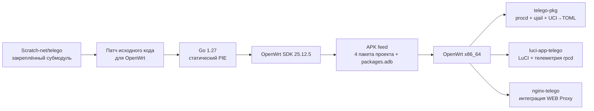
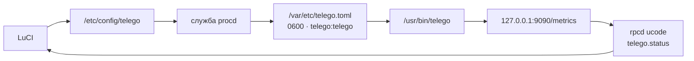

<div align="center">

# telEgo OpenWrt

**Telegram MTProxy + встроенный WEB Proxy для OpenWrt 25.12.x / x86_64**

[](https://github.com/Ra1nek/telEgo-openwrt/actions/workflows/build-telego.yaml)
[](https://github.com/Ra1nek/telEgo-openwrt/actions/workflows/codeql.yml)
[](https://openwrt.org/)
[](https://go.dev/)
[](#пакеты)
[](LICENSE)

**Высокопроизводительное Go-ядро · LuCI JavaScript · UCI→TOML · procd/ujail · Nginx · Prometheus · APK**

[Русский](README.md) · [English](README_EN.md) · [Документация](docs/README.md)

</div>

`telEgo-openwrt` — нативная интеграция закреплённой версии ядра [Scratch-net/telego](https://github.com/Scratch-net/telego) с OpenWrt. Репозиторий добавляет APK-пакеты, UCI/procd/ujail, LuCI, локальную телеметрию через rpcd, интеграцию с Nginx, установщик и CI/CD, при этом исходный Go-код upstream остаётся отдельным и не превращается во второй независимый форк.

> [!IMPORTANT]
> Исходный Go-код, используемый для сборки, находится в git-субмодуле `telego-src/`. Специфичная для OpenWrt интеграция находится в этом репозитории. Актуальную логику сборки определяют `.github/workflows/` и `package/*/Makefile`.

> [!NOTE]
> telEgo поддерживает FakeTLS, DRS, Split-TLS, обработку probe/splice, сопоставление профилей и другие механизмы, уменьшающие устойчивость сетевых отпечатков. Это не обещание абсолютной невидимости для любого DPI/ТСПУ: возможности классификации зависят от конкретной сети и меняются со временем.

## В двух словах

| | Текущее состояние |
|---|---|
| OpenWrt | `25.12.x`<br>целевая версия CI — `25.12.5` |
| Архитектура | `x86_64` |
| Пакетный менеджер | `apk` |
| Базовый telEgo | закреплённый субмодуль<br>`v0.6.1` |
| Go в CI | `1.27` |
| LuCI | JavaScript + UCI + ucode/rpcd |
| Управление службой | procd + обязательный ujail |
| WEB Proxy | приватный HTTP-listener<br>+ завершение реального TLS через Nginx |
| Middle-End | по 4 постоянных соединения gnet<br>на каждый подписанный DC<br>в активном поколении |
| Метрики | совместимая с Prometheus конечная точка<br>по умолчанию доступна только через loopback |
| Лицензия | Apache-2.0 |

## Почему этот стек отличается от обычного MTProxy

> Сравнение ниже описывает типичную устаревшую схему развёртывания, а не каждый существующий MTProxy-проект.

| Возможность | Типичная схема MTProxy | **telEgo OpenWrt** |
|---|---|---|
| Обработка трафика | демон + внешняя обвязка | единое ядро Go/gnet |
| `ee` FakeTLS + `dd` raw | зависит от реализации | автоматическое распознавание<br>на одном listener |
| Снижение сетевого отпечатка | часто отсутствует | DRS, Split-TLS,<br>запись сертификата с согласованным профилем |
| Согласование PQ key-share | обычно отсутствует | matching `X25519MLKEM768` key-share,<br>если его предложил клиент |
| Обработка probe-подключений | зависит от реализации | mask/splice + опциональный<br>SNI-following safelist |
| Telegram Middle-End | поддерживается не всегда | постоянные пулы,<br>Link Repair, Link Refresh |
| WEB Proxy | отдельный сервис<br>или отсутствует | встроенный WEB frontend |
| Lanes | обычно отсутствуют | HTTPS Lanes<br>WebSocket Lanes |
| Интерфейс OpenWrt | сторонний<br>или отсутствует | нативный LuCI<br>на JavaScript |
| Конфигурация | файл редактируется вручную | UCI → атомарно создаваемый<br>runtime TOML |
| Права процесса | нередко root | `telego:telego` + ujail<br>+ `no_new_privs` |
| Порт 443 без root | зависит от конфигурации | только `CAP_NET_BIND_SERVICE` |
| Телеметрия | журналы | rpcd/ubus + Prometheus |
| Поставка | скрипты/IPK<br>ручная сборка | нативный APK feed<br>для OpenWrt 25.12 |

## Архитектура



Подробные схемы сборки, работы процесса и сетевого трафика, а также устройство пулов Middle-End, Link Repair/Refresh и WEB Lanes: **[Архитектура](docs/ARCHITECTURE.md)**.

## Пакеты

| Пакет | Архитектура | Назначение |
|---|---:|---|
| `telego-pkg` | x86_64 | `/usr/bin/telego`, UCI,<br>служба procd/ujail,<br>профиль Linux capabilities |
| `luci-app-telego` | all | интерфейс LuCI на JavaScript<br>и read-only backend телеметрии rpcd |
| `luci-i18n-telego-ru` | all | русский перевод LuCI |
| `nginx-telego` | all | директивы Nginx для `http {}`<br>и готовый location-snippet WEB Proxy |

# Быстрая установка

На OpenWrt 25.12.x x86_64 под `root`:

```sh
wget -O /tmp/telego-install.sh \
  https://raw.githubusercontent.com/Ra1nek/telEgo-openwrt/develop/install.sh
sh /tmp/telego-install.sh
```

Установщик пошагово проведёт через настройку, предложит русский или английский язык интерфейса, при необходимости установит русский перевод LuCI и по умолчанию использует канал предварительных сборок `develop-latest`.

> [!TIP]
> Для обычной установки достаточно команды выше. Подробности о доверии к APK, различиях между предварительным и стабильным каналами и неинтерактивном режиме скрыты ниже, чтобы не перегружать первый запуск.

<details>
<summary><b>⚡ Как работает apk в OpenWrt и параметр --allow-untrusted (нажмите, чтобы раскрыть)</b></summary>

OpenWrt 25.12 использует пакетный менеджер `apk`. Установщик загружает согласованный набор пакетов проекта, проверяет их SHA-256, выполняет предварительную проверку APK-транзакции и устанавливает выбранные пакеты вместе с зависимостями из настроенных репозиториев OpenWrt.

Канал предварительных сборок может не иметь ключа подписи, которому уже доверяет конкретный маршрутизатор. В этом случае обход проверки доверия **не включается автоматически**.

Если вы осознанно доверяете предварительной сборке из `develop`:

```sh
sh /tmp/telego-install.sh \
  --lang ru \
  --ru \
  --yes \
  --allow-untrusted
```

Установщик на английском без русского перевода LuCI:

```sh
sh /tmp/telego-install.sh \
  --lang en \
  --no-ru \
  --yes \
  --allow-untrusted
```

Для подписанного стабильного выпуска, когда он опубликован и его ключ добавлен в доверенные на маршрутизаторе:

```sh
sh /tmp/telego-install.sh --release latest
```

> [!CAUTION]
> SHA-256 подтверждает целостность файла, но не удостоверяет личность издателя. Используйте `--allow-untrusted` только для сборки, происхождение которой вы самостоятельно проверили и которой осознанно доверяете.

Ручная установка согласованного набора APK:

```sh
apk update
apk add ./telego-pkg-*.apk \
        ./luci-app-telego-*.apk \
        ./luci-i18n-telego-ru-*.apk \
        ./nginx-telego-*.apk
/etc/init.d/rpcd restart
```

Для предварительной сборки, которой вы доверяете, но чья подпись не считается доверенной на маршрутизаторе, добавьте `--allow-untrusted` к команде `apk add`.

</details>

Полная инструкция: **[Установка](docs/INSTALL.md)**.

## После установки

1. Откройте **Services → telEgo** в LuCI.
2. Добавьте пользователя и сгенерируйте секрет.
3. Настройте адрес и порт MTProxy, а также TLS Fronting.
4. Включайте WEB Proxy только после настройки публичного TLS и Nginx.
5. Нажмите **Save & Apply** — OpenWrt заново сформирует `/var/etc/telego.toml` и при необходимости перезапустит службу.

Проверка:

```sh
/etc/init.d/telego status
ubus call telego status
logread -e telego
```

## Конфигурация и телеметрия



- Пошаговое описание всех полей LuCI: **[Конфигурация](docs/CONFIGURATION.md)**.
- Локальный интерфейс интеграции и телеметрии: **[Telemetry / ubus API](docs/API.md)**.
- В этой версии **нет публичного REST API управления** на порту `9091`; управление выполняется через UCI/LuCI/procd.

## FakeTLS: DRS, Split-TLS и согласование PQ key-share

Используемая версия upstream `v0.6.1` включает:

- **DRS** — первые исходящие TLS-записи имеют размер `1369` байт, затем размер увеличивается до `16384` после 8 записей или 128 KiB переданных данных;
- **Split-TLS** — первая исходящая запись `ApplicationData` имеет размер 1 байт;
- **подбор размера записи фиктивного сертификата под профиль маскирующего узла**;
- **согласование `X25519MLKEM768` (`0x11ec`) key-share** в синтетическом `ServerHello`, если клиент предложил гибридную группу;
- защиту от повторного воспроизведения и механизмы probe/splice.

> [!IMPORTANT]
> Поведение PQ key-share здесь прежде всего устраняет заметный для пассивного наблюдателя откат группы в синтетическом рукопожатии FakeTLS. Это не означает, что вся MTProxy-сессия получает полноценную сквозную post-quantum защиту.

Подробнее: **[Безопасность](docs/SECURITY.md)**.

## Telegram Middle-End

При включении Middle-End активное поколение upstream поддерживает по **4 физических соединения gnet на каждый подписанный Telegram DC**.

- **Link Repair** заменяет отказавший физический слот на месте; исправные соединения и пулы соседних DC при этом не перестраиваются.
- **Link Refresh** заранее подготавливает замену для неиспользуемого соединения после 45–60 секунд простоя и вводит её в работу только после рукопожатия и совпадающего RPC pong.
- Уже существующие привязки (bindings) не переносятся между физическими соединениями.
- Если Middle-End временно не может принять новую привязку, остаётся возможность прямого подключения к DC.

Подробная топология и жизненный цикл: **[Архитектура → Telegram Middle-End](docs/ARCHITECTURE.md#telegram-middle-end-me)**.

## WEB Proxy / Nginx

`nginx-telego` устанавливает:

```text
/etc/nginx/conf.d/telego.conf
/etc/nginx/snippets/telego.locations
```

Пакет намеренно **не создаёт** публичный TLS `server {}` и не получает сертификат: эта часть настройки зависит от конкретного развёртывания.

В TLS-сервер Nginx, которым управляет администратор, добавьте:

```nginx
include /etc/nginx/snippets/telego.locations;
```

WEB Proxy поддерживает:

| Carrier | Модель |
|---|---|
| `https` | последовательные HTTP-запросы<br>+ long polling |
| `https-lanes` | отдельная HTTPS lane<br>для каждого потока Telegram |
| `websocket` | один мультиплексированный WebSocket |
| `websocket-lanes` | отдельный WebSocket<br>для каждого активного потока |

Внутренний fallback-статус `418` сохраняет обычный запрос к сайту. Статус `419` используется для запроса, похожего на carrier-трафик, но не прошедшего аутентификацию; перед передачей такого запроса обычному сайту Nginx удаляет служебные данные carrier.

Топология и очистка запросов: **[Архитектура → Native WEB Proxy and Nginx](docs/ARCHITECTURE.md#native-web-proxy-and-nginx)**.

## Безопасность

Основные ограничения и границы безопасности:

- отдельные пользователь и группа `telego:telego`;
- `ujail` обязателен для запуска;
- используется `no_new_privs`;
- профиль capabilities ограничен `CAP_NET_BIND_SERVICE`;
- сгенерированный TOML записывается атомарно с правами `0600`;
- WEB Proxy и metrics по умолчанию слушают только loopback;
- backend телеметрии LuCI доступен только для чтения;
- очищающий fallback Nginx удаляет служебные данные carrier;
- одной проверки контрольной суммы недостаточно, чтобы считать preview APK доверенным.

Подробнее: **[Безопасность](docs/SECURITY.md)**.

## Разработка

```bash
git clone --recurse-submodules https://github.com/Ra1nek/telEgo-openwrt.git
cd telEgo-openwrt
bash .github/scripts/test-openwrt-integration.sh
```

APK для целевого устройства собираются в GitHub Actions через закреплённую версию `openwrt/gh-action-sdk`; nFPM в текущем рабочем конвейере сборки не используется.

- **[Сборка и выпуск](docs/BUILD.md)**
- **[Диагностика](docs/TROUBLESHOOTING.md)**
- **[Документация](docs/README.md)**

## Ключевые файлы реализации

| Что проверяем | Где реализовано |
|---|---|
| CI, сборка и выпуск | `.github/workflows/build-telego.yaml`<br>`.github/workflows/release.yaml` |
| Зависимости пакетов | `package/*/Makefile` |
| UCI → runtime TOML | `package/telego-pkg/files/init.d/telego` |
| Значения UCI по умолчанию | `package/telego-pkg/files/config/telego` |
| Поля LuCI | `package/luci-app-telego/htdocs/resources/view/telego/config.js` |
| Локальная телеметрия | `package/luci-app-telego/root/usr/share/rpcd/ucode/telego` |
| Интеграция Nginx | `package/nginx-telego/files/` |
| Исходный Go-код upstream | закреплённый субмодуль<br>`telego-src/` |

## Лицензия

Этот проект распространяется по лицензии **Apache License 2.0**. Исходный код `Scratch-net/telego` в субмодуле сохраняет собственные уведомления об авторских правах и лицензии Apache-2.0.
