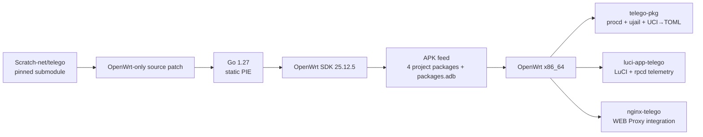
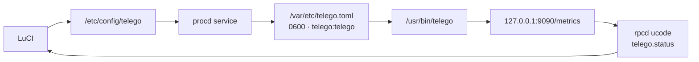

<div align="center">

# telEgo OpenWrt

**Telegram MTProxy + Native WEB Proxy for OpenWrt 25.12.x / x86_64**

[](https://github.com/Ra1nek/telEgo-openwrt/actions/workflows/build-telego.yaml)
[](https://github.com/Ra1nek/telEgo-openwrt/actions/workflows/codeql.yml)
[](https://openwrt.org/)
[](https://go.dev/)
[](#packages)
[](LICENSE)

**High-performance Go core · LuCI JavaScript · UCI→TOML · procd/ujail · Nginx · Prometheus · APK**

[Русский](README.md) · [English](README_EN.md) · [Documentation](docs/README_EN.md)

</div>

`telEgo-openwrt` is the native OpenWrt integration of the pinned [Scratch-net/telego](https://github.com/Scratch-net/telego) core. The repository adds APK packaging, UCI/procd/ujail, LuCI, local rpcd telemetry, Nginx integration, an installer, and CI/CD without turning the upstream Go source into a second independent fork.

> [!IMPORTANT]
> Production Go source lives in the `telego-src/` git submodule. OpenWrt-specific integration lives in this repository. Current build behavior is defined by `.github/workflows/` and `package/*/Makefile`.

> [!NOTE]
> telEgo includes FakeTLS, DRS, Split-TLS, probe/splice handling, profile matching, and other mechanisms designed to reduce stable network fingerprints. This is not a promise of absolute invisibility against every DPI system; real classification capability depends on the observer and changes over time.

## At a glance

| | Current project |
|---|---|
| OpenWrt | `25.12.x`; CI target `25.12.5` |
| Architecture | `x86_64` |
| Package manager | `apk` |
| Upstream telEgo | pinned submodule, `v0.6.5` |
| Go in CI | `1.27` |
| LuCI | JavaScript + UCI + ucode/rpcd |
| Service manager | procd + required ujail |
| WEB Proxy | private HTTP listener + Nginx real-TLS integration |
| Middle-End | 4 persistent gnet links per signed DC in the active generation |
| Metrics | Prometheus-compatible endpoint, loopback by default |
| License | Apache-2.0 |

## Why this stack is different from a typical MTProxy deployment

> The comparison describes a common legacy deployment pattern, not every MTProxy implementation.

| Capability | Typical MTProxy deployment | **telEgo OpenWrt** |
|---|---|---|
| Data plane | daemon + external glue | unified Go/gnet core |
| `ee` FakeTLS + `dd` raw | implementation-dependent | auto-detection on one listener |
| Anti-fingerprint shaping | often absent | DRS, Split-TLS, profile-matched cert record |
| Post-quantum handshake parity | usually absent | matching `X25519MLKEM768` key-share when offered by the client |
| Probe handling | implementation-dependent | mask/splice + optional SNI-following safelist |
| Telegram Middle-End | not always present | persistent pools, Link Repair, Link Refresh |
| Native WEB Proxy | separate service / absent | built-in WEB frontend |
| Lanes | usually absent | HTTPS Lanes / WebSocket Lanes |
| OpenWrt UI | external / absent | native LuCI JavaScript |
| Config lifecycle | hand-edited file | UCI → atomic runtime TOML |
| Runtime privilege | often root | `telego:telego` + ujail + `no_new_privs` |
| Port 443 without root | setup-dependent | only `CAP_NET_BIND_SERVICE` |
| Telemetry | logs | rpcd/ubus + Prometheus |
| Distribution | scripts/IPK/manual | OpenWrt 25.12 native APK feed |

## Architecture



Detailed build/runtime/network diagrams, Middle-End pools, Link Repair/Refresh, and WEB Lanes: **[Architecture](docs/ARCHITECTURE_EN.md)**.

## Packages

| Package | Arch | Responsibility |
|---|---:|---|
| `telego-pkg` | x86_64 | `/usr/bin/telego`, UCI, procd/ujail service, capability profile |
| `luci-app-telego` | all | LuCI JavaScript UI and read-only rpcd telemetry backend |
| `luci-i18n-telego-ru` | all | Russian LuCI translation |
| `nginx-telego` | all | managed Nginx ownership/reconciliation, WEB ingress/fallback, and reusable location snippet |

The optional **OpenWrt ACME DNS-01** add-on (`acme-acmesh`, `acme-acmesh-dnsapi`, `luci-app-acme`) consists of OpenWrt system packages, not a fifth project APK. The installer offers it separately and keeps it disabled by default.

# Quick install

Run as `root` on OpenWrt 25.12.x x86_64:

```sh
wget -O /tmp/telego-install.sh \
  https://raw.githubusercontent.com/Ra1nek/telEgo-openwrt/develop/install.sh
sh /tmp/telego-install.sh
```

The installer lets you choose the telEgo component set and uses the `develop-latest` preview channel by default. Managed ingress is installed **disabled**. OpenWrt ACME DNS-01 is available as a separate opt-in system add-on and is not selected by default.

> [!TIP]
> For a normal install, the command above is enough. APK trust, preview/stable channels, and unattended mode are hidden below so the first-run path stays simple.

<details>
<summary><b>⚡ How OpenWrt APK and --allow-untrusted work (click to expand)</b></summary>

OpenWrt 25.12 uses the `apk` package manager. The installer downloads a matching package set, verifies SHA-256, performs a package preflight, and installs the selected project APKs with dependencies resolved from the configured OpenWrt repositories.

The preview channel may not have a signing key already trusted by a specific router. The installer never enables trust bypass silently.

For an explicitly trusted develop preview:

```sh
sh /tmp/telego-install.sh \
  --lang en \
  --no-ru \
  --yes \
  --allow-untrusted
```

Russian installer + Russian LuCI:

```sh
sh /tmp/telego-install.sh \
  --lang ru \
  --ru \
  --yes \
  --allow-untrusted
```

For a signed stable release, once published and trusted by the router:

```sh
sh /tmp/telego-install.sh --release latest
```

> [!CAUTION]
> SHA-256 proves file integrity, not publisher identity. Use `--allow-untrusted` only for a build whose origin you have deliberately verified and accepted.

Manual installation of a matching APK set:

```sh
apk update
apk add ./telego-pkg-*.apk \
        ./luci-app-telego-*.apk \
        ./luci-i18n-telego-ru-*.apk \
        ./nginx-telego-*.apk
/etc/init.d/rpcd restart
```

For a deliberately trusted unsigned/untrusted preview, add `--allow-untrusted` to `apk add`.

</details>

Full guide: **[Installation](docs/INSTALL_EN.md)**.

## After installation

1. Open **Services → telEgo** in LuCI.
2. Add a user/secret.
3. Configure the MTProxy listener and TLS Fronting. Direct HTTPS requires MTProxy on a port other than `:443`; use Native Shared-Port when both services must share public `:443`.
4. Enable WEB Proxy after choosing the ingress topology. Direct HTTPS manages Nginx/firewall while the certificate can be administrator-managed or supplied by the optional OpenWrt ACME DNS-01 add-on.
5. Click **Save & Apply** — OpenWrt rebuilds `/var/etc/telego.toml` and restarts the daemon when required.

Verify:

```sh
/etc/init.d/telego status
ubus call telego status
logread -e telego
```

## Configuration and telemetry



- Step-by-step UX guide for every LuCI field: **[Configuration](docs/CONFIGURATION_EN.md)**.
- Local integration surface: **[Telemetry / ubus API](docs/API_EN.md)**.
- This fork has **no public REST management API** on port `9091`; management is performed through UCI/LuCI/procd.

## FakeTLS: DRS, Split-TLS, and PQ parity

Pinned upstream `v0.6.5` includes:

- **DRS** — early outbound TLS records at `1369` bytes with a ramp to `16384` after 8 records or 128 KiB;
- **Split-TLS** — the first outbound `ApplicationData` record is 1 byte;
- **profile-matched fake certificate record**;
- **X25519MLKEM768 (`0x11ec`) key-share parity** in the synthetic ServerHello when the client offers the hybrid group;
- replay protection and probe/splice mechanics.

> [!IMPORTANT]
> The PQ key-share behavior primarily removes a passive group-downgrade tell in the synthetic FakeTLS handshake. It should not be interpreted as a claim of complete end-to-end post-quantum security for the entire MTProxy session.

See **[Security](docs/SECURITY_EN.md)**.

## Telegram Middle-End

When Middle-End is enabled, the active upstream generation keeps **4 physical gnet links for every signed Telegram DC**.

- **Link Repair** replaces one failed physical slot in place; healthy links and neighboring DC pools stay intact.
- **Link Refresh** prepares a replacement for an unused link after 45–60 seconds of idle time and publishes it only after handshake + matching RPC pong.
- Existing bindings do not migrate between physical links.
- Direct DC fallback remains available when ME cannot admit a new binding.

Detailed topology and lifecycle: **[Architecture → Telegram Middle-End](docs/ARCHITECTURE_EN.md#telegram-middle-end-me)**.

## WEB Proxy / Nginx

`nginx-telego` uses the final P6/P7 managed layout:

```text
/etc/nginx/conf.d/20-telego-core.conf
/etc/nginx/snippets/telego.locations
/etc/nginx/conf.d/80-telego-ingress.conf      # conditional generated
/etc/nginx/conf.d/85-telego-fallback.conf     # conditional generated
```

Normal changes are applied through `/etc/init.d/nginx-telego reload`. The reconciler validates ownership/drift, performs safe migration/repair, uses the renderer as an internal generator, runs the final `nginx -t`, and rolls the managed filesystem back on failure.

`nginx-telego` generates the TLS `server {}` for managed Direct HTTPS and Native Shared-Port, but it **does not issue a certificate by itself**. A reusable snippet remains available for hand-written Nginx deployments:

```nginx
include /etc/nginx/snippets/telego.locations;
```

Managed Nginx ingress has three mutually exclusive modes:

- **Direct HTTPS** — LAN `:443` remains with LuCI/uhttpd while WAN `:443` is transactionally redirected by firewall4 to dual-stack Nginx `:18443`; MTProxy uses another public port;
- **Cloudflare Tunnel** — public TLS belongs to Cloudflare and local ingress listens on `127.0.0.1:18080`;
- **Native Shared-Port (Advanced)** — telEgo owns public `:443` and ordinary TLS is spliced to Nginx `:8443`.

For Direct HTTPS see the **[step-by-step installation path](docs/INSTALL_EN.md#recommended-path-direct-https--acme-dns-01)**, **[TLS certificate / ACME DNS-01](docs/TLS_CERTIFICATE_EN.md)**, and **[LAN/WAN hardware test](docs/DIRECT_HTTPS_TEST_EN.md)**.

WEB Proxy supports:

| Carrier | Model |
|---|---|
| `https` | serialized fetch + long poll |
| `https-lanes` | one HTTPS lane per Telegram stream |
| `websocket` | one multiplexed WebSocket |
| `websocket-lanes` | one WebSocket per active stream |

Private fallback `418` preserves an ordinary website request; `419` marks a carrier-shaped request that failed authentication, after which Nginx removes carrier credentials before the ordinary-site fallback.

Topology, ownership/reconciliation, and sanitization: **[Architecture → Native WEB Proxy and Nginx](docs/ARCHITECTURE_EN.md#native-web-proxy-and-nginx)** and **[Nginx files](docs/NGINX_FILES_EN.md)**.

## Security

Key boundaries:

- dedicated `telego:telego` user/group;
- `ujail` is required to run the daemon;
- `no_new_privs`;
- capability profile limited to `CAP_NET_BIND_SERVICE`;
- generated TOML written atomically with mode `0600`;
- WEB/metrics listeners are loopback-only by default;
- LuCI telemetry backend is read-only;
- Nginx sanitized fallback removes carrier credentials;
- preview APK trust is not replaced by checksum verification alone.

See **[Security](docs/SECURITY_EN.md)**.

## Development

```bash
git clone --recurse-submodules https://github.com/Ra1nek/telEgo-openwrt.git
cd telEgo-openwrt
bash .github/scripts/test-openwrt-integration.sh
```

Production APKs are built by GitHub Actions through a pinned `openwrt/gh-action-sdk`; nFPM is not part of the current production pipeline.

- **[Build & release](docs/BUILD_EN.md)**
- **[Troubleshooting](docs/TROUBLESHOOTING_EN.md)**
- **[Documentation index](docs/README_EN.md)**

## Source of truth

| Question | Authoritative source |
|---|---|
| CI/build/release | `.github/workflows/build-telego.yaml`, `.github/workflows/release.yaml` |
| Package dependencies | `package/*/Makefile` |
| UCI → runtime TOML | `package/telego-pkg/files/init.d/telego` |
| Default UCI values | `package/telego-pkg/files/config/telego` |
| LuCI fields | `package/luci-app-telego/htdocs/resources/view/telego/config.js` |
| Local telemetry | `package/luci-app-telego/root/usr/share/rpcd/ucode/telego` |
| Nginx contract | `package/nginx-telego/files/` |
| Upstream Go | pinned `telego-src/` submodule |

## License

This fork is distributed under the **Apache License 2.0**. The pinned `Scratch-net/telego` source retains its own Apache-2.0 copyright and license notices inside the submodule.
