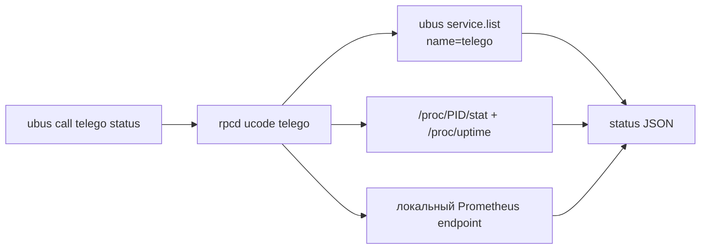

# Локальная интеграция и Telemetry API

[**Русский**](API.md) · [English](API_EN.md)

`telEgo-openwrt` предоставляет **локальную интеграционную поверхность OpenWrt**, а не публичный REST management API.

> [!IMPORTANT]
> Текущий fork **не реализует** исторические `/api/v1/status`, `/users`, `/config/reload` или management API на порту `9091`, которые ранее описывались в репозитории. Конфигурация управляется через UCI/LuCI/procd. Service telemetry и ограниченное Nginx file administration доступны через локальный `ubus`/rpcd; runtime counters также экспортируются через Prometheus metrics.

## Интерфейсы

| Интерфейс | Назначение | Scope |
|---|---|---|
| `ubus call telego status` | Состояние сервиса + выбранные counters | Локальный OpenWrt rpcd, read-only |
| `ubus call telego.nginx inventory` | Inventory managed/foreign/quarantined Nginx files | Локальный OpenWrt rpcd, read-only |
| `telego.nginx firewall_status/firewall_preflight` | Direct HTTPS firewall status и безопасный preflight | Локальный OpenWrt rpcd, read-only |
| `telego.nginx certificate_status/certificate_preflight` | TLS certificate readiness и `nginx -t` preflight | Локальный OpenWrt rpcd, read-only |
| `telego.nginx managed_content/foreign_*` | Ограниченное чтение Nginx content/revision | Локальный OpenWrt rpcd, read-only |
| `telego.nginx quarantine/restore/delete_*` | Явные guarded operations над foreign/custom `.conf` | Локальный OpenWrt rpcd, write |
| `telego.nginx repair` | Делегирование managed-state repair в P7 reconciler | Локальный OpenWrt rpcd, write |
| UCI `telego` | Чтение/запись основной конфигурации | Локальная конфигурация OpenWrt |
| UCI `nginx_telego` | Desired state managed Nginx ingress/fallback | Локальная конфигурация OpenWrt |
| Prometheus metrics endpoint | Подробные runtime metrics | HTTP endpoint из `metrics.bind_to`/`metrics.path` |
| `service.list` | Состояние procd service instance | Локальный ubus |

## Метод статуса `ubus`

Вызов:

```sh
ubus call telego status
```

Пример структуры ответа:

```json
{
  "running": true,
  "pid": 1234,
  "uptime": 3600,
  "connections": 12,
  "ips_active": 5,
  "ips_tracked": 8,
  "ips_blocked": 0,
  "rx_bytes": 12345678,
  "tx_bytes": 87654321
}
```

### Поля

| Поле | Тип | Значение |
|---|---|---|
| `running` | boolean | Запущен ли procd instance `telego` |
| `pid` | integer | PID процесса или `0` |
| `uptime` | integer | Приблизительное время работы процесса в секундах |
| `connections` | integer | Активные соединения, собранные telemetry backend |
| `ips_active` | integer | Количество активных IP |
| `ips_tracked` | integer | Количество отслеживаемых IP |
| `ips_blocked` | integer | Количество заблокированных IP |
| `rx_bytes` | integer | Суммарный входящий трафик, показываемый LuCI |
| `tx_bytes` | integer | Суммарный исходящий трафик, показываемый LuCI |

Реализация rpcd находится в `package/luci-app-telego/root/usr/share/rpcd/ucode/telego`.

## Как собирается статус



Состояние сервиса и PID берутся из `service.list`; uptime процесса рассчитывается по `/proc`; counters парсятся из настроенного metrics endpoint.

## Локальный Nginx/ingress API: `telego.nginx`

LuCI публикует отдельный локальный ubus object:

```text
telego.nginx
```

Backend находится в:

```text
package/luci-app-telego/root/usr/share/rpcd/ucode/telego-nginx
```

Он **не выполняет прямые filesystem/firewall/certificate mutations**. Privileged операции делегируются фиксированным helpers:

```text
/usr/libexec/nginx-telego-admin
/usr/libexec/nginx-telego-firewall
/usr/libexec/nginx-telego-cert
```

Browser/rpcd передаёт helper только ограниченные method arguments, а не произвольные absolute paths. Полный ownership/admin contract описан в [NGINX_FILES.md](NGINX_FILES.md).

### Ingress/certificate read-only methods

`firewall_status` возвращает состояние package-owned Direct HTTPS redirect без изменения firewall:

```sh
ubus call telego.nginx firewall_status
```

Ключевые поля: `profile_enabled`, `section_state` (`absent|owned|foreign`), `managed_match`, `wan_zone_count`, `wan_input`, `foreign_wan443`, `pending_changes`, `error`.

`firewall_preflight` проверяет WAN zone, foreign WAN TCP/443 ownership, pending UCI changes и `fw4 check`, но не применяет firewall:

```sh
ubus call telego.nginx firewall_preflight
```

`certificate_status` читает certificate/key readiness для активного managed ingress:

```sh
ubus call telego.nginx certificate_status
```

Ответ включает `profile`, `managed_tls`, `hostname`, пути certificate/key, `certificate_state`, `key_state`, `key_match`, `hostname_match`, `expiry_state`, `not_after`, SHA-256 fingerprint, `acme_managed`, `openssl_available` и `error`.

`certificate_preflight` повторяет строгую certificate/key/hostname/expiry проверку и завершает её `nginx -t`:

```sh
ubus call telego.nginx certificate_preflight
```

Оба preflight метода являются read-only относительно UCI/filesystem: они предназначены для проверки готовности до Save & Apply или renewal.

### `inventory`

Вызов:

```sh
ubus call telego.nginx inventory
```

Response shape:

```json
{
  "ok": true,
  "files": [
    {
      "kind": "managed",
      "name": "20-telego-core.conf",
      "path": "/etc/nginx/conf.d/20-telego-core.conf",
      "role": "core",
      "ownership": "package",
      "state": "ok",
      "source": "/usr/share/nginx-telego/templates/20-telego-core.conf"
    }
  ],
  "unsafe_count": 0,
  "error": ""
}
```

`kind` может быть `managed`, `foreign` или `quarantined`. `unsafe_count` сообщает число entries, которые helper намеренно не выставляет как actionable из-за небезопасного имени/path type.

### `managed_content`

Метод предназначен только для package-owned diff в LuCI.

```sh
ubus call telego.nginx managed_content '{"role":"core","side":"source"}'
ubus call telego.nginx managed_content '{"role":"core","side":"active"}'
```

Параметры:

- `role`: только `core` или `locations`;
- `side`: только `active` или `source`.

Успешный ответ:

```json
{
  "ok": true,
  "content": "...",
  "error": ""
}
```

Generated roles `ingress`/`fallback` через этот method не читаются.

### Foreign-file read/write methods

Для ограниченного редактора доступны read-only `foreign_content(name)` и `foreign_revision(name)`. Write methods принимают logical file name, а не path:

```sh
ubus call telego.nginx quarantine '{"name":"50-custom.conf"}'
ubus call telego.nginx restore '{"name":"50-custom.conf"}'
ubus call telego.nginx delete_active '{"name":"50-custom.conf"}'
ubus call telego.nginx delete_quarantined '{"name":"50-custom.conf"}'
ubus call telego.nginx create_foreign '{"name":"60-custom.conf","content":"..."}'
ubus call telego.nginx replace_active '{"name":"50-custom.conf","revision":"<sha256>","content":"..."}'
ubus call telego.nginx rename_active '{"name":"50-custom.conf","new_name":"51-custom.conf","revision":"<sha256>"}'
```

Успешный ответ имеет общий shape:

```json
{
  "ok": true,
  "message": "...",
  "error": ""
}
```

При отказе helper:

```json
{
  "ok": false,
  "message": "",
  "error": "nginx-telego-admin: ..."
}
```

Граница безопасности остаётся в `nginx-telego-admin`: безопасные direct-child `*.conf` names, ownership preflight, запрет package-owned mutations, shared kernel `flock(2)`, `nginx -t`, reload-if-running и rollback для active-tree changes.

### `repair`

```sh
ubus call telego.nginx repair
```

`repair` не реализует второй repair engine. Helper делегирует операцию существующему P7 path:

```text
/usr/libexec/nginx-telego-reconcile apply
```

Это сохраняет один ownership model, один lock boundary и один reconciliation contract.

## Metrics endpoint

Default UCI configuration:

```text
config metrics 'metrics'
    option bind_to '127.0.0.1:9090'
    option path '/metrics'
    option diagnostics '0'
```

Прямая проверка:

```sh
uclient-fetch -q -T 2 -O - http://127.0.0.1:9090/metrics
```

LuCI/rpcd backend использует следующие metric names, если они присутствуют:

```text
telego_connections_active
telego_ips_active
telego_ips_tracked
telego_ips_blocked
telego_traffic_in_bytes_total
telego_traffic_out_bytes_total
```

Upstream daemon может экспортировать дополнительные metrics. Здесь перечислены только counters, которые использует OpenWrt telemetry adapter.

### Ограничения rpcd fetch

В целях безопасности локальный telemetry backend не загружает произвольные URL из настроек администратора. Разрешены только:

- `127.0.0.1:<valid-port>`; или
- `[::1]:<valid-port>`;
- path, начинающийся с `/` и состоящий из URL-safe символов, разрешённых реализацией.

Fetch выполняется через `uclient-fetch` с коротким timeout.

Следствия:

- default loopback сохраняет live counters в LuCI;
- перенос daemon metrics listener на non-loopback адрес может сделать endpoint доступным в другом месте, но LuCI rpcd adapter намеренно откажется его читать и вернёт нулевые counters;
- service state/PID могут отображаться даже при недоступных metrics.

## LuCI ACL

`luci-app-telego` выдаёт веб-интерфейсу следующие логические разрешения:

```json
{
  "read": {
    "uci": ["telego", "nginx_telego"],
    "ubus": {
      "service": ["list"],
      "telego": ["status"],
      "telego.nginx": ["inventory", "managed_content", "foreign_content", "foreign_revision", "firewall_status", "firewall_preflight", "certificate_status", "certificate_preflight"]
    }
  },
  "write": {
    "uci": ["telego", "nginx_telego"],
    "ubus": {
      "telego.nginx": ["quarantine", "restore", "delete_active", "delete_quarantined", "replace_active", "create_foreign", "rename_active", "repair"]
    }
  }
}
```

`telego.status` остаётся read-only. `telego.nginx` намеренно разделяет status/preflight/read methods и file-mutation methods. Firewall/certificate preflight не изменяют UCI или runtime state; обычная конфигурация сохраняется через UCI.

## Управление конфигурацией через UCI

Прочитать non-secret значение:

```sh
uci -q get telego.general.enabled
```

Изменить и применить:

```sh
uci set telego.general.log_level='debug'
uci commit telego
/etc/init.d/telego reload
```

Managed Nginx desired state хранится отдельно в `/etc/config/nginx_telego` и применяется через `/etc/init.d/nginx-telego reload`, который вызывает P7 reconciler.

Полное соответствие options описано в [CONFIGURATION.md](CONFIGURATION.md); ownership/reconciliation/admin semantics — в [NGINX_FILES.md](NGINX_FILES.md).

## Информация procd

Базовое состояние OpenWrt service можно посмотреть напрямую:

```sh
ubus call service list '{"name":"telego"}'
```

Для стабильного project-facing summary используйте `ubus call telego status`; структура raw `service.list` относится к OpenWrt/procd.

## Поведение при ошибках

Страница LuCI остаётся пригодной для настройки даже при проблемах telemetry. Типичные сценарии:

- rpcd telemetry backend отсутствует или требует restart → status call завершается ошибкой;
- daemon остановлен → `running=false`, `pid=0`;
- metrics endpoint недоступен → service state может вернуться, counters становятся нулевыми;
- metrics address не loopback → rpcd намеренно отказывается выполнять fetch;
- `nginx-telego-admin` недоступен → `telego.nginx` возвращает `ok=false` / `admin-helper-unavailable`;
- unsafe/owned/colliding Nginx target → helper отказывает операции и возвращает текст ошибки через `error`;
- `nginx -t` или reload не проходит после active-tree mutation → helper выполняет rollback и возвращает ошибку.

См. [TROUBLESHOOTING.md](TROUBLESHOOTING.md#статус-luci-или-telemetry-недоступны) и [NGINX_FILES.md](NGINX_FILES.md).

## Замечания по безопасности

- Не публикуйте ubus/rpcd напрямую в Internet.
- Не добавляйте write operations в `telego.status`; конфигурация должна оставаться в UCI и существующем LuCI ACL.
- Не добавляйте arbitrary-path filesystem access в `telego.nginx`; root mutation boundary должна оставаться в `nginx-telego-admin`.
- Не обходите ownership checks, shared flock, `nginx -t` и rollback P8 прямыми `rm`/`mv` из rpcd/LuCI.
- Не заменяйте loopback-only guard для metrics произвольным URL fetch.
- Не публикуйте вывод `uci show telego`: в UCI хранятся secrets.
