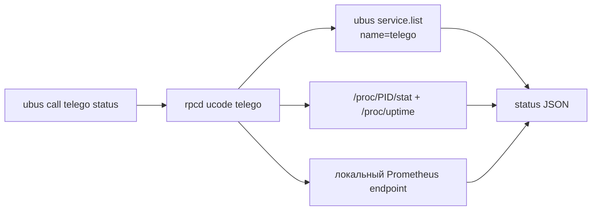

# Локальная интеграция и Telemetry API

[**Русский**](API.md) · [English](API_EN.md)

`telEgo-openwrt` предоставляет **локальную интеграционную поверхность OpenWrt**, а не публичный REST management API.

> [!IMPORTANT]
> Текущий fork **не реализует** исторические `/api/v1/status`, `/users`, `/config/reload` или management API на порту `9091`, которые ранее описывались в репозитории. Конфигурация управляется через UCI/LuCI/procd. Статус доступен через локальный `ubus`/rpcd и Prometheus metrics.

## Интерфейсы

| Интерфейс | Назначение | Scope |
|---|---|---|
| `ubus call telego status` | Состояние сервиса + выбранные counters | Локальный OpenWrt rpcd |
| UCI `telego` | Чтение/запись конфигурации | Локальная конфигурация OpenWrt |
| Prometheus metrics endpoint | Подробные runtime metrics | HTTP endpoint из `metrics.bind_to`/`metrics.path` |
| `service.list` | Состояние procd service instance | Локальный ubus |

## Метод статуса `ubus`

Вызов:

```sh
ubus call telego status
```

Пример структуры ответа:

```json
{
  "running": true,
  "pid": 1234,
  "uptime": 3600,
  "connections": 12,
  "ips_active": 5,
  "ips_tracked": 8,
  "ips_blocked": 0,
  "rx_bytes": 12345678,
  "tx_bytes": 87654321
}
```

### Поля

| Поле | Тип | Значение |
|---|---|---|
| `running` | boolean | Запущен ли procd instance `telego` |
| `pid` | integer | PID процесса или `0` |
| `uptime` | integer | Приблизительное время работы процесса в секундах |
| `connections` | integer | Активные соединения, собранные telemetry backend |
| `ips_active` | integer | Количество активных IP |
| `ips_tracked` | integer | Количество отслеживаемых IP |
| `ips_blocked` | integer | Количество заблокированных IP |
| `rx_bytes` | integer | Суммарный входящий трафик, показываемый LuCI |
| `tx_bytes` | integer | Суммарный исходящий трафик, показываемый LuCI |

Реализация rpcd находится в `package/luci-app-telego/root/usr/share/rpcd/ucode/telego`.

## Как собирается статус



Состояние сервиса и PID берутся из `service.list`; uptime процесса рассчитывается по `/proc`; counters парсятся из настроенного metrics endpoint.

## Metrics endpoint

Default UCI configuration:

```text
config metrics 'metrics'
    option bind_to '127.0.0.1:9090'
    option path '/metrics'
    option diagnostics '0'
```

Прямая проверка:

```sh
uclient-fetch -q -T 2 -O - http://127.0.0.1:9090/metrics
```

LuCI/rpcd backend использует следующие metric names, если они присутствуют:

```text
telego_connections_active
telego_ips_active
telego_ips_tracked
telego_ips_blocked
telego_traffic_in_bytes_total
telego_traffic_out_bytes_total
```

Upstream daemon может экспортировать дополнительные metrics. Здесь перечислены только counters, которые использует OpenWrt telemetry adapter.

### Ограничения rpcd fetch

В целях безопасности локальный telemetry backend не загружает произвольные URL из настроек администратора. Разрешены только:

- `127.0.0.1:<valid-port>`; или
- `[::1]:<valid-port>`;
- path, начинающийся с `/` и состоящий из URL-safe символов, разрешённых реализацией.

Fetch выполняется через `uclient-fetch` с коротким timeout.

Следствия:

- default loopback сохраняет live counters в LuCI;
- перенос daemon metrics listener на non-loopback адрес может сделать endpoint доступным в другом месте, но LuCI rpcd adapter намеренно откажется его читать и вернёт нулевые counters;
- service state/PID могут отображаться даже при недоступных metrics.

## LuCI ACL

`luci-app-telego` выдаёт веб-интерфейсу следующие логические разрешения:

```json
{
  "read": {
    "uci": ["telego"],
    "ubus": {
      "service": ["list"],
      "telego": ["status"]
    }
  },
  "write": {
    "uci": ["telego"]
  }
}
```

Сам RPC method статуса read-only; изменения конфигурации сохраняются через UCI.

## Управление конфигурацией через UCI

Прочитать non-secret значение:

```sh
uci -q get telego.general.enabled
```

Изменить и применить:

```sh
uci set telego.general.log_level='debug'
uci commit telego
/etc/init.d/telego reload
```

Полное соответствие options описано в [CONFIGURATION.md](CONFIGURATION.md).

## Информация procd

Базовое состояние OpenWrt service можно посмотреть напрямую:

```sh
ubus call service list '{"name":"telego"}'
```

Для стабильного project-facing summary используйте `ubus call telego status`; структура raw `service.list` относится к OpenWrt/procd.

## Поведение при ошибках

Страница LuCI остаётся пригодной для настройки даже при проблемах telemetry. Типичные сценарии:

- rpcd backend отсутствует или требует restart → status call завершается ошибкой;
- daemon остановлен → `running=false`, `pid=0`;
- metrics endpoint недоступен → service state может вернуться, counters становятся нулевыми;
- metrics address не loopback → rpcd намеренно отказывается выполнять fetch.

См. [TROUBLESHOOTING.md](TROUBLESHOOTING.md#статус-luci-или-telemetry-недоступны).

## Замечания по безопасности

- Не публикуйте ubus/rpcd напрямую в Internet.
- Не добавляйте write operations в `telego.status`; конфигурация должна оставаться в UCI и существующем LuCI ACL.
- Не заменяйте loopback-only guard для metrics произвольным URL fetch.
- Не публикуйте вывод `uci show telego`: в UCI хранятся secrets.
