# Архитектура

[**Русский**](ARCHITECTURE.md) · [English](ARCHITECTURE_EN.md)

Этот документ описывает текущую архитектуру ветки `develop` проекта `telEgo-openwrt`: pinned core `Scratch-net/telego`, обёрнутый нативным packaging OpenWrt 25.12.x, service management, LuCI, rpcd telemetry, Nginx integration и APK delivery.

> [!NOTE]
> `telego-src/` — production Go source. OpenWrt-specific integration находится вокруг него; этот репозиторий не поддерживает второй независимый Go fork.

## Scope

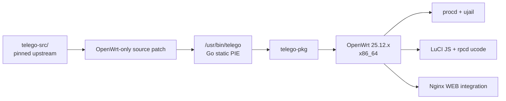

## Границы репозитория

| Область | Ответственность | Авторитетные файлы |
|---|---|---|
| Upstream application | MTProxy/WEB Proxy core, FakeTLS, Middle-End, metrics, Go runtime | `telego-src/` |
| OpenWrt source delta | Небольшой patch, применяемый к pinned upstream до build | `.github/scripts/apply-upstream-patches.py` |
| Daemon package | Установка binary, UCI defaults, procd/ujail runtime, capability profile | `package/telego-pkg/` |
| LuCI | Configuration UI и status view | `package/luci-app-telego/htdocs/` |
| Local telemetry | Read-only `ubus` method на основе service state + Prometheus metrics | `package/luci-app-telego/root/usr/share/rpcd/` |
| Translation | Русский перевод LuCI | `package/luci-i18n-telego-ru/` |
| WEB Proxy edge | Nginx `http {}` definitions и reusable location snippet | `package/nginx-telego/` |
| CI/release | Validation, Go build, OpenWrt SDK APK build, feed/release publishing | `.github/workflows/` |
| Installation | Preview/stable download, integrity/trust checks, установка на router | `install.sh`, `scripts/install-on-router.sh` |

## Общая модель системы

Продукт разделён на **control plane** и **data plane**.

| Plane | Компоненты | Назначение |
|---|---|---|
| Control plane | LuCI JS, UCI, init script, procd, rpcd | Настройка, start/stop, генерация runtime state, локальный status |
| Data plane | telEgo Go/gnet core, FakeTLS, WEB frontend, Middle-End/direct DC routes | Передача Telegram traffic |
| Edge integration | Nginx TLS + `telego.locations` | Real TLS termination, WEB ingress, fallback на ordinary site |

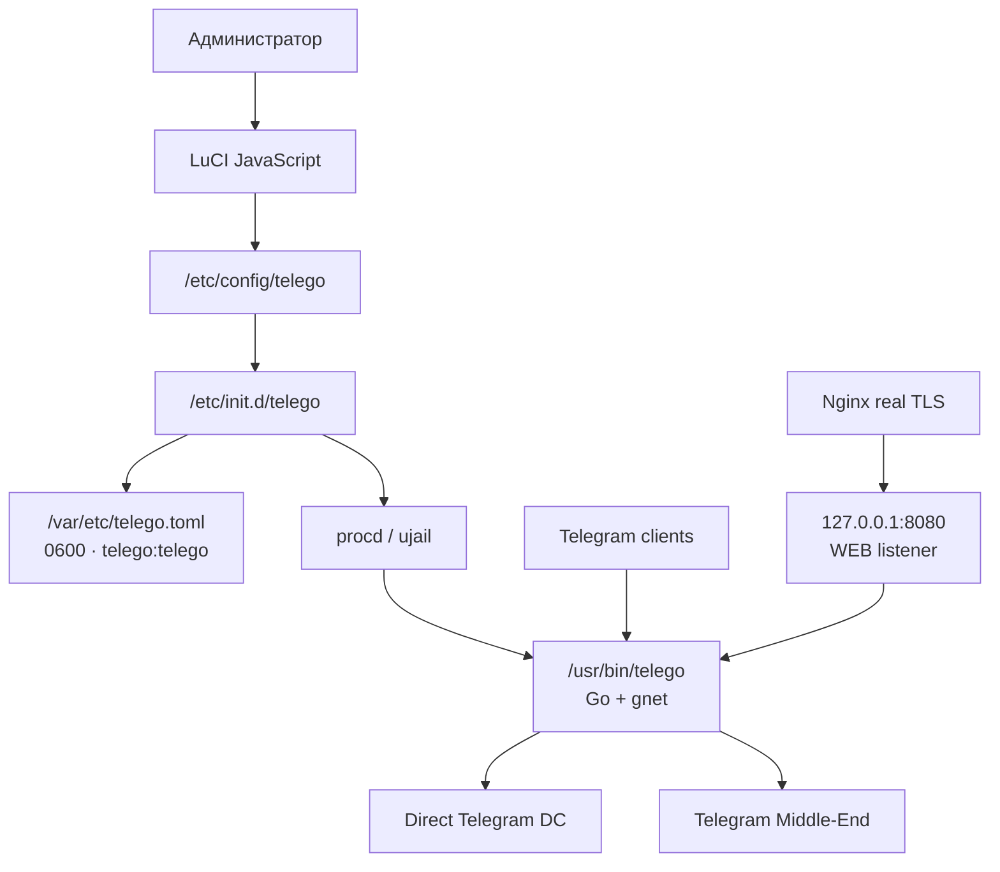

## Build pipeline

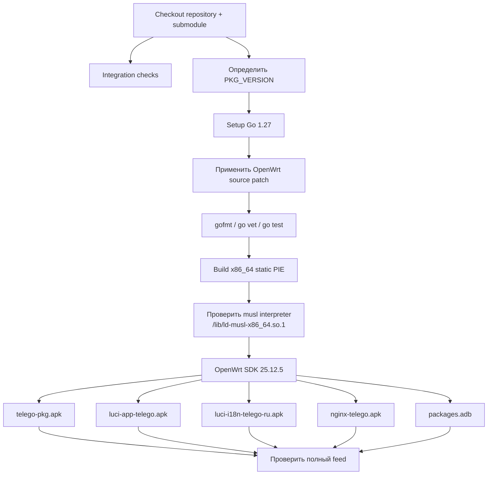

Production workflow — `.github/workflows/build-telego.yaml`. Releases повторяют релевантные проверки и собирают signed feed в `.github/workflows/release.yaml`.

## Lifecycle runtime configuration

Администратор изменяет OpenWrt UCI state. Daemon напрямую UCI не читает.

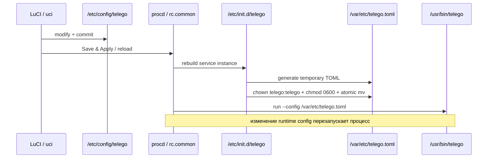

Важное поведение lifecycle:

- `general.enabled=0` означает отсутствие running procd instance.
- Изменившийся generated runtime config перезапускает daemon; secrets/listeners не считаются hot-reloadable в OpenWrt integration.
- `/var/etc/telego.toml` — generated state; его нельзя редактировать вручную.
- Generated file принадлежит `telego:telego` и имеет mode `0600`.

## Security boundary сервиса

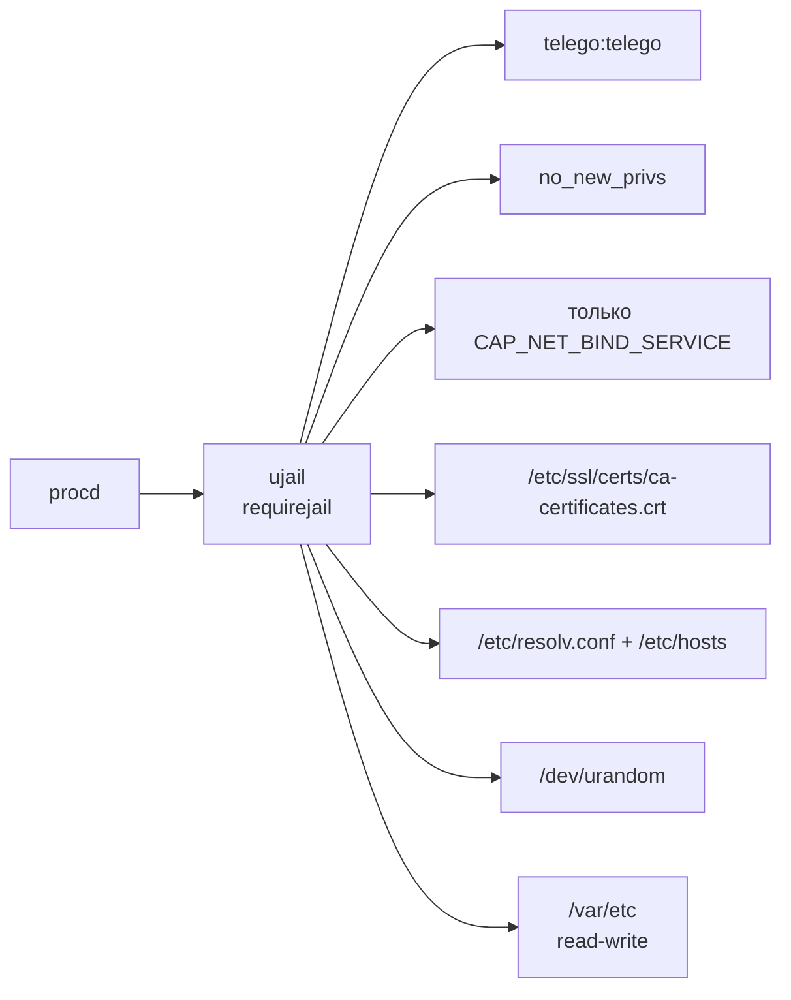

Binary намеренно собирается как static PIE. Service не запрашивает ujail `ronly` dependency discovery, потому что этот механизм ожидает dynamic ELF dependency metadata. Jail, namespace/filesystem isolation, UID/GID drop, `no_new_privs` и capability bounding остаются активными.

См. [SECURITY.md](SECURITY.md).

## MTProxy traffic path

Public telEgo listener принимает оба upstream MTProxy client variants на одном port и автоматически определяет transport по client handshake.

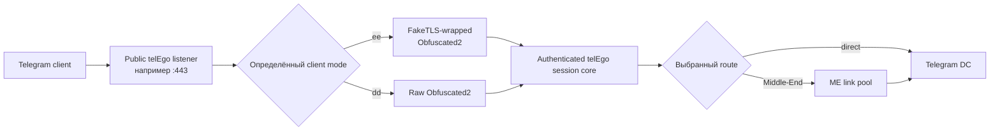

Route выбирается после authentication. Уже существующее public TCP connection не мигрирует позже из direct mode в Middle-End; новый route может быть выбран после reconnect.

## Telegram Middle-End (ME)

Middle-End — опциональный upstream transport. Это **не** WEB Proxy и **не** функция Nginx. Nginx отвечает только за WEB TLS edge; когда WEB stream или native MTProxy stream попадает в общий telEgo session core, дальнейший route может быть direct DC или Middle-End.

### Persistent link topology

Pinned upstream поддерживает **четыре physical gnet links на каждый signed Telegram DC** в active generation.

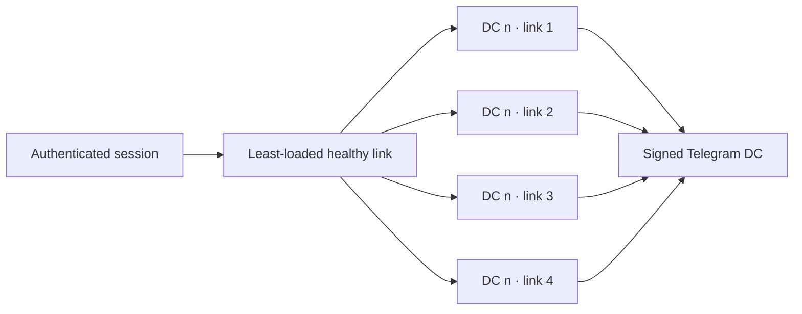

Binding остаётся на выбранном physical link до своего закрытия. Это не позволяет незаметно переносить established binding между разными ME link identities.

### Link Repair — замена одного failed slot, а не всего pool

Каждый physical ME link периодически проверяется. Upstream отправляет probes каждые **5 seconds** и считает link failed, если valid response не приходит в течение **100 seconds**.

Обычная ошибка одного slot запускает **in-place repair именно этого slot**:

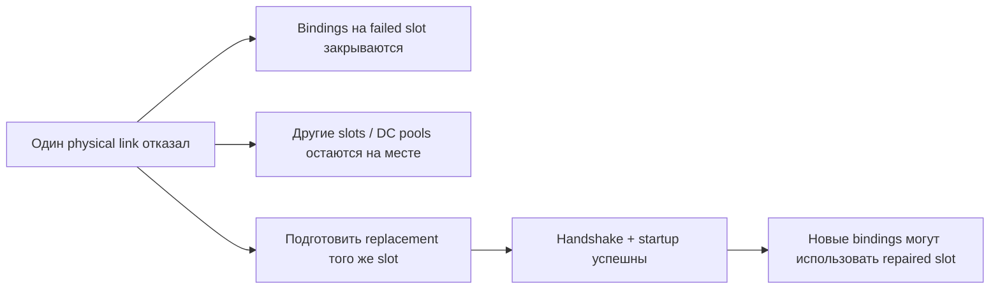

Практический эффект: отказ одного physical link не требует rebuild всей generation и не перемещает healthy bindings соседних links или других DC pools.

> [!NOTE]
> Bindings, находившиеся на failed slot, всё равно завершаются; telEgo не обещает lossless migration уже разрушенного physical transport. Здесь обеспечивается **fault isolation**, а не прозрачная «телепортация» session.

### Link Refresh — проактивная ротация неиспользуемых links

Unused physical links становятся кандидатами на refresh после распределённого idle периода **45–60 seconds**.

Replacement подготавливается **до** retirement текущего link:

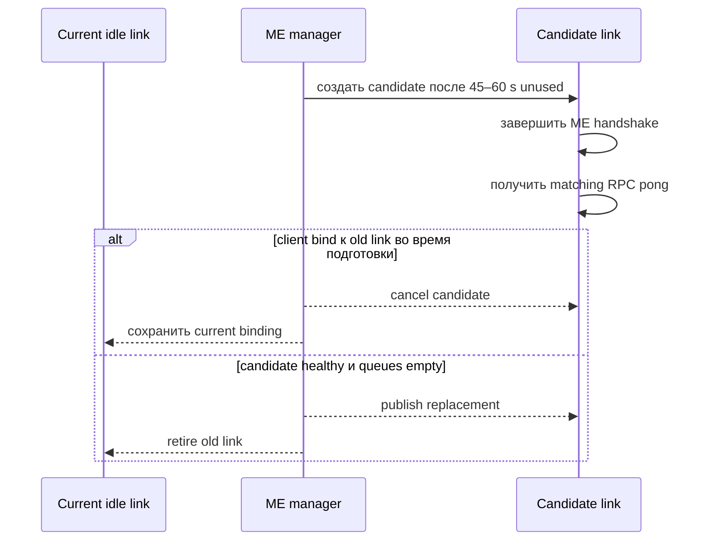

Candidate preparation имеет **10-second deadline**. Failed candidate оставляет current link неизменным и повторяется позже с bounded delay. Каждый manager ограничивает refresh reservations, чтобы избежать неконтролируемого connection churn.

### Generation rotation

Telegram artifacts обновляются периодически. При изменении artifact content telEgo строит и probes candidate generation, пока active generation продолжает принимать bindings. Успешный candidate публикуется атомарно; предыдущая generation drains до **90 seconds**.

> [!TIP]
> При capacity planning рассматривайте Middle-End как persistent connection pool с bounded queues и явными FD/memory requirements, а не как stateless toggle.

## LuCI и telemetry

LuCI application написан на JavaScript. Configuration writes идут через UCI; status читается через локальный rpcd ucode method.

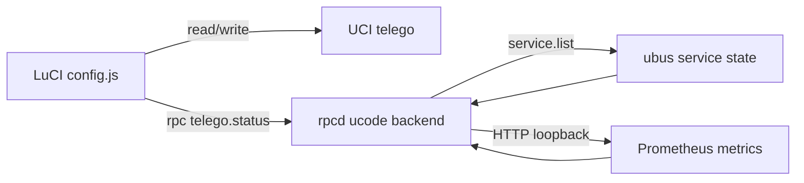

`telego.status` возвращает service state, PID, process uptime и выбранные counters. rpcd backend намеренно отказывается получать administrator-supplied remote metrics endpoint: для LuCI telemetry configured metrics address должен быть literal loopback (`127.0.0.1` или `[::1]`).

См. [API.md](API.md).

## Native WEB Proxy и Nginx

Package `nginx-telego` предоставляет reusable integration, а не полностью готовый public website/TLS deployment.

Installed files:

```text
/etc/nginx/conf.d/telego.conf
/etc/nginx/snippets/telego.locations
```

`telego.conf` подключается из Nginx `http {}` и определяет:

- mapping WebSocket `Connection`;
- `upstream telego_web` → `127.0.0.1:8080` с keepalive.

`telego.locations` должен подключаться внутри administrator-managed TLS `server {}` block.

### Shared-port topology

Наиболее функциональная topology позволяет telEgo владеть public `:443` для MTProxy/FakeTLS, а ordinary TLS splice'ить на private Nginx TLS listener. Затем Nginx передаёт decrypted WEB requests private telEgo WEB listener.

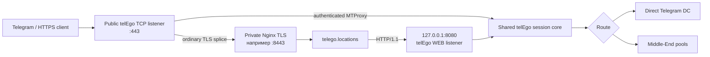

Ключевое разделение ответственности: **Nginx завершает real TLS; telEgo отвечает за carrier authentication/session routing; Middle-End — только один из возможных upstream routes после этого.**

## WEB carrier modes и Lanes

Upstream WEB frontend поддерживает четыре transport carriers:

| Carrier | Transport shape | Operational profile |
|---|---|---|
| `https` | Один serialized fetch + long-poll carrier | Минимальные требования к Nginx |
| `https-lanes` | Независимая fetch/long-poll lane на каждый Telegram stream | Консервативная рекомендация upstream; требуется public HTTP/2 |
| `websocket` | Один multiplexed WebSocket на WEB session | Требуется forwarding HTTP/1.1 `Upgrade` / `Connection` headers |
| `websocket-lanes` | Один WebSocket на каждый active Telegram stream | Official lane-style WebSocket option |

### Lanes простыми словами

WEB session Telegram Desktop может содержать несколько logical streams. Non-lane carrier multiplexes несколько streams через один transport carrier. Lane carrier выдаёт каждому logical stream независимую transport lane.

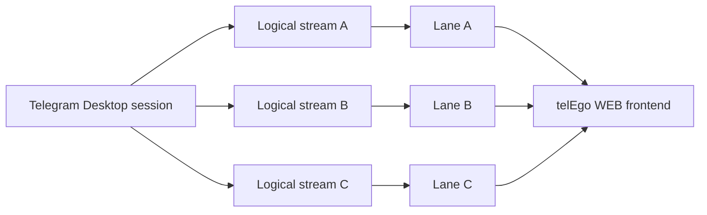

Практическая ценность — isolation на уровне carrier scheduling: одному logical stream не нужно делить строго ту же carrier sequence со всеми остальными streams. Это не следует рекламировать как гарантированное улучшение latency: результат зависит от network и поведения client.

## Бесшовный fallback на обычный сайт: 418 / 419

Каждый request для WEB hostname должен проходить через telEgo WEB classifier. Благодаря этому тот же hostname может показывать обычный сайт, если request не является authenticated carrier request.

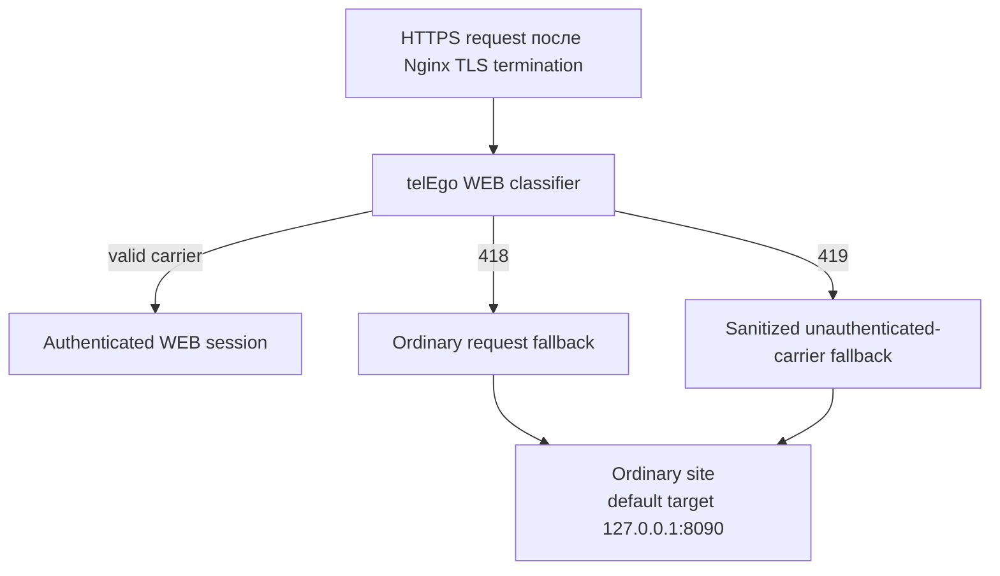

- **418** сохраняет обычный website request и направляет его ordinary site.
- **419** используется для carrier-shaped request, который не прошёл authentication. Nginx удаляет carrier credentials, body/content metadata, forwarded-address headers и WebSocket/session headers перед безопасным fallback request.

> [!IMPORTANT]
> `419` sanitization — security/privacy boundary. Custom Nginx deployment должен сохранять её, а не передавать failed carrier requests напрямую ordinary site.

## Relationships пакетов

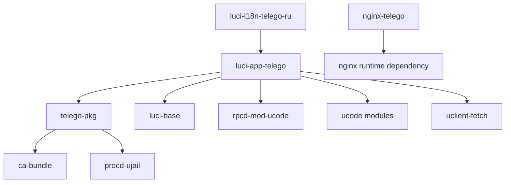

Точные package dependency names и revisions определяются `package/*/Makefile`; diagram намеренно не дублирует все version constraints.

## Синхронизация upstream

Обновление telEgo — не обычная замена source copy. Ожидаемый flow:

1. Переместить submodule pointer `telego-src` на нужный upstream commit/tag.
2. Повторно проверить `.github/scripts/apply-upstream-patches.py` относительно exact source.
3. При необходимости обновить package versions/releases.
4. Запустить repository integration checks и upstream Go tests.
5. Собрать все 4 APK через OpenWrt SDK и проверить `packages.adb`.
6. Только после этого публиковать/обновлять release channel.

См. [BUILD.md](BUILD.md).
