# Architecture

This document describes the current `develop` architecture of `telEgo-openwrt`: a pinned upstream `Scratch-net/telego` core wrapped in native OpenWrt 25.12.x packaging, service management, LuCI, rpcd telemetry, Nginx integration, and APK delivery.

> [!NOTE]
> `telego-src/` is the production Go source. OpenWrt-specific integration lives around it; this repository does not maintain a second independent Go fork.

## Scope

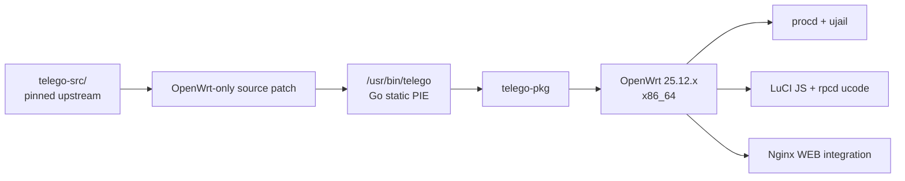

## Repository boundaries

| Area | Responsibility | Authoritative files |
|---|---|---|
| Upstream application | MTProxy/WEB Proxy core, FakeTLS, Middle-End, metrics, Go runtime | `telego-src/` |
| OpenWrt source delta | Small patch applied to pinned upstream before build | `.github/scripts/apply-upstream-patches.py` |
| Daemon package | Binary install, UCI defaults, procd/ujail runtime, capability profile | `package/telego-pkg/` |
| LuCI | Configuration UI and status view | `package/luci-app-telego/htdocs/` |
| Local telemetry | Read-only `ubus` method backed by service state + Prometheus metrics | `package/luci-app-telego/root/usr/share/rpcd/` |
| Translation | Russian LuCI translation | `package/luci-i18n-telego-ru/` |
| WEB Proxy edge | Nginx `http {}` definitions and reusable location snippet | `package/nginx-telego/` |
| CI/release | Validation, Go build, OpenWrt SDK APK build, feed/release publishing | `.github/workflows/` |
| Installation | Preview/stable download, integrity/trust checks, router installation | `install.sh`, `scripts/install-on-router.sh` |

## System overview

The product is split into a **control plane** and a **data plane**.

| Plane | Components | Purpose |
|---|---|---|
| Control plane | LuCI JS, UCI, init script, procd, rpcd | Configure, start/stop, generate runtime state, expose local status |
| Data plane | telEgo Go/gnet core, FakeTLS, WEB frontend, Middle-End/direct DC routes | Carry Telegram traffic |
| Edge integration | Nginx TLS + `telego.locations` | Real TLS termination, WEB ingress, ordinary-site fallback |

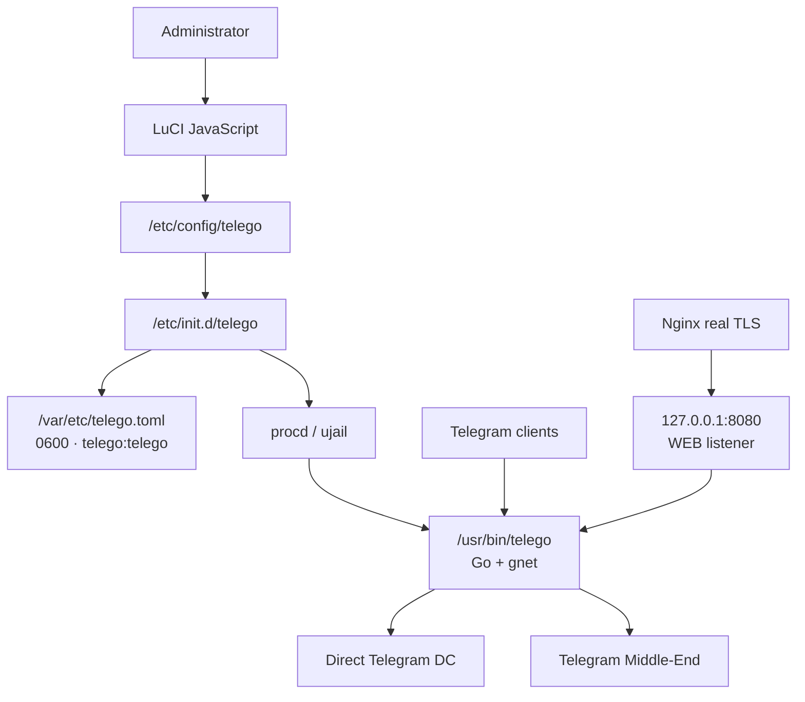

## Build pipeline

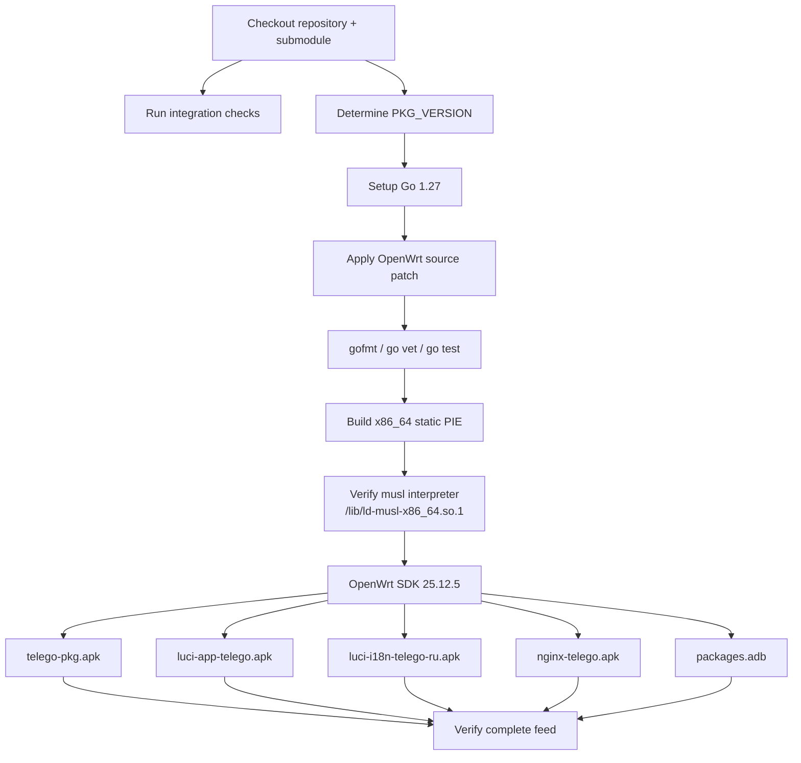

The production workflow is `.github/workflows/build-telego.yaml`. Releases repeat the relevant checks and build a signed feed in `.github/workflows/release.yaml`.

## Runtime configuration lifecycle

The administrator edits OpenWrt UCI state. The daemon never reads UCI directly.

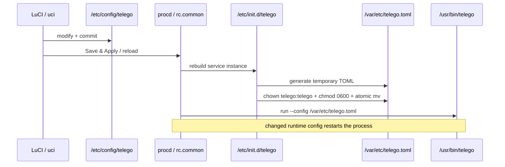

Important lifecycle behavior:

- `general.enabled=0` means no running procd instance.
- A changed generated runtime config restarts the daemon; secrets/listeners are not treated as hot-reloadable by the OpenWrt integration.
- `/var/etc/telego.toml` is generated state and must not be edited manually.
- The generated file is owned by `telego:telego` and mode `0600`.

## Service security boundary

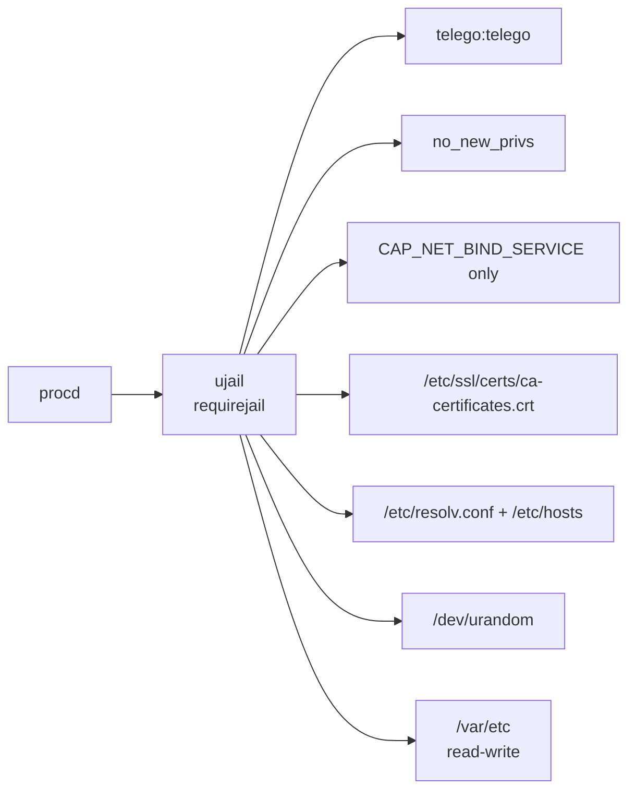

The binary is deliberately built as a static PIE. The service does not request ujail `ronly` dependency discovery because that mechanism expects dynamic ELF dependency metadata. The jail, namespace/filesystem isolation, UID/GID drop, `no_new_privs`, and capability bounding remain active.

See [SECURITY.md](SECURITY.md).

## MTProxy traffic path

The public telEgo listener accepts both upstream MTProxy client variants on the same port and auto-detects the transport from the client handshake.

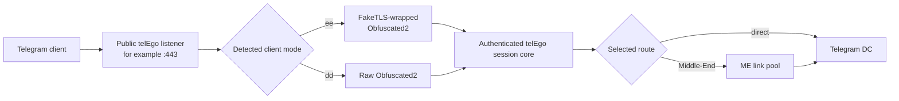

The route is selected after authentication. An existing public TCP connection is not migrated from direct mode to Middle-End later; reconnecting allows a new route decision.

## Telegram Middle-End (ME)

Middle-End is an optional upstream transport. It is **not** the same thing as WEB Proxy and it is **not** provided by Nginx. Nginx only handles the WEB TLS edge; once a WEB or native MTProxy stream enters the shared telEgo session core, the route can be direct DC or Middle-End.

### Persistent link topology

Pinned upstream keeps **four physical gnet links for each signed Telegram DC** in the active generation.

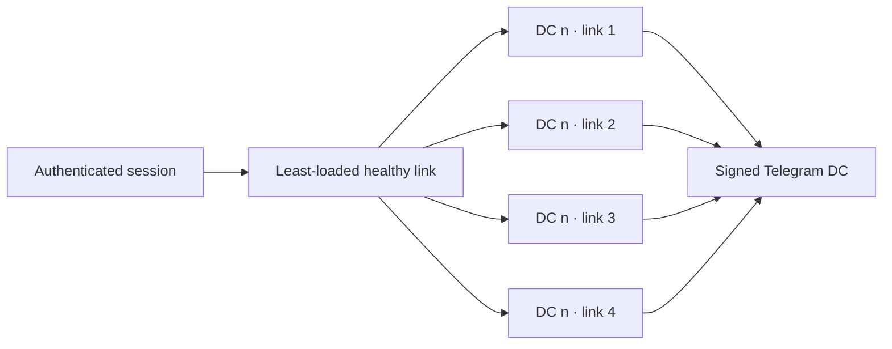

A binding stays on the physical link selected for it until that binding closes. This avoids silently moving an established binding between different ME link identities.

### Link Repair — replace one failed slot, not the whole pool

Every physical ME link is probed periodically. Upstream sends probes every **5 seconds** and treats a link as failed when no valid response arrives within **100 seconds**.

An ordinary slot failure triggers **in-place repair of that slot**:

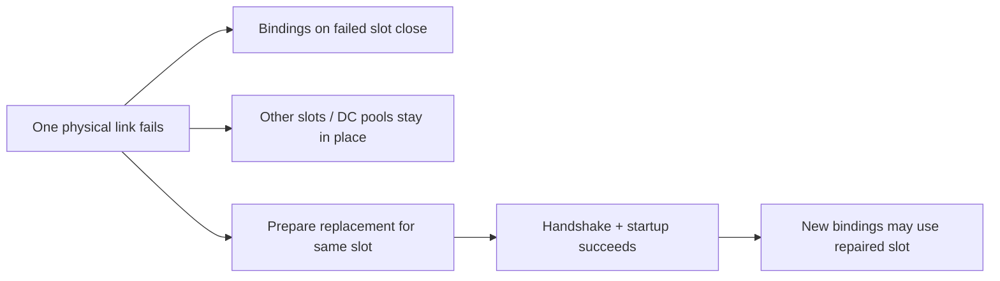

This is important operationally: one failing physical link does not force a full generation rebuild and does not relocate healthy bindings on neighboring links or other DC pools.

> [!NOTE]
> Bindings that were on the failed slot still terminate; telEgo does not claim lossless migration of an already-broken physical transport. The resilience property is **fault isolation**, not transparent session teleportation.

### Link Refresh — proactive turnover of unused links

Unused physical links become eligible for refresh after a staggered **45–60 second** idle period.

The replacement is prepared **before** the current link is retired:

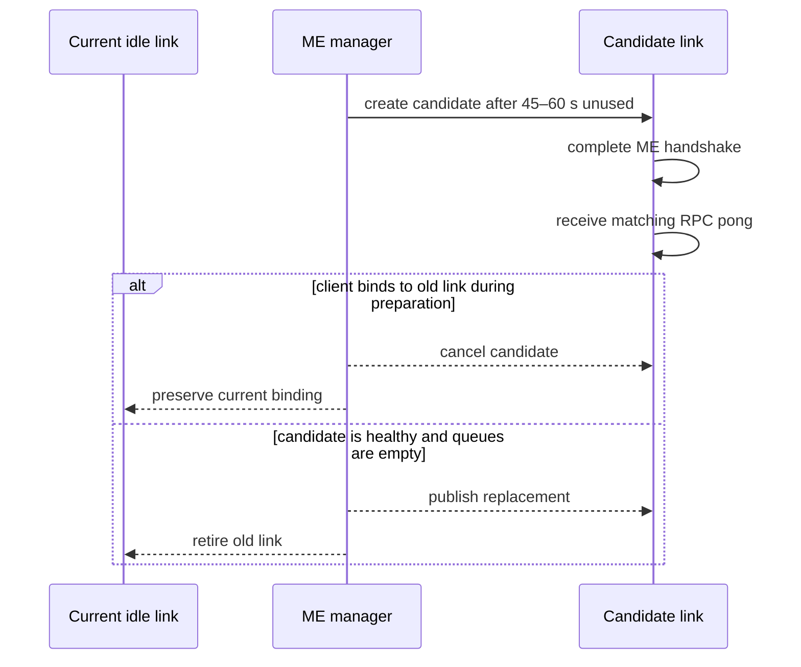

Candidate preparation has a **10-second deadline**. A failed candidate leaves the current link unchanged and retries later with bounded delay. Each manager limits refresh reservations to avoid uncontrolled connection churn.

### Generation rotation

Telegram artifacts are refreshed periodically. When artifact content changes, telEgo builds and probes a candidate generation while the active generation continues admitting bindings. A successful candidate is published atomically; the previous generation drains for up to **90 seconds**.

> [!TIP]
> For capacity planning, treat Middle-End as a persistent connection pool with bounded queues and explicit FD/memory requirements, not as a stateless toggle.

## LuCI and telemetry

The LuCI application is JavaScript-only. Configuration writes go through UCI; status is read through a local rpcd ucode method.

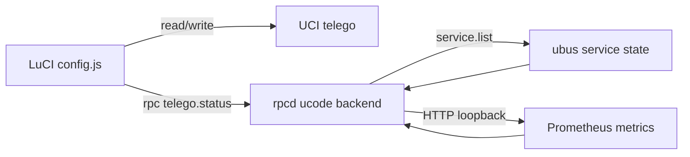

`telego.status` returns service state, PID, process uptime, and selected counters. The rpcd backend intentionally refuses to fetch an administrator-supplied remote metrics endpoint: for LuCI telemetry, the configured metrics address must be literal loopback (`127.0.0.1` or `[::1]`).

See [API.md](API.md).

## Native WEB Proxy and Nginx

The `nginx-telego` package provides reusable integration, not a complete public website/TLS deployment.

Installed files:

```text
/etc/nginx/conf.d/telego.conf
/etc/nginx/snippets/telego.locations
```

`telego.conf` is included from Nginx `http {}` and defines:

- the WebSocket `Connection` mapping;
- `upstream telego_web` → `127.0.0.1:8080` with keepalive.

`telego.locations` must be included inside the administrator-managed TLS `server {}` block.

### Shared-port topology

The most capable topology lets telEgo own public `:443` for MTProxy/FakeTLS while ordinary TLS is spliced to a private Nginx TLS listener. Nginx then forwards decrypted WEB requests to the private telEgo WEB listener.

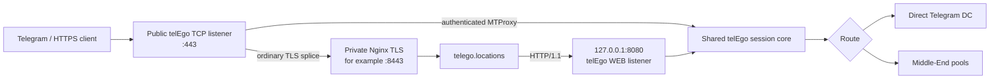

This distinction matters: **Nginx terminates real TLS; telEgo owns carrier authentication/session routing; Middle-End is only one possible upstream route after that point.**

## WEB carrier modes and Lanes

The upstream WEB frontend supports four transport carriers:

| Carrier | Transport shape | Operational profile |
|---|---|---|
| `https` | One serialized fetch + long-poll carrier | Lowest Nginx feature requirement |
| `https-lanes` | Independent fetch/long-poll lane per Telegram stream | Conservative upstream recommendation; public HTTP/2 required |
| `websocket` | One multiplexed WebSocket for the WEB session | Requires forwarded HTTP/1.1 `Upgrade` / `Connection` headers |
| `websocket-lanes` | One WebSocket per active Telegram stream | Official lane-style WebSocket option |

### Lanes in plain language

A Telegram Desktop WEB session can contain multiple logical streams. A non-lane carrier multiplexes several streams through one carrier. A lane carrier gives each logical stream an independent transport lane.

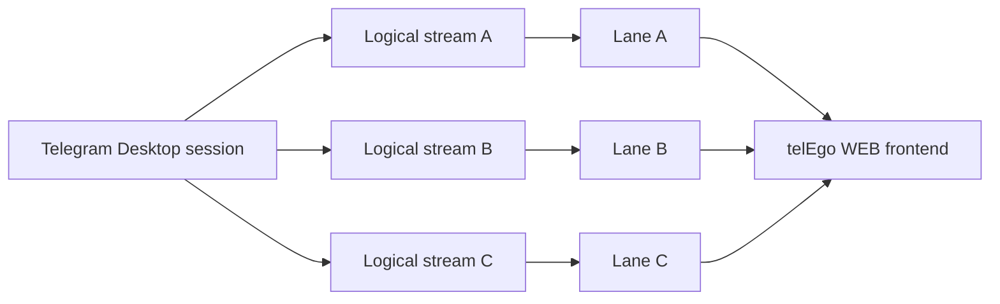

The commercial value is isolation at the carrier-scheduling layer: one logical stream does not have to share the exact same carrier sequence with every other stream. This should not be marketed as a guaranteed latency improvement; comparative performance still depends on the network and client behavior.

## Seamless ordinary-site fallback: 418 / 419

Every request for the WEB hostname is expected to pass through the telEgo WEB classifier. That allows the same hostname to present a normal website when a request is not an authenticated carrier request.

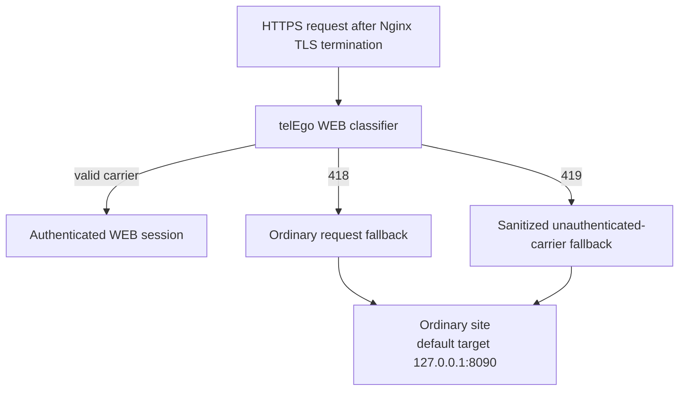

- **418** preserves an ordinary website request and routes it to the ordinary site.
- **419** is used for a carrier-shaped request that failed authentication. Nginx removes carrier credentials, body/content metadata, forwarded-address headers, and WebSocket/session headers before issuing a safe fallback request.

> [!IMPORTANT]
> The `419` sanitization is a security/privacy boundary. A custom Nginx deployment should preserve it instead of routing failed carrier requests directly to the ordinary site.

## Package relationships

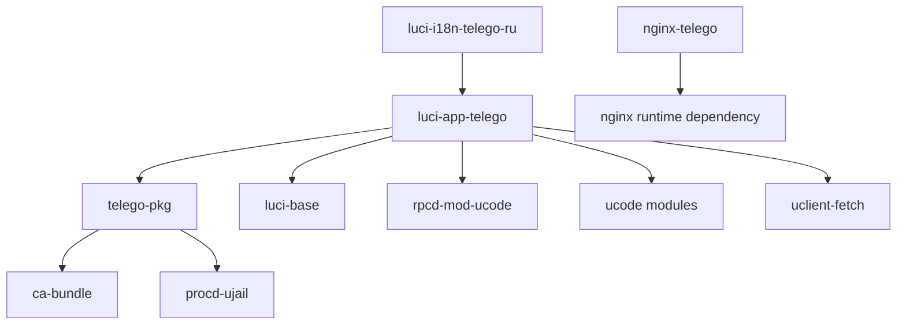

Exact package dependency names and revisions belong to `package/*/Makefile`; this diagram intentionally avoids duplicating all version constraints.

## Upstream synchronization

Updating telEgo is not a normal copy-and-paste source replacement. The expected flow is:

1. Move the `telego-src` submodule pointer to the intended upstream commit/tag.
2. Re-evaluate `.github/scripts/apply-upstream-patches.py` against that exact source.
3. Update package versions/releases as required.
4. Run repository integration checks and upstream Go tests.
5. Build all four APKs through the OpenWrt SDK and verify `packages.adb`.
6. Only then publish/update a release channel.

See [BUILD.md](BUILD.md).
