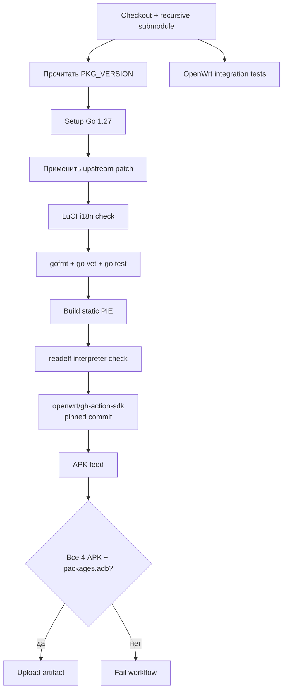
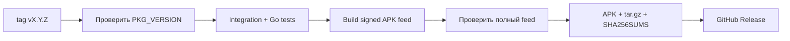

# Сборка и релизы

[**Русский**](BUILD.md) · [English](BUILD_EN.md)

Этот документ описывает текущий production build path. Авторитетные определения находятся в:

- `.github/workflows/build-telego.yaml`
- `.github/workflows/release.yaml`

Не используйте исторические инструкции на базе nFPM для production packages.

## Build contract

| Параметр | Текущее значение |
|---|---|
| OpenWrt SDK target | `x86_64-25.12.5` |
| Package format | OpenWrt APK |
| Go toolchain в CI | `1.27` |
| Go CGO | disabled |
| Binary mode | PIE |
| Ожидаемый musl interpreter | `/lib/ld-musl-x86_64.so.1` |
| Upstream source | pinned submodule `telego-src/` |
| Project feed | `telego` |

OpenWrt 25.12 и новее использует `apk`, поэтому проект собирает нативные APK packages и индекс `packages.adb`, а не legacy opkg/IPK output.

## Production CI pipeline



Package-only SDK configuration задаётся через `.github/openwrt-sdk.config` с `KCONFIG_ALLCONFIG`. Стандартные SDK feeds остаются доступными, потому что LuCI host tooling и package dependencies нужны для сборки.

## Ожидаемый результат

Feed должен содержать следующие project package families и индекс:

```text
telego-pkg-*.apk
luci-app-telego-*.apk
luci-i18n-telego-ru-*.apk
nginx-telego-*.apk
packages.adb
```

CI verification step завершается ошибкой, если отсутствует хотя бы один ожидаемый APK. Workflow, который «успешно» пропустил запрошенный package, не считается успешной сборкой проекта.

## Подготовка исходников

Клонирование с submodules:

```bash
git clone --recurse-submodules https://github.com/Ra1nek/telEgo-openwrt.git
cd telEgo-openwrt
```

Для существующего checkout:

```bash
git submodule update --init --recursive
```

Перед Go build CI применяет OpenWrt-only delta:

```bash
python3 .github/scripts/apply-upstream-patches.py
```

Patch script намеренно строгий: если ожидаемые блоки pinned upstream больше не найдены, он останавливается вместо молчаливого patch неизвестной revision.

## Локальная валидация по задаче

Integration suite проверяет installer, service account, service definition, LuCI, i18n и rpcd/ucode behavior:

```bash
bash .github/scripts/test-openwrt-integration.sh
```

Если `UCODE` не задан, скрипт при необходимости может собрать подходящий host interpreter `ucode`.

### Go validation

Если затронут upstream Go source или OpenWrt source patch:

```bash
python3 .github/scripts/apply-upstream-patches.py
cd telego-src
gofmt -w ./cmd/telego/main.go
go vet ./...
go test ./...
```

Для documentation-only или изолированных packaging changes не запускайте весь upstream Go test suite без необходимости.

### LuCI/i18n validation

Профильные проверки:

```bash
node .github/tests/luci-config.cjs
python3 .github/scripts/check-luci-i18n.py
```

Полный integration script уже вызывает поддерживаемый набор проверок.

## Полная сборка APK

Каноническая package build выполняется GitHub Actions через pinned `openwrt/gh-action-sdk`. Это удерживает SDK target, feeds и package metadata синхронизированными с CI.

При packaging problem сначала смотрите конкретный failing SDK step и точную ошибку. Локально собранный nFPM APK не является эквивалентом OpenWrt SDK output.

## Публикация develop preview

Успешный push в `develop` может обновить preview channel `develop-latest` после прохождения integration и package build jobs.

Preview publisher:

1. проверяет, что workflow SHA всё ещё является текущим head `develop`;
2. загружает feed artifact из того же run;
3. подготавливает install assets;
4. загружает APK;
5. загружает `telego-install.sha256` последним.

Manifest публикуется последним, чтобы installer не получил частично обновлённый preview set.

## Stable release pipeline

Stable release запускается tag:

```text
vX.Y.Z
```

Release workflow проверяет, что версия tag совпадает с `PKG_VERSION` из `package/telego-pkg/Makefile` до публикации любых assets.



Signing key передаётся через repository secret `OPENWRT_APK_PRIVATE_KEY`; он никогда не должен храниться в репозитории или документации.

## Release checklist

Перед созданием stable tag:

1. Подтвердите нужный upstream submodule commit.
2. Проверьте, что `.github/scripts/apply-upstream-patches.py` всё ещё применим к этой revision.
3. Согласованно обновите `PKG_VERSION`/`PKG_RELEASE`, где это требуется.
4. Запустите integration checks.
5. Убедитесь, что normal package workflow собирает все 4 APK и `packages.adb`.
6. Проверьте доступность release signing configuration.
7. Создайте tag, точно совпадающий с `PKG_VERSION`.
8. Проверьте опубликованные assets и checksums.

## Синхронизация upstream

Production source of truth остаётся `telego-src/`; проект не копирует upstream Go changes в параллельное source tree.

При обновлении upstream:

```bash
git -C telego-src fetch --tags
git -C telego-src checkout <reviewed-commit-or-tag>
git add telego-src
```

После этого повторно проверьте OpenWrt patch и package integration до commit изменения submodule pointer.

## Стратегия диагностики CI

Для failed run:

1. Найдите failed job.
2. Найдите failed step.
3. Извлеките точную ошибку и короткий окружающий фрагмент log.
4. Сначала проверяйте только непосредственно связанные workflow/package/source files.
5. Внесите минимальный согласованный fix.
6. Валидируйте **новый run для нового commit**, а не старый SHA.
7. Убедитесь, что artifact содержит каждый ожидаемый APK.

Такой подход быстрее и экономнее по контексту для coding agents, чем загрузка целого verbose SDK log.
