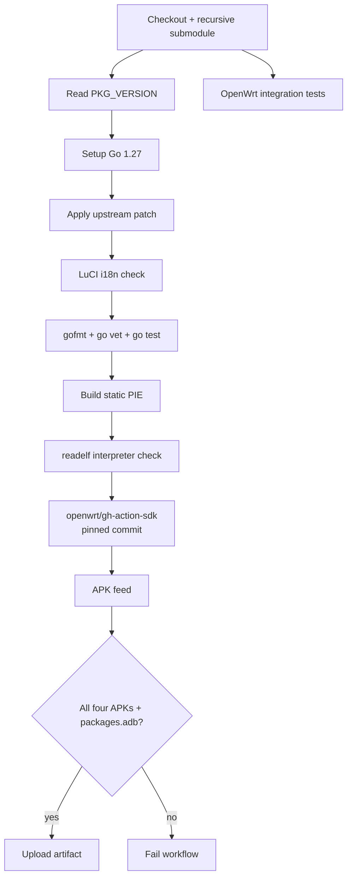
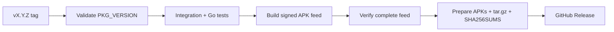

# Build and Release

This document describes the current production build path. The authoritative definitions are:

- `.github/workflows/build-telego.yaml`
- `.github/workflows/release.yaml`

Do not use historical nFPM-based instructions for production packages.

## Build contract

| Item | Current value |
|---|---|
| OpenWrt SDK target | `x86_64-25.12.5` |
| Package format | OpenWrt APK |
| Go toolchain in CI | `1.27` |
| Go CGO | disabled |
| Binary mode | PIE |
| Expected musl interpreter | `/lib/ld-musl-x86_64.so.1` |
| Upstream source | pinned `telego-src/` submodule |
| Project feed | `telego` |

OpenWrt 25.12 and newer uses `apk`; the project therefore builds native APK packages and a `packages.adb` index rather than legacy opkg/IPK output.

## Production CI pipeline



The package-only SDK configuration is provided through `.github/openwrt-sdk.config` using `KCONFIG_ALLCONFIG`. Default SDK feeds remain available because LuCI host tooling and package dependencies are required by the build.

## Expected output

The feed must contain exactly the project package families below plus its index:

```text
telego-pkg-*.apk
luci-app-telego-*.apk
luci-i18n-telego-ru-*.apk
nginx-telego-*.apk
packages.adb
```

The CI verification step fails if any expected APK is missing. A workflow that silently skips a requested package is not considered a successful project build.

## Source preparation

Clone recursively:

```bash
git clone --recurse-submodules https://github.com/Ra1nek/telEgo-openwrt.git
cd telEgo-openwrt
```

For an existing checkout:

```bash
git submodule update --init --recursive
```

Before the Go build, CI applies the OpenWrt-only delta:

```bash
python3 .github/scripts/apply-upstream-patches.py
```

The patch script is intentionally strict: if the expected pinned upstream blocks are no longer present, it stops rather than silently patching an unknown source revision.

## Focused local validation

The integration suite exercises installer, service-account, service-definition, LuCI, i18n and rpcd/ucode behavior:

```bash
bash .github/scripts/test-openwrt-integration.sh
```

It may build a matching host `ucode` interpreter when `UCODE` is not supplied.

### Go validation

When the upstream Go source or OpenWrt source patch is involved:

```bash
python3 .github/scripts/apply-upstream-patches.py
cd telego-src
gofmt -w ./cmd/telego/main.go
go vet ./...
go test ./...
```

Do not run upstream Go tests for documentation-only or isolated packaging changes unless needed to prove the change.

### LuCI/i18n validation

Relevant project checks include:

```bash
node .github/tests/luci-config.cjs
python3 .github/scripts/check-luci-i18n.py
```

The full integration script already invokes the complete supported set.

## Full APK build

The canonical full package build runs in GitHub Actions through the pinned `openwrt/gh-action-sdk` action. This keeps SDK target, feeds and package metadata consistent with CI.

For packaging problems, inspect the failing SDK step and exact error first. Avoid treating a locally constructed nFPM APK as equivalent to the OpenWrt SDK output.

## Develop preview publishing

A successful `develop` push can publish/update the `develop-latest` preview channel after both integration and package build jobs succeed.

The preview publisher:

1. verifies that the workflow SHA is still the current `develop` head;
2. downloads the feed artifact from the same run;
3. prepares install assets;
4. uploads APKs;
5. uploads `telego-install.sha256` last.

Uploading the manifest last reduces the chance that an installer consumes a partially updated preview set.

## Stable release pipeline

Stable releases are tag-driven:

```text
vX.Y.Z
```

The release workflow validates that the tag version matches `PKG_VERSION` from `package/telego-pkg/Makefile` before publishing anything.



The signing key is supplied through the repository secret `OPENWRT_APK_PRIVATE_KEY`; it must never be stored in the repository or documentation.

## Release checklist

Before creating a stable tag:

1. Confirm the intended upstream submodule commit.
2. Confirm `.github/scripts/apply-upstream-patches.py` still applies to that exact revision.
3. Update `PKG_VERSION`/`PKG_RELEASE` values coherently where required.
4. Run integration checks.
5. Ensure the normal package workflow builds all four APKs and `packages.adb`.
6. Confirm release signing configuration is available.
7. Create a tag matching `PKG_VERSION` exactly.
8. Verify the published release assets and checksums.

## Upstream synchronization

The repository does not copy upstream Go changes into a parallel source tree for production. The production source of truth remains `telego-src/`.

When updating upstream:

```bash
git -C telego-src fetch --tags
git -C telego-src checkout <reviewed-commit-or-tag>
git add telego-src
```

Then revalidate the OpenWrt patch and package integration before committing the pointer update.

## CI debugging strategy

For a failed run:

1. Identify the failed job.
2. Identify the failed step.
3. Extract the exact error and a short surrounding log range.
4. Check only directly relevant workflow/package/source files first.
5. Apply the smallest coherent fix.
6. Validate a **new run for the new commit**, not an obsolete SHA.
7. Confirm the artifact contains every expected APK.

This approach is both faster and more context-efficient for coding agents than ingesting an entire verbose SDK log.
