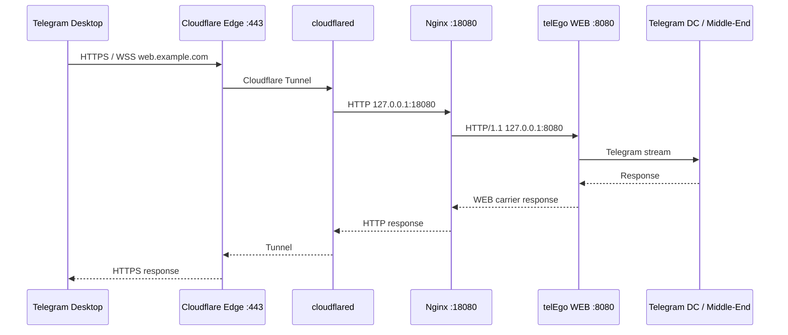

<div align="center">

# Cloudflare Tunnel на OpenWrt

**telEgo WEB Proxy через Cloudflare без входящего WAN TCP/443**

[](https://openwrt.org/)
[](https://developers.cloudflare.com/cloudflare-one/networks/connectors/cloudflare-tunnel/)
[](#3-настройка-локального-nginx-ingress)
[](#источники)

**Cloudflare Edge :443 · исходящий Tunnel · Nginx :18080 · telEgo WEB :8080**

[Русский](CLOUDFLARE.md) · [English](CLOUDFLARE_EN.md) · [Документация](README.md)

</div>

Этот runbook описывает **полную рабочую цепочку WEB Proxy**, а не только создание Tunnel в Cloudflare. В конце Telegram Desktop обращается к публичному HTTPS-имени, Cloudflare принимает TLS на своей стороне, `cloudflared` доставляет HTTP-запрос на OpenWrt, локальный Nginx адаптирует его для telEgo, а WEB frontend telEgo работает только на loopback.

Cloudflare Tunnel здесь относится только к WEB Proxy. Прямой MTProto/MTProxy listener telEgo остаётся отдельным путём и может продолжать работать на своём публичном адресе/порту.

> [!IMPORTANT]
> Если у вас **уже работает** ручной `/etc/nginx/conf.d/zz-telego-cloudflare.conf`, не включайте поверх него managed Cloudflare profile из `nginx-telego`. Обе схемы решают одну задачу и одновременно владеть `127.0.0.1:18080` не должны. Package upgrade не должен удалять или переписывать ваш ручной файл.

---

## Как проходит запрос



Здесь важно различать три локальных роли:

| Адрес | Владелец | Назначение |
|---|---|---|
| `127.0.0.1:8080` | telEgo | приватный HTTP/1.1 WEB listener |
| `127.0.0.1:18080` | Nginx | специализированный ingress для `cloudflared` |
| `127.0.0.1:8090` | Nginx или ваш сайт | обычный fallback для запросов, которые telEgo классифицировал не как WEB carrier |

`cloudflared` должен обращаться к **Nginx `:18080`**, а не напрямую к telEgo `:8080`. Nginx реализует нужный proxy/fallback contract и передаёт telEgo адрес клиента, полученный от Cloudflare.

### Где здесь `telego.locations`

`/etc/nginx/snippets/telego.locations` — generic snippet для **обычного TLS/Nginx deployment**, прежде всего native shared-port схемы `telEgo :443 → Nginx TLS :8443 → telEgo WEB :8080`.

Cloudflare ingress другой: ему нужна обработка `CF-Connecting-IP`, поэтому managed Cloudflare profile использует собственные `location`-блоки и **не включает `telego.locations`**.

---

## Быстрый маршрут

1. telEgo запущен, WEB Proxy включён и слушает `127.0.0.1:8080`.
2. `web_proxy.hostname` совпадает с публичным именем, например `web.example.com`.
3. Nginx слушает `127.0.0.1:18080` — либо через managed `nginx_telego.cloudflare`, либо через ваш ручной Cloudflare-конфиг.
4. `cloudflared` подключён к remotely-managed Tunnel и показывает `Healthy`.
5. Published Application направляет `web.example.com` на `http://127.0.0.1:18080`.
6. DNS имени создаётся/маршрутизируется через Tunnel, а не указывает `A/AAAA` непосредственно на WAN OpenWrt.
7. Проверяются по очереди `:8080`, `:18080`, Tunnel, публичный HTTPS и реальный Telegram Desktop.

---

# 1. Перед началом

Нужно:

- OpenWrt `25.12.x` с рабочим выходом в Интернет;
- установленный `telego-pkg`;
- `nginx-telego` и `nginx-ssl`;
- домен, использующий Cloudflare DNS;
- отдельное имя для WEB Proxy, например `web.example.com`;
- доступ к Cloudflare Dashboard.

Проверьте базовые компоненты:

```sh
apk info telego-pkg
apk info nginx-telego
ls -l /etc/nginx/conf.d/20-telego-core.conf
ls -l /etc/nginx/snippets/telego.locations
```

`nginx-telego` устанавливает managed ownership/reconciliation stack:

```text
/etc/config/nginx_telego
/etc/init.d/nginx-telego
/usr/libexec/nginx-telego-files
/usr/libexec/nginx-telego-render
/usr/libexec/nginx-telego-reconcile
/usr/share/nginx-telego/ownership.tsv
```

Имя UCI package — именно `nginx_telego` с подчёркиванием. APK и init script по-прежнему называются `nginx-telego`.

Все managed ingress-профили **выключены по умолчанию**. Установка или обновление пакета не должны автоматически занимать `18080`, `8443`, `8444` или заменять существующий ручной Nginx-конфиг.

---

# 2. Подготовка WEB Proxy в telEgo

Cloudflare должен публиковать уже исправный локальный WEB frontend.

В LuCI откройте:

**Services → telEgo → WEB Proxy**

Базовый профиль:

| Параметр | Значение |
|---|---|
| **Enable WEB Proxy** | `on` |
| **Carrier Mode** | `https-lanes` как рекомендуемая отправная точка; существующий рабочий режим менять необязательно |
| **Bind Address** | `127.0.0.1:8080` |
| **Hostname** | `web.example.com` |
| **Trusted Proxy CIDRs** | `127.0.0.1/32` |
| **Compatibility Backend** | пусто, если специальный backend не нужен |
| **WEB Event Loops** | `0` для automatic |

После **Save & Apply** проверьте:

```sh
/etc/init.d/telego status
netstat -lntp 2>/dev/null | grep ':8080'
```

Ожидается listener только на loopback:

```text
127.0.0.1:8080
```

Если его нет, сначала исправьте telEgo. Nginx и Cloudflare не смогут компенсировать неработающий WEB listener.

> [!NOTE]
> `https-lanes` требует публичный HTTP/2. Cloudflare предоставляет HTTP/2 на edge. Режимы `websocket` и `websocket-lanes` также поддерживаются, если весь путь корректно передаёт WebSocket Upgrade.

---

# 3. Настройка локального Nginx ingress

Есть **два взаимоисключающих варианта**.

## Вариант A — managed profile `nginx-telego` для новой установки

Сначала убедитесь, что старого ручного listener `18080` нет:

```sh
grep -RnsE 'listen[[:space:]]+([^;[:space:]]*:)?18080([[:space:]]|;)' \
    /etc/nginx/conf.d /etc/nginx/uci.conf 2>/dev/null
```

Если вывод показывает ваш рабочий `zz-telego-cloudflare.conf`, используйте **вариант B** и не мигрируйте только ради managed profile.

Для новой managed-конфигурации:

```sh
uci set nginx_telego.cloudflare.enabled='1'
uci set nginx_telego.cloudflare.hostname='web.example.com'
uci set nginx_telego.shared.enabled='0'
uci set nginx_telego.fallback.manage='1'
uci commit nginx_telego
/etc/init.d/nginx-telego reload
```

Публичный apply-path — init helper `nginx-telego`. Он запускает reconciliation engine: проверяет ownership, восстанавливает безопасный package drift, получает от renderer desired generated state, выполняет финальный `nginx -t` и только после успешной проверки всего managed filesystem reload'ит Nginx.

Перед commit managed Cloudflare profile проверяет:

- WEB Proxy действительно включён;
- hostname совпадает с `telego.web_proxy.hostname`;
- WEB listener настроен на `127.0.0.1:8080`;
- `127.0.0.1/32` входит в trusted proxy CIDRs;
- `18080` и, при managed fallback, `8090` не заняты другим конфигом;
- итоговая конфигурация Nginx проходит `nginx -t`.

Managed state разделён по ролям:

```text
/etc/nginx/conf.d/20-telego-core.conf       # package-owned core maps/upstream
/etc/nginx/conf.d/80-telego-ingress.conf    # generated при включённом managed profile
/etc/nginx/conf.d/85-telego-fallback.conf   # generated при fallback.manage=1
```

Generated-файлы содержат общий ownership marker и marker конкретной роли. Regular file на reserved path без корректных markers считается `foreign` и не перезаписывается.

Исторический combined `/etc/nginx/conf.d/zz-telego-managed.conf` используется только для migration. Он удаляется автоматически лишь когда старый marker доказывает ownership `nginx-telego`; чужой regular file с таким именем сохраняется.

Если renderer, финальный `nginx -t` или reload Nginx завершается ошибкой, reconciler восстанавливает managed filesystem в pre-transaction состояние.

Проверьте результат, не обходя reconciler:

```sh
/usr/libexec/nginx-telego-files validate
/usr/libexec/nginx-telego-files status
/usr/sbin/nginx -T -c /etc/nginx/uci.conf 2>&1 | \
    grep -nE '18080|8090|telego_cf_client_ip|telego_web'
netstat -lntp 2>/dev/null | grep -E ':18080|:8090|:8080'
```

Если `8090` уже занят вашим локальным сайтом, оставьте сайт как есть и используйте:

```sh
uci set nginx_telego.fallback.manage='0'
uci commit nginx_telego
/etc/init.d/nginx-telego reload
```

В этом режиме пакет сохраняет managed ingress, но удаляет свой `85-telego-fallback.conf` и не трогает внешнего владельца `8090`.

## Вариант B — существующий ручной Cloudflare-конфиг

Если `/etc/nginx/conf.d/zz-telego-cloudflare.conf` уже проверен и работает, **оставьте его**.

Managed profile должен быть выключен:

```sh
uci set nginx_telego.cloudflare.enabled='0'
uci set nginx_telego.shared.enabled='0'
uci commit nginx_telego
/etc/init.d/nginx-telego reload
```

При выключенных профилях reconciliation удаляет только собственные generated ingress/fallback файлы. Ваш `zz-telego-cloudflare.conf` и другие `foreign` regular `.conf` не затрагиваются. Если остался старый marker-owned `zz-telego-managed.conf`, он транзакционно удаляется как legacy package state.

Ручной Cloudflare ingress должен выполнять те же функции, что managed profile:

- слушать только `127.0.0.1:18080`;
- проксировать в `http://telego_web` (`127.0.0.1:8080`);
- передавать `CF-Connecting-IP` в telEgo как доверенный client IP;
- передавать Upgrade/Connection для WebSocket;
- обрабатывать `418` как обычный сайт;
- обрабатывать `419` через sanitized fallback без carrier credentials.

### Проверка `18080`

```sh
curl -i -H 'Host: web.example.com' http://127.0.0.1:18080/
```

Обычный `curl` не является Telegram WEB carrier. Поэтому telEgo может вернуть classification status, после чего Nginx отправит запрос в fallback `8090`. Для технической проверки важны отсутствие connection error и корректная цепочка `18080 → 8080 → fallback`.

---

# 4. Установка `cloudflared`

Официальные пакеты OpenWrt 25.12 устанавливаются через `apk`:

```sh
apk update
apk add cloudflared luci-app-cloudflared
```

Для русского интерфейса LuCI при наличии пакета локализации:

```sh
apk add luci-i18n-cloudflared-ru
```

Проверка:

```sh
cloudflared --version
apk info cloudflared
```

---

# 5. Создание и подключение Tunnel

Используйте **remotely-managed Tunnel**.

В Cloudflare Dashboard:

1. **Networking → Tunnels**.
2. **Create Tunnel**.
3. Задайте имя, например `telego-web`.
4. Создайте Tunnel.
5. Получите connector token через предложенную команду установки / **Add a replica**.

До первого подключения состояние `Inactive` нормально.

На OpenWrt откройте:

**VPN → Cloudflare Zero Trust Tunnel → Configuration**

Укажите:

| Поле | Значение |
|---|---|
| Enable | `on` |
| Token | token созданного Tunnel |
| Config file path | пусто для remotely-managed режима |
| Certificate of Origin | пусто |
| Log level | `info` |

Нажмите **Save & Apply** и проверьте:

```sh
/etc/init.d/cloudflared status
logread -e cloudflared | tail -n 80
```

В Dashboard Tunnel должен перейти в `Healthy`.

> [!IMPORTANT]
> `Healthy` означает, что connector OpenWrt подключён к Cloudflare. Это **не доказывает**, что Nginx `:18080` или telEgo `:8080` исправны.

---

# 6. Сеть и firewall

Роутер **сам устанавливает исходящее соединение** с Cloudflare. Для Tunnel используются исходящие соединения на порт `7844`: UDP для QUIC и TCP для HTTP/2.

Стандартный OpenWrt firewall уже разрешает самому роутеру выход в Интернет, поэтому обычно не нужны:

- WAN port-forward;
- входящее правило TCP/443 для WEB Proxy;
- входящее правило TCP/7844 или UDP/7844.

Если вы намеренно ограничили **исходящий** трафик самого роутера, разрешите `cloudflared` TCP/UDP `7844` согласно текущей документации Cloudflare.

| Transport | Направление |
|---|---|
| QUIC | OpenWrt → Cloudflare UDP/7844 |
| HTTP/2 | OpenWrt → Cloudflare TCP/7844 |

Оставьте protocol `auto`, если нет причины принудительно выбирать transport.

---

# 7. Published Application

В Dashboard откройте Tunnel и добавьте Published Application / hostname route.

Пример:

| Поле | Значение |
|---|---|
| Hostname | `web.example.com` |
| Service type | `HTTP` |
| Service URL | `http://127.0.0.1:18080` |

Используйте именно:

```text
http://127.0.0.1:18080
```

### Почему здесь HTTP, а не HTTPS

Публичный HTTPS завершается на Cloudflare Edge. От Cloudflare до `cloudflared` трафик уже защищён Tunnel. После этого `cloudflared` передаёт запрос локальному Nginx через loopback самого роутера.

Дополнительный TLS между двумя локальными процессами на `127.0.0.1` не создаёт полезной внешней границы безопасности, зато потребовал бы ещё один сертификат и TLS handshake на OpenWrt.

---

# 8. DNS

Для Published Application Cloudflare создаёт маршрут/DNS-запись Tunnel для hostname. В Full DNS setup это обычно CNAME-подобная привязка к Tunnel target, управляемая Cloudflare.

WEB hostname не должен одновременно указывать `A/AAAA` непосредственно на WAN роутера.

Проверьте:

```sh
nslookup web.example.com
```

Главная идея: внешний клиент приходит на Cloudflare, а не напрямую на IP OpenWrt.

---

# 9. Финальная проверка по слоям

Не начинайте диагностику с Telegram Desktop. Проверяйте цепочку снизу вверх.

### 1. telEgo WEB listener

```sh
netstat -lntp 2>/dev/null | grep ':8080'
/etc/init.d/telego status
```

### 2. Nginx ingress

```sh
/usr/sbin/nginx -t -c /etc/nginx/uci.conf
netstat -lntp 2>/dev/null | grep ':18080'
curl -i -H 'Host: web.example.com' http://127.0.0.1:18080/
```

### 3. Cloudflare connector

```sh
/etc/init.d/cloudflared status
logread -e cloudflared | tail -n 80
```

Dashboard: `Healthy`.

### 4. Публичный HTTPS

```sh
curl -I https://web.example.com/
```

Ответ fallback-сайта может быть `200`, `204`, `301`, `302` или другой ожидаемый вашим сайтом. `502/503` означает, что edge/Tunnel уже достигнут, но локальный service path требует проверки.

### 5. Реальный Telegram Desktop

После того как четыре предыдущих слоя исправны, проверяйте WEB Proxy в Telegram Desktop и смотрите вкладку **Services → telEgo → Status**:

- Active WEB Sessions;
- Active WEB Streams;
- Carrier Retries;
- Backpressure Events.

---

# 10. После перезагрузки и обновления

`cloudflared`, Nginx и telEgo управляются init/procd OpenWrt.

`nginx-telego` — не отдельный daemon. Его init helper запускает reconciliation engine для opt-in Nginx state из:

```text
/etc/config/nginx_telego
```

Reconciliation также восстанавливает безопасный drift package-owned core/snippet и выводит из эксплуатации известные package-owned legacy paths. Administrator-owned regular file не принимается в ownership только из-за совпадающего имени.

Managed profiles остаются `off`, пока вы явно их не включили. Существующий пользовательский Nginx-файл не должен автоматически становиться managed после обновления APK.

После крупного обновления полезно проверить:

```sh
/etc/init.d/telego status
/etc/init.d/nginx status
/etc/init.d/cloudflared status
/usr/libexec/nginx-telego-files status
/usr/sbin/nginx -t -c /etc/nginx/uci.conf
```

---

# 11. Диагностика

| Симптом | Что проверить первым |
|---|---|
| Нет `127.0.0.1:8080` | telEgo service, WEB Proxy `enabled`, hostname, логи telEgo |
| Reconciler сообщает conflict `18080` | уже существует ручной Cloudflare ingress; оставьте managed profile выключенным либо мигрируйте осознанно |
| Reconciler сообщает mismatch hostname | `nginx_telego.cloudflare.hostname` и `telego.web_proxy.hostname` должны совпадать |
| `nginx -t` не проходит | ошибка другого Nginx-конфига или generated candidate; reconciliation откатывает managed state вместо commit сломанного дерева |
| `nginx-telego-files status` показывает `foreign` | reserved path занят regular file, ownership/role markers которого не подтверждают `nginx-telego`; сначала изучите файл |
| Tunnel `Inactive` | service/token/DNS/исходящий 7844 |
| Tunnel `Healthy`, но внешний `502` | `18080`, затем `8080`, затем fallback `8090` |
| Браузер работает, Telegram нет | hostname/carrier/trusted proxy, Telegram link/profile, WEB runtime metrics |
| WebSocket carrier не работает | Upgrade headers, Cloudflare WebSocket support, Nginx `proxy_http_version 1.1` |
| После включения managed profile перестал применяться | проверьте, не существует ли ручной listener на том же порту и не занят ли `8090` |

### Быстрый диагностический блок

```sh
/etc/init.d/telego status
/etc/init.d/nginx status
/etc/init.d/cloudflared status

/usr/libexec/nginx-telego-files status
netstat -lntp 2>/dev/null | grep -E ':8080|:8090|:18080'

/usr/sbin/nginx -T -c /etc/nginx/uci.conf 2>&1 | \
    grep -nE 'telego|18080|8090|8080|CF-Connecting-IP'

logread -e telego | tail -n 80
logread -e cloudflared | tail -n 80
```

---

## Источники

- [Cloudflare Tunnel — overview and setup](https://developers.cloudflare.com/cloudflare-one/networks/connectors/cloudflare-tunnel/)
- [Create a remotely-managed Tunnel](https://developers.cloudflare.com/cloudflare-one/networks/connectors/cloudflare-tunnel/get-started/create-remote-tunnel/)
- [Published applications / routing to a Tunnel](https://developers.cloudflare.com/cloudflare-one/networks/connectors/cloudflare-tunnel/routing-to-tunnel/)
- [Cloudflare Tunnel configuration](https://developers.cloudflare.com/tunnel/configuration/)
- [Cloudflare Tunnel firewall requirements](https://developers.cloudflare.com/cloudflare-one/connections/connect-networks/deploy-tunnels/tunnel-with-firewall/)
- [OpenWrt Nginx](https://openwrt.org/docs/guide-user/services/webserver/nginx)
- [telEgo WEB proxy — pinned upstream design](https://github.com/Scratch-net/telego/blob/d9e74017e5f6c8ede4e3ef633646b15ac26abb30/docs/web-proxy.md)

---

[← Домен и DNS](DOMAIN.md) · [Документация](README.md) · [English →](CLOUDFLARE_EN.md)
