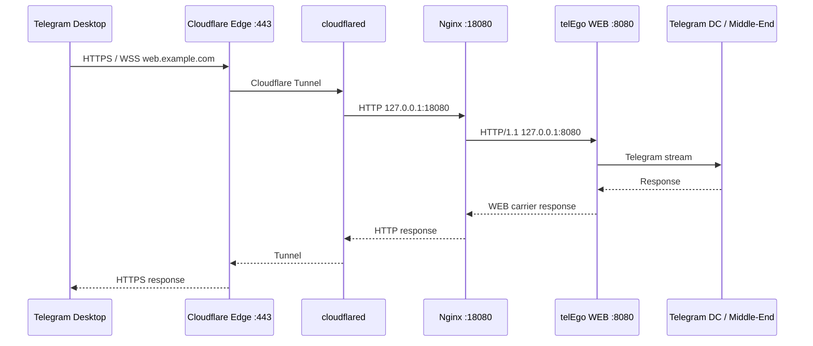

<div align="center">

# Cloudflare Tunnel on OpenWrt

**telEgo WEB Proxy through Cloudflare without exposing WAN TCP/443**

[](https://openwrt.org/)
[](https://developers.cloudflare.com/cloudflare-one/networks/connectors/cloudflare-tunnel/)
[](#3-configure-the-local-nginx-ingress)
[](#sources)

**Cloudflare Edge :443 · outbound Tunnel · Nginx :18080 · telEgo WEB :8080**

[Русский](CLOUDFLARE.md) · [English](CLOUDFLARE_EN.md) · [Documentation](README_EN.md)

</div>

This runbook covers the **complete WEB Proxy path**, not only creation of a Cloudflare Tunnel. At the end, Telegram Desktop connects to a public HTTPS hostname, Cloudflare terminates TLS at its edge, `cloudflared` delivers HTTP to OpenWrt, local Nginx adapts the request for telEgo, and the telEgo WEB frontend remains bound to loopback only.

Cloudflare Tunnel is used here only for WEB Proxy traffic. A direct telEgo MTProto/MTProxy listener remains a separate network path and can continue to use its own public address and port.

> [!IMPORTANT]
> If you **already have a working** `/etc/nginx/conf.d/zz-telego-cloudflare.conf`, do not enable the managed Cloudflare profile on top of it. Both configurations serve the same role and must not own `127.0.0.1:18080` at the same time. A package upgrade must not remove or overwrite your hand-written file.

---

## Request flow



Three local roles matter:

| Address | Owner | Purpose |
|---|---|---|
| `127.0.0.1:8080` | telEgo | private HTTP/1.1 WEB listener |
| `127.0.0.1:18080` | Nginx | Cloudflare-specific ingress for `cloudflared` |
| `127.0.0.1:8090` | Nginx or your site | ordinary-site fallback for requests telEgo classifies as non-carrier traffic |

`cloudflared` should connect to **Nginx on `:18080`**, not directly to telEgo on `:8080`. Nginx implements the required proxy/fallback contract and supplies telEgo with the client address received from Cloudflare.

### Where `telego.locations` fits

`/etc/nginx/snippets/telego.locations` is a generic snippet for a **normal TLS/Nginx deployment**, especially the native shared-port path `telEgo :443 → Nginx TLS :8443 → telEgo WEB :8080`.

Cloudflare ingress is different because it needs `CF-Connecting-IP` handling. The managed Cloudflare profile therefore has its own `location` blocks and **does not include `telego.locations`**.

---

## Fast path

1. telEgo is running, WEB Proxy is enabled, and `127.0.0.1:8080` is listening.
2. `web_proxy.hostname` matches the intended public hostname such as `web.example.com`.
3. Nginx listens on `127.0.0.1:18080`, either through managed `nginx_telego.cloudflare` or an existing hand-written Cloudflare configuration.
4. `cloudflared` is connected to a remotely-managed Tunnel and the connector is `Healthy`.
5. A Published Application maps `web.example.com` to `http://127.0.0.1:18080`.
6. DNS routes the hostname through the Tunnel rather than an `A/AAAA` record directly to the OpenWrt WAN address.
7. Verify `:8080`, `:18080`, Tunnel health, public HTTPS, and finally Telegram Desktop in that order.

---

# 1. Before you begin

You need:

- OpenWrt `25.12.x` with working Internet access;
- `telego-pkg` installed;
- `nginx-telego` and `nginx-ssl`;
- a domain using Cloudflare DNS;
- a dedicated WEB Proxy hostname such as `web.example.com`;
- access to the Cloudflare Dashboard.

Verify the base components:

```sh
apk info telego-pkg
apk info nginx-telego
ls -l /etc/nginx/conf.d/20-telego-core.conf
ls -l /etc/nginx/snippets/telego.locations
```

`nginx-telego` installs the managed ownership/reconciliation stack:

```text
/etc/config/nginx_telego
/etc/init.d/nginx-telego
/usr/libexec/nginx-telego-files
/usr/libexec/nginx-telego-render
/usr/libexec/nginx-telego-reconcile
/usr/share/nginx-telego/ownership.tsv
```

The UCI package name is deliberately `nginx_telego` with an underscore. The APK and init script remain named `nginx-telego`.

All managed ingress profiles are **disabled by default**. Installing or upgrading the package must not automatically claim `18080`, `8443`, `8444`, or replace an existing hand-written Nginx configuration.

---

# 2. Prepare telEgo WEB Proxy

Cloudflare should publish an already-working local WEB frontend.

In LuCI open:

**Services → telEgo → WEB Proxy**

A baseline profile is:

| Setting | Value |
|---|---|
| **Enable WEB Proxy** | `on` |
| **Carrier Mode** | `https-lanes` as a recommended starting point; there is no need to change an existing working mode merely for this guide |
| **Bind Address** | `127.0.0.1:8080` |
| **Hostname** | `web.example.com` |
| **Trusted Proxy CIDRs** | `127.0.0.1/32` |
| **Compatibility Backend** | empty unless a specific compatibility backend is required |
| **WEB Event Loops** | `0` for automatic |

After **Save & Apply** verify:

```sh
/etc/init.d/telego status
netstat -lntp 2>/dev/null | grep ':8080'
```

The expected listener is loopback-only:

```text
127.0.0.1:8080
```

If it is missing, fix telEgo first. Neither Nginx nor Cloudflare can compensate for a WEB listener that is not running.

> [!NOTE]
> `https-lanes` requires public HTTP/2. Cloudflare provides HTTP/2 at the edge. `websocket` and `websocket-lanes` are also supported when the whole path forwards WebSocket Upgrade correctly.

---

# 3. Configure the local Nginx ingress

There are **two mutually exclusive choices**.

## Option A — managed `nginx-telego` profile for a new setup

First make sure an older manual `18080` listener is not already present:

```sh
grep -RnsE 'listen[[:space:]]+([^;[:space:]]*:)?18080([[:space:]]|;)' \
    /etc/nginx/conf.d /etc/nginx/uci.conf 2>/dev/null
```

If this reports your existing `zz-telego-cloudflare.conf`, use **Option B** and do not replace it merely for the sake of using the managed profile.

For a new managed configuration:

```sh
uci set nginx_telego.cloudflare.enabled='1'
uci set nginx_telego.cloudflare.hostname='web.example.com'
uci set nginx_telego.shared.enabled='0'
uci set nginx_telego.fallback.manage='1'
uci commit nginx_telego
/etc/init.d/nginx-telego reload
```

The public apply path is the `nginx-telego` init helper. It invokes the reconciliation engine, which validates ownership, repairs safe package drift, asks the renderer for the desired generated state, performs a final `nginx -t`, and reloads Nginx only after the whole managed filesystem state is known-good.

Before commit, the managed Cloudflare profile verifies that:

- WEB Proxy is enabled;
- the hostname matches `telego.web_proxy.hostname`;
- the WEB listener is `127.0.0.1:8080`;
- `127.0.0.1/32` is in the trusted proxy CIDRs;
- `18080` and, when managed fallback is enabled, `8090` are not already owned by another configuration;
- the complete resulting Nginx configuration passes `nginx -t`.

Managed files are role-separated:

```text
/etc/nginx/conf.d/20-telego-core.conf       # package-owned core maps/upstream
/etc/nginx/conf.d/80-telego-ingress.conf    # generated while a managed profile is enabled
/etc/nginx/conf.d/85-telego-fallback.conf   # generated when fallback.manage=1
```

Generated files carry both the nginx-telego ownership marker and a role marker. A regular file on one of the reserved generated paths without the correct markers is treated as foreign and is not overwritten.

The old alpha `/etc/nginx/conf.d/zz-telego-managed.conf` is not a migration input and is never removed automatically. If it remains from an early test build, inspect its origin/content first and remove it manually before adopting the P7 baseline.

If rendering, final `nginx -t`, or Nginx reload fails, the reconciler restores the managed filesystem to its pre-transaction state.

Verify the result without bypassing the reconciler:

```sh
/usr/libexec/nginx-telego-files validate
/usr/libexec/nginx-telego-files status
/usr/sbin/nginx -T -c /etc/nginx/uci.conf 2>&1 | \
    grep -nE '18080|8090|telego_cf_client_ip|telego_web'
netstat -lntp 2>/dev/null | grep -E ':18080|:8090|:8080'
```

If `8090` is already used by your own local site, keep that site and configure:

```sh
uci set nginx_telego.fallback.manage='0'
uci commit nginx_telego
/etc/init.d/nginx-telego reload
```

In that mode the package keeps the managed ingress but removes its own `85-telego-fallback.conf` and leaves the external `8090` owner untouched.

## Option B — existing hand-written Cloudflare configuration

If `/etc/nginx/conf.d/zz-telego-cloudflare.conf` is already tested and working, **keep it**.

Make sure both managed profiles remain disabled:

```sh
uci set nginx_telego.cloudflare.enabled='0'
uci set nginx_telego.shared.enabled='0'
uci commit nginx_telego
/etc/init.d/nginx-telego reload
```

With both profiles disabled, reconciliation removes only current nginx-telego-owned generated ingress/fallback state. It does not touch your `zz-telego-cloudflare.conf`, old alpha paths outside the registry, or another foreign regular `.conf` file.

A hand-written Cloudflare ingress should provide the same behavior as the managed profile:

- listen only on `127.0.0.1:18080`;
- proxy to `http://telego_web` (`127.0.0.1:8080`);
- convert `CF-Connecting-IP` into the trusted client address supplied to telEgo;
- forward Upgrade/Connection for WebSocket;
- route status `418` to the ordinary site;
- route status `419` through a sanitized fallback with carrier credentials removed.

### Check `18080`

```sh
curl -i -H 'Host: web.example.com' http://127.0.0.1:18080/
```

A normal `curl` request is not a Telegram WEB carrier. telEgo may therefore return a classification status that Nginx sends to the `8090` fallback. For this check, the important result is that `18080` accepts the connection and the chain `18080 → 8080 → fallback` is intact.

---

# 4. Install `cloudflared`

Official OpenWrt 25.12 packages use `apk`:

```sh
apk update
apk add cloudflared luci-app-cloudflared
```

For a Russian LuCI interface, install the translation package when available:

```sh
apk add luci-i18n-cloudflared-ru
```

Verify:

```sh
cloudflared --version
apk info cloudflared
```

---

# 5. Create and connect the Tunnel

Use a **remotely-managed Tunnel**.

In the Cloudflare Dashboard:

1. Open **Networking → Tunnels**.
2. Select **Create Tunnel**.
3. Give it a descriptive name such as `telego-web`.
4. Create the Tunnel.
5. Obtain the connector token from the installation command / **Add a replica** flow.

`Inactive` is normal before the first connector comes online.

On OpenWrt open:

**VPN → Cloudflare Zero Trust Tunnel → Configuration**

Use:

| Field | Value |
|---|---|
| Enable | `on` |
| Token | token for the Tunnel |
| Config file path | empty for a remotely-managed Tunnel |
| Certificate of Origin | empty |
| Log level | `info` |

Select **Save & Apply** and verify:

```sh
/etc/init.d/cloudflared status
logread -e cloudflared | tail -n 80
```

The Dashboard should show the connector as `Healthy`.

> [!IMPORTANT]
> `Healthy` confirms the OpenWrt connector can reach Cloudflare. It does **not** prove that local Nginx `:18080` or telEgo `:8080` is healthy.

---

# 6. Network and firewall

The router itself establishes an **outbound** connection to Cloudflare. Tunnel transports use outbound port `7844`: UDP for QUIC and TCP for HTTP/2.

A standard OpenWrt firewall already permits the router itself to access the Internet, so you normally do not need:

- a WAN port forward;
- an inbound TCP/443 rule for WEB Proxy;
- an inbound TCP/7844 or UDP/7844 rule.

If you deliberately restrict **outbound** router traffic, allow `cloudflared` TCP/UDP `7844` according to current Cloudflare guidance.

| Transport | Direction |
|---|---|
| QUIC | OpenWrt → Cloudflare UDP/7844 |
| HTTP/2 | OpenWrt → Cloudflare TCP/7844 |

Keep protocol selection at `auto` unless you have a specific reason to force one transport.

---

# 7. Published Application

Open the Tunnel in the Dashboard and add a Published Application / hostname route.

Example:

| Field | Value |
|---|---|
| Hostname | `web.example.com` |
| Service type | `HTTP` |
| Service URL | `http://127.0.0.1:18080` |

Use exactly:

```text
http://127.0.0.1:18080
```

### Why the local service uses HTTP instead of HTTPS

Public HTTPS terminates at Cloudflare Edge. Traffic from Cloudflare to `cloudflared` is already protected by the Tunnel. `cloudflared` then hands the request to local Nginx over the router's own loopback interface.

Adding another TLS layer between two local processes on `127.0.0.1` does not add a useful external trust boundary and would require another certificate and TLS handshake on OpenWrt.

---

# 8. DNS

For a Published Application, Cloudflare creates the Tunnel route/DNS association for the hostname. In a Full DNS setup this is normally a CNAME-like association to the Tunnel target managed by Cloudflare.

The WEB hostname should not simultaneously use `A/AAAA` records that point directly at the OpenWrt WAN address.

Check:

```sh
nslookup web.example.com
```

The key property is that external clients reach Cloudflare, not the router's WAN IP directly.

---

# 9. Final verification by layer

Do not start troubleshooting in Telegram Desktop. Verify the chain from the inside out.

### 1. telEgo WEB listener

```sh
netstat -lntp 2>/dev/null | grep ':8080'
/etc/init.d/telego status
```

### 2. Nginx ingress

```sh
/usr/sbin/nginx -t -c /etc/nginx/uci.conf
netstat -lntp 2>/dev/null | grep ':18080'
curl -i -H 'Host: web.example.com' http://127.0.0.1:18080/
```

### 3. Cloudflare connector

```sh
/etc/init.d/cloudflared status
logread -e cloudflared | tail -n 80
```

Dashboard: `Healthy`.

### 4. Public HTTPS

```sh
curl -I https://web.example.com/
```

Your fallback site may legitimately return `200`, `204`, `301`, `302`, or another response your site expects. A `502/503` usually means the edge/Tunnel was reached but the local service path still needs attention.

### 5. Telegram Desktop

After the first four layers are healthy, test WEB Proxy in Telegram Desktop and inspect **Services → telEgo → Status**:

- Active WEB Sessions;
- Active WEB Streams;
- Carrier Retries;
- Backpressure Events.

---

# 10. Reboots and upgrades

`cloudflared`, Nginx, and telEgo are managed by OpenWrt init/procd.

`nginx-telego` is not another daemon. Its init helper runs the reconciliation engine for the opt-in Nginx state stored in:

```text
/etc/config/nginx_telego
```

Reconciliation repairs safe drift in package-owned core/snippet files and manages only the current generated `80-telego-ingress.conf` / `85-telego-fallback.conf` paths. Old alpha paths outside the registry are not removed automatically.

Managed profiles remain `off` unless you explicitly enable them. An existing administrator-owned Nginx file must not become managed just because the APK was upgraded.

After a major update, a useful quick check is:

```sh
/etc/init.d/telego status
/etc/init.d/nginx status
/etc/init.d/cloudflared status
/usr/libexec/nginx-telego-files status
/usr/sbin/nginx -t -c /etc/nginx/uci.conf
```

---

# 11. Troubleshooting

| Symptom | Check first |
|---|---|
| No `127.0.0.1:8080` | telEgo service, WEB Proxy `enabled`, hostname, telEgo logs |
| Reconciler reports an `18080` conflict | an existing manual Cloudflare ingress is already present; keep managed mode off or deliberately replace the manual configuration |
| Reconciler reports hostname mismatch | `nginx_telego.cloudflare.hostname` and `telego.web_proxy.hostname` must match |
| `nginx -t` fails | another Nginx file or the generated candidate is invalid; reconciliation rolls managed state back instead of committing a broken tree |
| `nginx-telego-files status` reports `foreign` | the reserved path exists but ownership/role markers do not prove it belongs to nginx-telego; inspect it before changing anything |
| Tunnel is `Inactive` | service/token/DNS/outbound 7844 |
| Tunnel is `Healthy` but public request returns `502` | check `18080`, then `8080`, then fallback `8090` |
| Browser works but Telegram does not | hostname/carrier/trusted proxy, Telegram profile/link, WEB runtime metrics |
| WebSocket carrier does not work | Upgrade headers, Cloudflare WebSocket support, Nginx `proxy_http_version 1.1` |
| Managed profile no longer applies | check for another listener on the same port and whether `8090` is already occupied |

### Quick diagnostic block

```sh
/etc/init.d/telego status
/etc/init.d/nginx status
/etc/init.d/cloudflared status

/usr/libexec/nginx-telego-files status
netstat -lntp 2>/dev/null | grep -E ':8080|:8090|:18080'

/usr/sbin/nginx -T -c /etc/nginx/uci.conf 2>&1 | \
    grep -nE 'telego|18080|8090|8080|CF-Connecting-IP'

logread -e telego | tail -n 80
logread -e cloudflared | tail -n 80
```

---

## Sources

- [Cloudflare Tunnel — overview and setup](https://developers.cloudflare.com/cloudflare-one/networks/connectors/cloudflare-tunnel/)
- [Create a remotely-managed Tunnel](https://developers.cloudflare.com/cloudflare-one/networks/connectors/cloudflare-tunnel/get-started/create-remote-tunnel/)
- [Published applications / routing to a Tunnel](https://developers.cloudflare.com/cloudflare-one/networks/connectors/cloudflare-tunnel/routing-to-tunnel/)
- [Cloudflare Tunnel configuration](https://developers.cloudflare.com/tunnel/configuration/)
- [Cloudflare Tunnel firewall requirements](https://developers.cloudflare.com/cloudflare-one/connections/connect-networks/deploy-tunnels/tunnel-with-firewall/)
- [OpenWrt Nginx](https://openwrt.org/docs/guide-user/services/webserver/nginx)
- [telEgo WEB proxy — pinned upstream design](https://github.com/Scratch-net/telego/blob/d9e74017e5f6c8ede4e3ef633646b15ac26abb30/docs/web-proxy.md)

---

[← Domain and DNS](DOMAIN_EN.md) · [Documentation](README_EN.md) · [Русский →](CLOUDFLARE.md)
