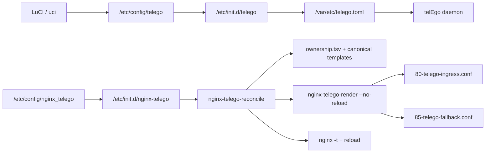

# Конфигурация telEgo на OpenWrt

[**Русский**](CONFIGURATION.md) · [English](CONFIGURATION_EN.md)

`telEgo-openwrt` использует OpenWrt UCI как единственный пользовательский source of truth:

```text
/etc/config/telego
```

Init script преобразует UCI в runtime TOML:

```text
/var/etc/telego.toml
```

Generated TOML принадлежит `telego:telego`, имеет mode `0600` и атомарно пересоздаётся при применении конфигурации. **Не редактируйте его вручную**: при следующем reload победит UCI.

Для Nginx-интеграции есть отдельный opt-in UCI package:

```text
/etc/config/nginx_telego
```

Он управляет только managed Nginx ingress-профилями и по умолчанию ничего не включает.

---

## Архитектура конфигурации



Два контура намеренно разделены. `telego` описывает runtime самого proxy daemon. `nginx_telego` описывает только Nginx edge вокруг WEB Proxy. Reconciliation engine **не меняет** `/etc/config/telego`; он проверяет требуемый telEgo contract и отказывается применять несовместимый desired state. Renderer является внутренним компонентом generated state, а не пользовательским apply-path.

---

# LuCI

Откройте:

```text
Services → telEgo
```

Страница содержит вкладки **Configuration** и **Status**.

# 1. MTProxy

## Enable MTProxy — `general.enabled`

Управляет всем procd instance telEgo. Если switch выключен, daemon не запускается, поэтому вместе с MTProxy исчезают WEB listener и Middle-End runtime этого процесса.

Default: `off`.

## Listen Address — `general.bind_to`

Default:

```text
0.0.0.0:443
```

Это публичный TCP listener telEgo. Для прямого MTProxy можно использовать другой порт. Для native shared-port WEB deployment telEgo должен владеть публичным `:443`.

## Log Level — `general.log_level`

`trace`, `debug`, `info`, `warn`, `error`. Для обычной эксплуатации используйте `info`.

## Advanced MTProxy controls

Эти параметры теперь доступны в LuCI и напрямую соответствуют pinned upstream:

| Поле | UCI | Default | Назначение |
|---|---|---:|---|
| Accept Incoming PROXY Protocol | `proxy_protocol` | `0` | Доверять входящему PROXY protocol только от контролируемого TCP proxy |
| Max Connections per IP | `max_connections_per_ip` | `100` | Защита от connection flood; `0` отключает limit |
| Max IPs per User | `max_ips_per_user` | `10` | Ограничение количества IP на secret; `0` отключает |
| IP Block Timeout | `ip_block_timeout` | `5m` | Время блокировки вытесненного IP |
| Handshake Timeout | `handshake_timeout` | `5s` | Максимальное время authentication handshake |
| Clock Sync URL | `clock_sync_url` | empty | Однократная коррекция сильного clock skew по HTTP `Date` |

`proxy_protocol` не следует включать на открытом Internet listener без доверенной сетевой границы перед telEgo.

---

# 2. TLS Fronting / FakeTLS

## Mask Domain — `tls_fronting.mask_host`

Default:

```text
www.google.com
```

Используется для FakeTLS SNI/certificate-profile behavior. В обычном direct MTProxy deployment это может быть внешний mask host. В **native shared-port WEB deployment** значение должно совпадать с hostname реального WEB TLS certificate, потому что обычный TLS splice возвращается на локальный Nginx.

## Mask Port — `mask_port`

Default `443`.

## Certificate Host / Port — `cert_host`, `cert_port`

Опциональный источник certificate chain для FakeTLS. Поля принимают hostname **или IP**, поэтому local shared-port topology корректно использует:

```text
Certificate Host = 127.0.0.1
Certificate Port = 8444
```

## Fallback Host / Port — `splice_host`, `splice_port`

Куда telEgo передаёт TLS-соединение, которое не оказалось authenticated MTProxy.

Native shared-port topology:

```text
Fallback Host = 127.0.0.1
Fallback Port = 8443
Fallback PROXY Protocol = v2
```

## Fake Certificate Size — `fake_cert_size`

- `0` — automatic matching, рекомендуемый default;
- explicit override допускается только `256..16384` bytes.

LuCI проверяет этот диапазон до сохранения.

## Mask SNI Safelist

Exact hostnames, которым разрешён SNI-following probe forwarding. Пустой список отключает эту функцию.

## DRS и Split TLS

Оба включены по умолчанию и соответствуют upstream anti-fingerprint shaping. Менять их без конкретной причины обычно не нужно.

---

# 3. Users / Secrets

Каждая запись **Users** становится элементом `[secrets]` в runtime TOML.

| Поле | Требование |
|---|---|
| Username | UCI-safe имя |
| Secret | ровно 32 hexadecimal characters |

Кнопка **Generate** создаёт 16 random bytes через Web Crypto в браузере и отображает их как 32 hex characters.

> [!IMPORTANT]
> Secret — credential. Не публикуйте `uci show telego`, `/var/etc/telego.toml` или screenshots, содержащие реальные secrets.

---

# 4. WEB Proxy

WEB Proxy — private HTTP frontend Telegram Desktop. Он **не завершает TLS самостоятельно**. Перед ним должен быть Nginx, Cloudflare или другой reviewed edge, который выполняет полный fallback contract.

## Enable WEB Proxy — `web_proxy.enabled`

Default `off`.

## Carrier Mode — `carrier`

| Значение | Смысл |
|---|---|
| `https` | один serialized fetch/long-poll carrier |
| `https-lanes` | отдельная HTTP lane на Telegram stream |
| `websocket` | один multiplexed WebSocket |
| `websocket-lanes` | отдельный WebSocket на stream |

OpenWrt default — `https-lanes`, что соответствует conservative recommendation pinned upstream для нового deployment с public HTTP/2. Это не утверждение, что этот mode всегда быстрее остальных.

## Bind Address — `bind_to`

Default:

```text
127.0.0.1:8080
```

Это private HTTP/1.1 listener. Не публикуйте его напрямую в WAN.

## Hostname — `hostname`

Обязателен, когда WEB Proxy включён. Должен совпадать с public TLS hostname или Cloudflare Published Application.

## Trusted Proxy CIDRs

Default:

```text
127.0.0.1/32
```

Только эти Nginx/proxy peers могут сообщать telEgo forwarded client IP.

## Compatibility Backend — `backend`

Теперь доступен в LuCI как advanced option.

Пустое значение — нормальный и предпочтительный path: WEB streams входят напрямую в shared MTProxy core внутри процесса без дополнительного TCP/Unix hop.

Explicit backend нужен только для compatibility topology, например:

```text
127.0.0.1:9443
```

или supported local Unix socket.

## WEB Event Loops — `num_event_loops`

`0` = automatic gnet event-loop count. Меняйте только после измерений.

---

# 5. Nginx deployment profiles

`nginx-telego` устанавливает финальный managed layout P6/P7:

```text
/etc/nginx/conf.d/20-telego-core.conf
/etc/nginx/snippets/telego.locations
/usr/share/nginx-telego/ownership.tsv
/usr/libexec/nginx-telego-files
/usr/libexec/nginx-telego-render
/usr/libexec/nginx-telego-reconcile
```

`20-telego-core.conf` создаёт общий `telego_web → 127.0.0.1:8080` и необходимые Nginx maps. Его canonical repair source хранится в `/usr/share/nginx-telego/templates/20-telego-core.conf`.

`telego.locations` — reusable HTTP/WebSocket/fallback snippet для обычного Nginx TLS server. Он **не является MTProto handler**. Direct HTTPS подключает его на Nginx `:18443`, а Native Shared-Port — на приватном TLS listener `:8443` после того, как telEgo отделил MTProxy от обычного TLS.

Opt-in managed profiles используют:

```text
/etc/config/nginx_telego
/etc/nginx/conf.d/80-telego-ingress.conf
/etc/nginx/conf.d/85-telego-fallback.conf
```

`80-telego-ingress.conf` существует только при включённом Direct HTTPS, Cloudflare или Native Shared-Port managed ingress. `85-telego-fallback.conf` существует только при включённом managed profile и `fallback.manage=1`. Generated files содержат общий marker `nginx-telego` и marker конкретной роли, поэтому скопированный на неправильный reserved path файл не принимается в ownership молча.

Все три managed profiles выключены default и **взаимоисключающие**.

Для всех managed profiles поле hostname имеет один контракт: пустое значение наследует `telego.web_proxy.hostname`; если override задан явно, он должен в точности совпадать с WEB hostname. Это позволяет хранить hostname в одном месте и при этом оставляет явный override для проверяемых миграций.

Старые alpha-пути `/etc/nginx/conf.d/telego.conf` и `/etc/nginx/conf.d/zz-telego-managed.conf` не входят в ownership registry, не мигрируются и не удаляются автоматически. Если они остались на тестовой системе, сначала проверьте их происхождение/содержимое и удалите вручную перед переходом на baseline P7.

Точная state machine и правила rollback описаны в **[Nginx file ownership и reconciliation](NGINX_FILES.md)**.

## 5.1 Direct HTTPS profile

Direct HTTPS оставляет LAN TCP/443 за uhttpd/LuCI, а только входящий WAN TCP/443 перенаправляет firewall4 в отдельный Nginx TLS backend:

```text
LAN :443 ───────────────────────────────> uhttpd / LuCI

WAN :443 → firewall.telego_direct_https
                     ↓ DNAT
               Nginx :18443
                     ↓
             telego.locations
                     ↓
             telEgo WEB :8080
```

Профиль требует:

- `telego.general.enabled=1`;
- MTProxy listener **не на TCP/443** (например, `0.0.0.0:9443`), потому что WAN/443 целиком принадлежит WEB/Nginx;
- `telego.web_proxy.enabled=1`;
- WEB bind `127.0.0.1:8080`;
- совпадающий WEB/ingress hostname;
- `127.0.0.1/32` в trusted proxy CIDRs;
- настоящий certificate/key;
- ровно одну активную firewall zone с именем `wan`;
- WAN input policy не `ACCEPT`;
- отсутствие чужого redirect, который уже владеет WAN TCP/443;
- отсутствие чужого WAN redirect или input `ACCEPT` rule, публикующего зарезервированный backend TCP/18443.

Nginx генерирует listeners `0.0.0.0:18443` и `[::]:18443`; firewall rule имеет `family=any`. Поэтому опубликованный AAAA поддерживается той же схемой, но IPv6 необходимо проверять отдельно на реальном WAN.

Менеджер Direct HTTPS **не открывает MTProxy-порт**. Если вы перенесли MTProxy, например, на `:9443` и он должен быть публичным, создайте обычное WAN TCP/9443 allow-rule средствами firewall4/LuCI самостоятельно. Ownership `nginx-telego-firewall` ограничен WEB redirect WAN TCP/443 → :18443.

Минимальная настройка предполагает, что telEgo/WEB contract уже сохранён:

```sh
uci set telego.general.enabled='1'
uci set telego.general.bind_to='0.0.0.0:9443'
uci set telego.web_proxy.enabled='1'
uci set telego.web_proxy.bind_to='127.0.0.1:8080'
uci set telego.web_proxy.hostname='web.example.com'

uci set nginx_telego.direct_https.enabled='1'
uci set nginx_telego.direct_https.hostname='web.example.com'
uci set nginx_telego.direct_https.certificate='/etc/ssl/acme/web.example.com.fullchain.crt'
uci set nginx_telego.direct_https.certificate_key='/etc/ssl/acme/web.example.com.key'
uci set nginx_telego.cloudflare.enabled='0'
uci set nginx_telego.shared.enabled='0'
uci commit nginx_telego
/etc/init.d/nginx-telego reload
```

Apply-path сначала выполняет firewall safety check, затем Nginx reconciliation, и только после успешного `nginx -t` устанавливает package-owned WAN/443 redirect. При переключении с Direct HTTPS порядок обратный: redirect удаляется **до** удаления listener `:18443`.

Read-only проверки:

```sh
/usr/libexec/nginx-telego-firewall status
/usr/libexec/nginx-telego-firewall preflight
/usr/libexec/nginx-telego-cert status
/usr/libexec/nginx-telego-cert preflight
```

Сертификат через OpenWrt ACME/DNS-01: **[TLS-сертификат / ACME DNS-01](TLS_CERTIFICATE.md)**.

Финальная LAN/WAN/HTTP2/Telegram/reboot/rollback проверка: **[Проверка Direct HTTPS](DIRECT_HTTPS_TEST.md)**.

## 5.2 Cloudflare profile

Подробная инструкция: **[Cloudflare Tunnel](CLOUDFLARE.md)**.

Кратко:

```sh
uci set nginx_telego.cloudflare.enabled='1'
uci set nginx_telego.cloudflare.hostname='web.example.com'
uci set nginx_telego.direct_https.enabled='0'
uci set nginx_telego.shared.enabled='0'
uci commit nginx_telego
/etc/init.d/nginx-telego reload
```

Он создаёт loopback ingress `127.0.0.1:18080`, восстанавливает client IP из `CF-Connecting-IP` и реализует `418/419` fallback contract.

Cloudflare profile **не использует `telego.locations`**, потому что ему нужна Cloudflare-specific client-IP обработка.

## 5.3 Native shared-port profile

Эта схема позволяет telEgo MTProxy и WEB Proxy разделять публичный TCP/443:

```text
                    ┌─ authenticated MTProxy ──> Telegram
                    │
Internet → telEgo :443
                    │
                    └─ ordinary TLS
                           ↓ PROXY v2
                    Nginx TLS :8443
                           ↓ decrypted HTTP/1.1
                    telego.locations
                           ↓
                    telEgo WEB :8080
```

Отдельный control path:

```text
telEgo certificate fetcher → Nginx TLS :8444
```

### Требования

- public `:443` принадлежит telEgo;
- WEB hostname имеет настоящий TLS certificate и private key на OpenWrt;
- `mask_host` = WEB/certificate hostname;
- WEB listener = `127.0.0.1:8080`;
- `trusted_proxy_cidrs` содержит `127.0.0.1/32`;
- Nginx private ports `8443`, `8444` и managed fallback `8090` свободны;
- для `https-lanes` Nginx должен иметь HTTP/2 support; стандартный OpenWrt `nginx-ssl` 25.12 включает HTTP/2 default.

### Настройка telEgo

Пример для `proxy.example.com`:

```sh
uci set telego.general.bind_to='0.0.0.0:443'

uci set telego.tls_fronting.mask_host='proxy.example.com'
uci set telego.tls_fronting.cert_host='127.0.0.1'
uci set telego.tls_fronting.cert_port='8444'
uci set telego.tls_fronting.splice_host='127.0.0.1'
uci set telego.tls_fronting.splice_port='8443'
uci set telego.tls_fronting.splice_proxy_protocol='2'

uci set telego.web_proxy.enabled='1'
uci set telego.web_proxy.hostname='proxy.example.com'
uci set telego.web_proxy.bind_to='127.0.0.1:8080'
uci -q delete telego.web_proxy.trusted_proxy_cidrs
uci add_list telego.web_proxy.trusted_proxy_cidrs='127.0.0.1/32'

uci commit telego
/etc/init.d/telego reload
```

### Настройка managed Nginx

Пакет **не выпускает сертификат**. Укажите пути к уже существующим certificate/key:

```sh
uci set nginx_telego.shared.enabled='1'
uci set nginx_telego.shared.hostname='proxy.example.com'
uci set nginx_telego.shared.certificate='/etc/ssl/example/fullchain.pem'
uci set nginx_telego.shared.certificate_key='/etc/ssl/example/privkey.pem'
uci set nginx_telego.cloudflare.enabled='0'
uci set nginx_telego.fallback.manage='1'
uci commit nginx_telego

/etc/init.d/nginx-telego reload
```

Reconciler проверяет ownership/drift, renderer валидирует telEgo contract, конфликты портов и readability certificate files, а outer transaction выполняет финальный `nginx -t` до reload. Ошибка render, validation или reload восстанавливает managed files в pre-transaction состояние.

Проверка:

```sh
/usr/libexec/nginx-telego-files status
/usr/sbin/nginx -T -c /etc/nginx/uci.conf 2>&1 | \
    grep -nE '8443|8444|8090|telego.locations|telego_web'
netstat -lntp 2>/dev/null | grep -E ':443|:8080|:8090|:8443|:8444'
```

> [!IMPORTANT]
> Не включайте native shared-port только ради эксперимента на уже работающем production router. Он намеренно меняет владельца public `:443`, mask/certificate topology и TLS splice path. Cloudflare deployment можно продолжать использовать независимо.

---

# 6. Telegram Middle-End

Middle-End (ME) — **opt-in outbound transport** после authentication. Default `off`, поэтому обновление пакета сохраняет привычный direct Telegram DC route.

## Что меняется при включении

ME поддерживает persistent gnet links к Telegram Middle-End endpoints, собственные bounded queues, artifact refresh, STUN/NAT discovery и автоматический direct fallback, когда active generation не готова.

Перед включением убедитесь, что router:

- может получить Telegram artifacts по HTTPS;
- может подключаться к signed ME endpoints;
- может использовать UDP STUN для private direct sockets либо имеет корректный `nat_ip` override;
- имеет достаточно file descriptors и памяти.

## Поля LuCI

| Поле | Default | Проверка |
|---|---:|---|
| Enable Middle-End | `off` | включается только оператором |
| Proxy Tag | empty | empty или ровно 32 hex |
| SOCKS5 Proxy | empty | optional ME egress |
| SOCKS5 Username / Password | empty | credentials SOCKS5 |
| Artifact Proxy | empty | optional proxy только для artifacts |
| STUN NAT IP | empty | literal IP; обычно не нужен |
| Max Connections | `0` | `0` или `1..10000` |
| Queue Budget (MB) | `0` | `0` или `2..32` |

`0` для max connections означает upstream default `10000`. Для queue budget `0` сохраняет upstream defaults: бюджеты request/frontend-input остаются примерно `32 MiB` каждый, а общий response/frontend-output pool — около `66 MiB` на 64-битной сборке. Явное `N` (`2..32`) задаёт `N MiB` для request/frontend-input и общий response/output pool `2×N MiB`, включая processing reserve.

Proxy tag **не обязателен** для включения Middle-End; если Telegram его не выдавал, оставьте поле пустым.

## Безопасный запуск

Сначала включите metrics и наблюдение. Затем:

```sh
uci set telego.middle_end.enabled='1'
uci commit telego
/etc/init.d/telego reload
```

Проверяйте вкладку **Status** и `logread -e telego`.

Для rollback:

```sh
uci set telego.middle_end.enabled='0'
uci commit telego
/etc/init.d/telego reload
```

После отключения новые authenticated connections снова используют обычный direct DC path.

---

# 7. Performance

| LuCI | UCI | Default | Guidance |
|---|---|---:|---|
| TCP Buffer (KB) | `tcp_buffer_kb` | `128` | менять только по измерениям |
| Event Loops | `num_event_loops` | `0` | automatic |
| IP Preference | `prefer_ip` | `prefer-ipv4` | зависит от качества IPv4/IPv6 |
| Idle Timeout | `idle_timeout` | `5m` | не делайте слишком коротким |
| Max Write Buffer (MB) | `max_write_buffer_mb` | `0` | upstream derived default |
| Client Silence Close | `client_silence_close` | `0s` | diagnostic recovery option, default disabled |

---

# 8. Generic Upstream SOCKS5

`upstream.socks5` относится к обычным Telegram DC connections и отделён от Middle-End-specific SOCKS5 options.

Оставьте пустым для direct routing.

---

# 9. Metrics and Diagnostics

Default endpoint:

```text
127.0.0.1:9090/metrics
```

LuCI Status намеренно разрешает rpcd читать metrics только с literal loopback `127.0.0.1` или `::1`, чтобы status RPC нельзя было превратить в произвольный HTTP fetcher.

`Enable Diagnostics` открывает private runtime profile endpoints на том же loopback metrics server. Не публикуйте их через Nginx, Cloudflare или WAN.

Проверка metrics:

```sh
uclient-fetch -q -T 2 -O - http://127.0.0.1:9090/metrics | head
```

---

# 10. Status

Вкладка **Status** теперь показывает три группы.

## Service and MTProxy

- service state / PID / uptime;
- active connections;
- active / tracked / blocked IPs;
- received / sent traffic.

## WEB Proxy Runtime

- enabled state и carrier;
- active WEB sessions/streams/WebSockets;
- active backend dials;
- pending bytes/items;
- sessions created/closed;
- carrier retries;
- backpressure events.

## Middle-End Runtime

- enabled state;
- admission readiness;
- repair state;
- physical links;
- active bindings;
- active slot repairs / failures;
- artifact applied/pending state;
- artifact refresh failures.

Эти значения приходят из локального Prometheus endpoint telEgo через read-only rpcd backend.

---

# 11. UCI → TOML reference

| UCI section | Основные options | Runtime section |
|---|---|---|
| `general` | `bind_to`, `log_level`, limits/timeouts | `[general]` |
| `tls_fronting` | mask/cert/splice/DRS/Split TLS | `[tls-fronting]` |
| `secret` | `name`, `secret` | `[secrets]` map |
| `web_proxy` | enabled/carrier/bind/hostname/backend/trusted/loops | `[web-proxy]` |
| `middle_end` | enabled/tag/proxies/NAT/limits | `[middle-end]` |
| `performance` | buffers/loops/IP/timeouts | `[performance]` |
| `upstream` | `socks5` | `[upstream]` |
| `metrics` | bind/path/diagnostics | `[metrics]` |

Проверить generated runtime без публикации secrets:

```sh
ls -l /var/etc/telego.toml
/etc/init.d/telego status
ubus call telego status
```

---

# 12. Reload semantics

`Save & Apply` меняет UCI и перестраивает procd instance. Если runtime TOML изменился, процесс перезапускается; listener/secrets/WEB/ME topology не считаются hot-reload внутри уже работающего процесса.

`nginx_telego` применяется отдельно:

```sh
/etc/init.d/nginx-telego reload
```

Init helper запускает `nginx-telego-reconcile`. Reconciliation сериализует изменения lock'ом, чинит безопасный package drift, делегирует renderer генерацию с отключённым reload, выполняет финальный `nginx -t`, а затем reload'ит Nginx только если итоговый managed filesystem действительно изменился. Ошибки renderer, final validation и reload приводят к rollback filesystem state.

При выключенных managed profiles `nginx-telego` удаляет только собственные generated files и не затрагивает administrator-owned Nginx files.

---

## Источники

- [Pinned telEgo configuration example](https://github.com/Scratch-net/telego/blob/d9e74017e5f6c8ede4e3ef633646b15ac26abb30/config.example.toml)
- [Pinned telEgo WEB Proxy design](https://github.com/Scratch-net/telego/blob/d9e74017e5f6c8ede4e3ef633646b15ac26abb30/docs/web-proxy.md)
- [Pinned Telegram Middle-End design](https://github.com/Scratch-net/telego/blob/d9e74017e5f6c8ede4e3ef633646b15ac26abb30/docs/middle-end.md)
- [OpenWrt Nginx](https://openwrt.org/docs/guide-user/services/webserver/nginx)

[← Документация](README.md) · [TLS-сертификат](TLS_CERTIFICATE.md) · [Проверка Direct HTTPS](DIRECT_HTTPS_TEST.md) · [Cloudflare Tunnel](CLOUDFLARE.md) · [English →](CONFIGURATION_EN.md)
