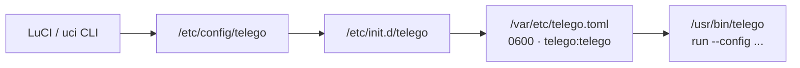
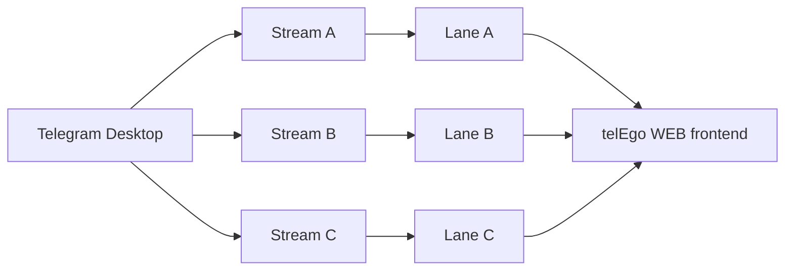
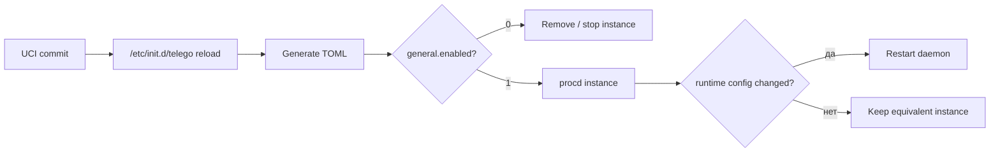

# Конфигурация и UX-гайд LuCI

[**Русский**](CONFIGURATION.md) · [English](CONFIGURATION_EN.md)

`telEgo-openwrt` настраивается через OpenWrt UCI:

```text
/etc/config/telego
```

Init script procd преобразует UCI в generated runtime file:

```text
/var/etc/telego.toml
```

**Не редактируйте generated TOML вручную.** Он перестраивается из UCI, атомарно заменяется, принадлежит `telego:telego` и имеет mode `0600`.

> [!IMPORTANT]
> Этот документ одновременно является field reference и пользовательским UX-гайдом. Авторитетные defaults находятся в `package/telego-pkg/files/config/telego`, mapping UCI→TOML — в `package/telego-pkg/files/init.d/telego`, а видимые поля LuCI — в `package/luci-app-telego/htdocs/resources/view/telego/config.js`.

## Поток конфигурации



## UCI → TOML bridge: один source of truth

Администратор OpenWrt работает с UCI; upstream telEgo ожидает TOML. Init layer связывает эти два мира.

<table>
<tr>
<th width="50%">OpenWrt source — <code>/etc/config/telego</code></th>
<th width="50%">Generated runtime — <code>/var/etc/telego.toml</code></th>
</tr>
<tr>
<td valign="top"><pre><code>config general 'general'
    option enabled '1'
    option bind_to '0.0.0.0:443'
    option log_level 'info'

config tls_fronting 'tls_fronting'
    option mask_host 'www.google.com'
    option enable_drs '1'
    option enable_split_tls '1'

config secret 'alice'
    option name 'alice'
    option secret '0123456789abcdef0123456789abcdef'

config secret 'bob'
    option name 'bob'
    option secret 'fedcba9876543210fedcba9876543210'</code></pre></td>
<td valign="top"><pre><code>[general]
bind-to = "0.0.0.0:443"
log-level = "info"

[tls-fronting]
mask-host = "www.google.com"
enable-drs = true
enable-split-tls = true

[secrets]
"alice" = "0123456789abcdef0123456789abcdef"
"bob" = "fedcba9876543210fedcba9876543210"</code></pre></td>
</tr>
</table>

Runtime file сначала создаётся во temporary path, затем получает owner `telego:telego`, mode `0600` и атомарно перемещается на место.

> [!TIP]
> Считайте `/etc/config/telego` **базой настроек**, а `/var/etc/telego.toml` — **скомпилированным runtime artifact**. Если они расходятся, при следующем reload победит UCI.

---

# LuCI: пошаговая настройка

Откройте:

```text
Services → telEgo
```

Страница содержит configuration и live status view. Разделы ниже идут в текущем порядке LuCI и объясняют не только mapping полей, но и когда их действительно стоит менять.

## 1. MTProxy

### Enable MTProxy — `general.enabled`

| Параметр | Что делает | Практическая ценность |
|---|---|---|
| **Enable MTProxy** | Управляет созданием procd instance telEgo | Одним switch запускает/останавливает весь runtime, включая WEB listener этого процесса |

Default: `off`.

При выключенном flag daemon telEgo не поддерживается запущенным. Option относится только к OpenWrt и не попадает в TOML.

### Listen Address — `general.bind_to`

Default:

```text
0.0.0.0:443
```

Это public MTProxy listener.

> [!TIP]
> Port `443` обеспечивает лучшую client compatibility и является естественным выбором для shared FakeTLS deployment. Перед включением убедитесь, что `uhttpd`, Nginx или другой service уже не слушает тот же address/port.

### Log Level — `general.log_level`

Доступные значения:

| Значение | Когда использовать |
|---|---|
| `trace` | Глубокая временная protocol diagnostics; очень verbose |
| `debug` | Диагностика routing, WEB, Middle-End или startup problems |
| `info` | Нормальная production operation |
| `warn` | Только operational anomalies |
| `error` | Минимум логов; обычно слишком мало для активной диагностики |

Рекомендуемый default: `info`.

## 2. TLS Fronting / FakeTLS

Текущий LuCI **не имеет отдельного switch “ee/dd mode”**. Upstream core автоматически определяет client mode на одном listener:

- client secret `ee…` → FakeTLS-wrapped Obfuscated2;
- client secret `dd…` → raw Obfuscated2.

Поля ниже управляют FakeTLS/fronting behavior для `ee` path и probe/splice path.

> [!IMPORTANT]
> Если приоритет — максимальная network camouflage, а не минимальный framing overhead, используйте **FakeTLS (`ee`) client link**, оставьте DRS и Split-TLS включёнными и выберите стабильный HTTPS mask host. Универсального «идеального» mask domain не существует: выбор зависит от того, что естественно доступно в целевой сети.

### Mask Domain — `tls_fronting.mask_host`

Default:

```text
www.google.com
```

Используется для mask/SNI validation и certificate-profile behavior.

Хороший mask host:

- стабильно доступен с router/из целевой сети;
- обслуживает обычный современный HTTPS на `443`;
- не является private/internal hostname;
- имеет стабильный TLS endpoint;
- выглядит естественно как обычный HTTPS traffic в вашей среде.

> [!CAUTION]
> Не воспринимайте конкретный популярный домен как «магическую» bypass-рецептуру. Политика blocking/fingerprinting отличается между providers и меняется со временем.

### Mask Port — `tls_fronting.mask_port`

Default: `443`.

Обычно оставляйте без изменений. Другой port нужен только в специально спроектированной mask/certificate topology.

### Certificate Host / Certificate Port — `cert_host`, `cert_port`

Опциональный advanced override источника TLS certificate/profile data.

Используйте, если public mask name и локальный certificate source намеренно различаются — например в shared-port topology с private Nginx certificate listener.

Типичный advanced layout:

```text
cert_host = 127.0.0.1
cert_port = 8444
```

### Fallback Host / Fallback Port — `splice_host`, `splice_port`

Определяет, куда splice'ится unrecognized/unauthenticated TLS traffic.

Если поля пусты, upstream может использовать mask endpoint. В shared-port deployment fallback можно направить на private Nginx TLS listener с реальным certificate/site.

Пример:

```text
Fallback Host = 127.0.0.1
Fallback Port = 8443
```

### Fake Certificate Size — `fake_cert_size`

Default: `0`.

`0` означает automatic profile matching. Upstream implementation может подстроить размер первого fake certificate `ApplicationData` record под наблюдаемый первый certificate record mask backend.

> [!TIP]
> Оставляйте `0`, если у вас нет packet captures и конкретной compatibility/fingerprint причины для override.

### Mask SNI Safelist — `mask_sni_safelist`

Dynamic list exact hostnames, которым разрешён SNI-following probe forwarding.

Пример:

```text
www.microsoft.com
www.apple.com
```

Это намеренно **не open relay**: разрешены только exact configured domains.

### Fallback PROXY Protocol — `splice_proxy_protocol`

| Значение | Смысл |
|---:|---|
| `0` | Disabled |
| `1` | PROXY protocol v1 |
| `2` | PROXY protocol v2 |

Включайте только если downstream Nginx/HAProxy listener настроен принимать ту же PROXY protocol version.

### Fallback Idle Timeout — `splice_idle_timeout`

Default:

```text
30s
```

Определяет idle lifetime spliced/decoy connections. Они намеренно живут меньше authenticated proxy sessions.

### Enable DRS — `enable_drs`

Default: `on`.

Dynamic Record Sizer формирует proxy→client TLS `ApplicationData`:

```text
records по 1369 bytes
        ↓
после 8 records ИЛИ 128 KiB
        ↓
steady-state records по 16384 bytes
```

Так уменьшается устойчивый early-record-size fingerprint при сохранении full-size records для продолжительного traffic.

### Enable Split TLS — `enable_split_tls`

Default: `on`.

Первый outbound `ApplicationData` record отправляется размером 1 byte, что ломает простые signatures, предполагающие обычный размер первого application record.

> [!NOTE]
> DRS и Split-TLS — anti-fingerprint mechanisms, а не гарантия того, что конкретный DPI/ТСПУ никогда не классифицирует flow.

---

## 3. Users / Secrets

Каждая строка в grid LuCI **Users** становится entry в TOML `[secrets]`.

| Поле | Требование | Что происходит |
|---|---|---|
| **Username** | UCI-safe name | Становится TOML map key |
| **Secret** | Ровно 32 hexadecimal characters | 16-byte / 128-bit base MTProxy secret |
| **Generate** | Browser button | Генерирует 16 random bytes через Web Crypto и преобразует в 32 hex characters |

Generator использует:

```javascript
const bytes = new Uint8Array(16);
window.crypto.getRandomValues(bytes);
```

Для этой кнопки серверу не нужен внешний randomness API.

> [!CAUTION]
> User secret — credential. `uci show telego`, `/etc/config/telego`, `/var/etc/telego.toml` и screenshots LuCI могут его раскрыть.

<details>
<summary><b>⚡ Создать пользователя через CLI (нажмите, чтобы раскрыть)</b></summary>

```sh
uci add telego secret
uci set telego.@secret[-1].name='alice'
uci set telego.@secret[-1].secret='0123456789abcdef0123456789abcdef'
uci commit telego
/etc/init.d/telego reload
```

</details>

---

## 4. WEB Proxy

WEB Proxy — отдельный frontend для Telegram Desktop. Он использует private HTTP/1.1 listener за real TLS termination в Nginx и затем входит в shared telEgo session core.

### Enable WEB Proxy — `web_proxy.enabled`

Default: `off`.

Включайте только после подготовки:

- public DNS hostname;
- valid TLS certificate для этого hostname;
- Nginx/TLS deployment, который отправляет каждый request для hostname через telEgo WEB classifier;
- private WEB listener, не опубликованный напрямую в WAN.

### Carrier Mode — `web_proxy.carrier`

Текущий OpenWrt default: `https-lanes`.

| Carrier | Что делает | Когда выбирать |
|---|---|---|
| `https` | Один serialized fetch + long-poll carrier | Нужен самый простой Nginx setup и максимальная compatibility |
| `https-lanes` | Независимая fetch/long-poll lane для каждого Telegram stream | Рекомендуемый starting point для полного WEB setup; upstream guidance требует public HTTP/2 |
| `websocket` | Один multiplexed WebSocket на session | Edge надёжно поддерживает WebSocket Upgrade и нужен один persistent WS carrier |
| `websocket-lanes` | Один WebSocket на каждый active Telegram stream | Нужна lane-style WebSocket separation, а edge стабильно обрабатывает несколько WSS connections |

### Что такое Lanes?

Non-lane carrier использует одну transport sequence для нескольких logical Telegram streams. Lane mode выделяет каждому stream отдельную transport lane.



> [!TIP]
> Для нового fully controlled Nginx deployment **`https-lanes` является консервативной upstream recommendation**. Это deployment recommendation, а не доказательство, что этот mode всегда быстрее или сложнее классифицируется, чем любой другой carrier.

### Bind Address — `web_proxy.bind_to`

Default:

```text
127.0.0.1:8080
```

Это **private plain HTTP/1.1 listener** между Nginx и telEgo.

> [!CAUTION]
> Не публикуйте port `8080` напрямую в Internet. Единственным client должен быть Nginx или другой reviewed TLS edge, реализующий полный fallback contract.

### Hostname — `web_proxy.hostname`

Обязателен при включённом WEB Proxy.

Пример:

```text
proxy.example.com
```

Должен совпадать с public hostname и TLS certificate WEB edge.

### Trusted Proxy CIDRs — `trusted_proxy_cidrs`

Default:

```text
127.0.0.1/32
```

Только trusted proxy peers имеют право передавать forwarded client addresses.

> [!CAUTION]
> Не используйте `0.0.0.0/0` просто ради «чтобы заработало». Доверие forwarded addresses от arbitrary Internet peers разрушает client-IP trust boundary.

### Скрытые advanced WEB fields

Эти options существуют в UCI/runtime, но сейчас не показываются в LuCI:

| UCI option | Default | Runtime mapping |
|---|---:|---|
| `backend` | empty | `web-proxy.backend` compatibility socket path |
| `num_event_loops` | `0` | `web-proxy.num-event-loops` |

Без explicit `backend` native WEB streams входят непосредственно в shared telEgo session core; для default path не нужен внутренний TCP/Unix hop.

---

## 5. Telegram Middle-End

Middle-End — опциональный upstream route после authentication. Он независим от выбора WEB carrier.

| Поле | Default | Operator guidance |
|---|---:|---|
| **Enable Middle-End** | `0` | Включайте только если понимаете persistent-link/NAT/FD requirements |
| **Proxy Tag** | empty | Указывайте только если Telegram выдал proxy tag; ME может работать без него |
| **SOCKS5 Proxy** | empty | Направляет ME links через SOCKS5 egress |
| **SOCKS5 Username** | empty | Использовать вместе с password |
| **SOCKS5 Password** | empty | Sensitive credential; использовать вместе с username |
| **Artifact Proxy** | empty | Отдельный proxy для Telegram artifact downloads |
| **STUN NAT IP** | empty | Обычно оставлять пустым; override только если automatic public-IP discovery ошибается |
| **Middle-End Max Connections** | `0` | `0` выбирает upstream default; override может только уменьшить derived limit |
| **Middle-End Queue Budget (MB)** | `0` | `0` выбирает upstream default; expert memory-pressure control |

Pinned upstream поддерживает четыре physical gnet links на каждый signed Telegram DC и может repair'ить отдельный failed slot без rebuild всех healthy DC pools. См. [ARCHITECTURE.md](ARCHITECTURE.md#telegram-middle-end-me).

---

## 6. Performance

| Поле LuCI | Default | Что контролирует | Рекомендация |
|---|---:|---|---|
| **TCP Buffer (KB)** | `128` | `performance.tcp-buffer-kb` | Оставить default без измеренного throughput/buffer pressure |
| **Event Loops** | `0` | Количество core gnet event loops | `0` = automatic; предпочтительный starting point |
| **IP Preference** | `prefer-ipv4` | DC address-family policy | Менять только если качество IPv6/IPv4 path это оправдывает |
| **Idle Timeout** | `5m` | Общий connection idle timeout | Настраивать консервативно; слишком короткие значения увеличивают reconnect churn |
| **Max Write Buffer (MB)** | `0` | Pending write limit для slow receiver | Ограничивать memory только при наличии измерений |
| **Client Silence Close** | `0s` | Optional stale-client recovery | Advanced workaround; слишком малое значение может закрывать legitimate slow sessions |

Доступные IP preference values:

```text
prefer-ipv4
prefer-ipv6
only-ipv4
only-ipv6
```

---

## 7. Generic Upstream SOCKS5

`upstream.socks5` отделён от Middle-End-specific SOCKS5 settings.

Пример:

```text
127.0.0.1:1080
```

Используйте, если direct Telegram DC connections должны выходить через VPN/tunnel/SOCKS5 path.

---

## 8. Metrics

### Metrics Address — `metrics.bind_to`

Default:

```text
127.0.0.1:9090
```

### Metrics Path — `metrics.path`

Default:

```text
/metrics
```

### Enable Diagnostics — `metrics.diagnostics`

Default: `off`.

Private runtime diagnostics должны оставаться на literal loopback.

> [!IMPORTANT]
> Built-in LuCI telemetry backend намеренно читает только `127.0.0.1:<port>` или `[::1]:<port>`. Remote metrics bind может быть валиден для самого daemon, но LuCI не превращает status RPC в generic remote HTTP fetcher.

<details>
<summary><b>⚡ Проверить локальные Prometheus metrics (нажмите, чтобы раскрыть)</b></summary>

```sh
uclient-fetch -q -T 2 -O - http://127.0.0.1:9090/metrics
```

</details>

См. [API.md](API.md).

---

# Канонический UCI reference

## Управление сервисом: `general`

| UCI option | Default | LuCI | Runtime effect |
|---|---:|:---:|---|
| `enabled` | `0` | да | Управляет созданием/running procd instance; в TOML не записывается |
| `bind_to` | `0.0.0.0:443` | да | `general.bind-to` |
| `log_level` | `info` | да | `general.log-level` |
| `proxy_protocol` | `0` | нет | `general.proxy-protocol` boolean |
| `max_connections_per_ip` | `100` | нет | `general.max-connections-per-ip` |
| `max_ips_per_user` | `10` | нет | `general.max-ips-per-user` |
| `ip_block_timeout` | `5m` | нет | `general.ip-block-timeout` |
| `handshake_timeout` | `5s` | нет | `general.handshake-timeout` |
| `clock_sync_url` | empty | нет | `general.clock-sync-url` только если non-empty |

## TLS fronting: `tls_fronting`

| UCI option | Default | LuCI | Runtime mapping |
|---|---:|:---:|---|
| `mask_host` | `www.google.com` | да | `tls-fronting.mask-host` |
| `mask_port` | `443` | да | `tls-fronting.mask-port` |
| `cert_host` | empty | да | `tls-fronting.cert-host` when set |
| `cert_port` | empty | да | `tls-fronting.cert-port` when set |
| `fake_cert_size` | `0` | да | `tls-fronting.fake-cert-size` when non-zero |
| `mask_sni_safelist` | none | да | array `mask-sni-safelist` |
| `splice_host` | empty | да | `tls-fronting.splice-host` when set |
| `splice_port` | empty | да | `tls-fronting.splice-port` when set |
| `splice_proxy_protocol` | `0` | да | `0` off, `1` v1, `2` v2 |
| `splice_idle_timeout` | `30s` | да | `tls-fronting.splice-idle-timeout` |
| `enable_drs` | `1` | да | `tls-fronting.enable-drs` |
| `enable_split_tls` | `1` | да | `tls-fronting.enable-split-tls` |

## Users/secrets: `secret`

| UCI option | Required | LuCI | Behavior |
|---|:---:|:---:|---|
| `name` | да | да | TOML map key; при отсутствии используется UCI section id |
| `secret` | да | да | Ровно 32 hexadecimal characters |
| `description` | нет | нет | OpenWrt-side metadata; текущий runtime generator её не записывает |

## WEB Proxy: `web_proxy`

| UCI option | Default | LuCI | Runtime mapping |
|---|---:|:---:|---|
| `enabled` | `0` | да | `web-proxy.enabled` |
| `carrier` | `https-lanes` | да | `https`, `https-lanes`, `websocket`, `websocket-lanes` |
| `bind_to` | `127.0.0.1:8080` | да | `web-proxy.bind-to` |
| `hostname` | empty | да, required when enabled | `web-proxy.hostname` |
| `trusted_proxy_cidrs` | `127.0.0.1/32` | да | array `trusted-proxy-cidrs` |
| `backend` | empty | нет | `web-proxy.backend` |
| `num_event_loops` | `0` | нет | `web-proxy.num-event-loops` |

## Telegram Middle-End: `middle_end`

| UCI option | Default | LuCI | Runtime mapping |
|---|---:|:---:|---|
| `enabled` | `0` | да | `middle-end.enabled` |
| `proxy_tag` | empty | да | `middle-end.proxy-tag` |
| `socks5` | empty | да | `middle-end.socks5` |
| `socks5_username` | empty | да | `middle-end.socks5-username` |
| `socks5_password` | empty | да | `middle-end.socks5-password` |
| `artifact_proxy` | empty | да | `middle-end.artifact-proxy` |
| `nat_ip` | empty | да | `middle-end.nat-ip` |
| `max_connections` | `0` | да | `middle-end.max-connections` |
| `queue_budget_mb` | `0` | да | `middle-end.queue-budget-mb` |

## Performance: `performance`

| UCI option | Default | LuCI | Runtime mapping |
|---|---:|:---:|---|
| `tcp_buffer_kb` | `128` | да | `performance.tcp-buffer-kb` |
| `num_event_loops` | `0` | да | `performance.num-event-loops` |
| `prefer_ip` | `prefer-ipv4` | да | `prefer-ipv4`, `prefer-ipv6`, `only-ipv4`, `only-ipv6` |
| `idle_timeout` | `5m` | да | `performance.idle-timeout` |
| `max_write_buffer_mb` | `0` | да | `performance.max-write-buffer-mb` |
| `client_silence_close` | `0s` | да | `performance.client-silence-close` |

## Generic upstream SOCKS5: `upstream`

| UCI option | Default | LuCI | Runtime mapping |
|---|---:|:---:|---|
| `socks5` | empty | да | `upstream.socks5` |

## Metrics: `metrics`

| UCI option | Default | LuCI | Runtime mapping |
|---|---:|:---:|---|
| `bind_to` | `127.0.0.1:9090` | да | `metrics.bind-to` |
| `path` | `/metrics` | да | `metrics.path` |
| `diagnostics` | `0` | да | `metrics.diagnostics` boolean |

---

# Reload / restart semantics

Init script регистрирует UCI reload trigger. **Save & Apply** / reload перестраивает definition procd instance.



Secrets и listener changes не hot-reload'ятся внутри process этой OpenWrt integration. Existing connections могут прерваться при restart.

# Безопасная проверка конфигурации

<details>
<summary><b>⚡ Non-secret health checks (нажмите, чтобы раскрыть)</b></summary>

```sh
uci -q get telego.general.enabled
uci -q get telego.general.bind_to
uci -q get telego.web_proxy.enabled
uci -q get telego.metrics.bind_to
/etc/init.d/telego status
ubus call telego status
```

</details>

Generated runtime config содержит secrets. Просматривайте его только локально от root, когда это действительно необходимо:

```sh
ls -l /var/etc/telego.toml
```

Не публикуйте содержимое файла.
