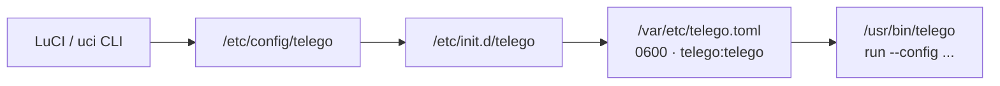
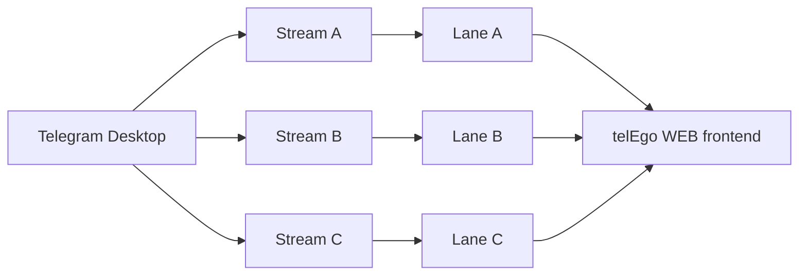
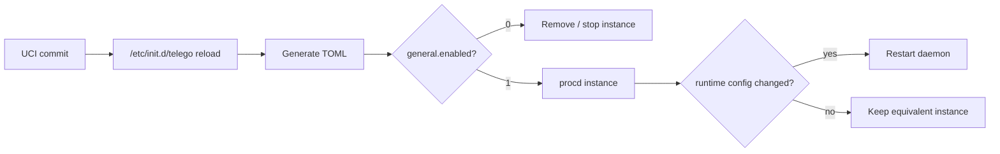

# Configuration Reference & LuCI UX Guide

`telEgo-openwrt` is configured through OpenWrt UCI at:

```text
/etc/config/telego
```

The procd init script converts UCI into a generated runtime file:

```text
/var/etc/telego.toml
```

Do **not** edit the generated TOML. It is rebuilt from UCI and atomically replaced with owner `telego:telego` and mode `0600`.

> [!IMPORTANT]
> This document is both the field reference and the user-facing guide. The authoritative defaults still live in `package/telego-pkg/files/config/telego`, the UCI→TOML mapping in `package/telego-pkg/files/init.d/telego`, and the visible LuCI fields in `package/luci-app-telego/htdocs/resources/view/telego/config.js`.

## Configuration flow



## UCI → TOML bridge: one source of truth

OpenWrt administrators work with UCI; upstream telEgo consumes TOML. The init layer is the bridge between the two worlds.

<table>
<tr>
<th width="50%">OpenWrt source — <code>/etc/config/telego</code></th>
<th width="50%">Generated runtime — <code>/var/etc/telego.toml</code></th>
</tr>
<tr>
<td valign="top"><pre><code>config general 'general'
    option enabled '1'
    option bind_to '0.0.0.0:443'
    option log_level 'info'

config tls_fronting 'tls_fronting'
    option mask_host 'www.google.com'
    option enable_drs '1'
    option enable_split_tls '1'

config secret 'alice'
    option name 'alice'
    option secret '0123456789abcdef0123456789abcdef'

config secret 'bob'
    option name 'bob'
    option secret 'fedcba9876543210fedcba9876543210'</code></pre></td>
<td valign="top"><pre><code>[general]
bind-to = "0.0.0.0:443"
log-level = "info"

[tls-fronting]
mask-host = "www.google.com"
enable-drs = true
enable-split-tls = true

[secrets]
"alice" = "0123456789abcdef0123456789abcdef"
"bob" = "fedcba9876543210fedcba9876543210"</code></pre></td>
</tr>
</table>

The runtime file is built in a temporary path, validated, changed to `telego:telego`, set to `0600`, and atomically moved into place.

> [!TIP]
> Think of `/etc/config/telego` as the **database** and `/var/etc/telego.toml` as a **compiled runtime artifact**. If they differ, UCI wins on the next reload.

---

# LuCI: guided configuration

Open:

```text
Services → telEgo
```

The page exposes the configuration and a live status view. The sections below follow the current LuCI order and explain not only what each field maps to, but when an operator should actually change it.

## 1. MTProxy

### Enable MTProxy — `general.enabled`

| Parameter | What it does | Operational value |
|---|---|---|
| **Enable MTProxy** | Controls whether procd creates the telEgo service instance | One switch starts/stops the entire runtime, including the WEB listener owned by that process |

Default: `off`.

When disabled, no telEgo daemon instance is kept running. The option is OpenWrt-only and is not emitted into the TOML file.

### Listen Address — `general.bind_to`

Default:

```text
0.0.0.0:443
```

This is the public MTProxy listener.

> [!TIP]
> Port `443` gives the best client compatibility and is the natural choice for a shared FakeTLS deployment. Before enabling it, verify that `uhttpd`, Nginx, or another service is not already bound to the same address/port.

### Log Level — `general.log_level`

Available values:

| Value | Use it when |
|---|---|
| `trace` | Deep temporary protocol debugging; very verbose |
| `debug` | Diagnosing routing, WEB, Middle-End, or startup problems |
| `info` | Normal production operation |
| `warn` | You only want operational anomalies |
| `error` | Minimal logging, usually too sparse for active troubleshooting |

Recommended default: `info`.

## 2. TLS Fronting / FakeTLS

The current LuCI does **not** have a separate “ee/dd mode” switch. The upstream core auto-detects client mode on one listener:

- `ee…` client secret → FakeTLS-wrapped Obfuscated2;
- `dd…` client secret → raw Obfuscated2.

The LuCI fields below configure the FakeTLS/fronting behavior used by the `ee` path and the probe/splice path.

> [!IMPORTANT]
> If your goal is maximum network camouflage rather than minimum framing overhead, use the **FakeTLS (`ee`) client link**, keep DRS and Split-TLS enabled, and use a stable HTTPS mask host. There is no universal “perfect” mask domain: the best choice depends on what is naturally reachable from the target network.

### Mask Domain — `tls_fronting.mask_host`

Default:

```text
www.google.com
```

Used for mask/SNI validation and certificate-profile behavior.

Choose a host that:

- is reliably reachable from the router/network;
- serves ordinary modern HTTPS on port `443`;
- is not a private/internal hostname;
- has a stable TLS endpoint;
- makes sense as normal HTTPS traffic in your environment.

> [!CAUTION]
> Do not treat a specific famous domain as a magic bypass recipe. Blocking and fingerprinting policy differs between providers and changes over time.

### Mask Port — `tls_fronting.mask_port`

Default: `443`.

Normally leave it unchanged. Change it only when the selected mask/certificate topology deliberately uses another TLS port.

### Certificate Host / Certificate Port — `cert_host`, `cert_port`

Optional advanced override for where telEgo obtains the TLS certificate/profile data.

Use it when the public mask name and the local certificate source are intentionally different, for example in a shared-port topology with a private Nginx certificate listener.

Typical advanced layout:

```text
cert_host = 127.0.0.1
cert_port = 8444
```

### Fallback Host / Fallback Port — `splice_host`, `splice_port`

Controls where unrecognized/unauthenticated TLS traffic is spliced.

When empty, upstream can use the mask endpoint. In a premium shared-port deployment, point the fallback to a private Nginx TLS listener that serves the real certificate/site.

Example:

```text
Fallback Host = 127.0.0.1
Fallback Port = 8443
```

### Fake Certificate Size — `fake_cert_size`

Default: `0`.

`0` means automatic profile matching. The upstream implementation can match the first fake certificate `ApplicationData` record size to the mask backend's observed first certificate record.

> [!TIP]
> Leave this at `0` unless you have packet captures and a specific compatibility/fingerprint reason for overriding it.

### Mask SNI Safelist — `mask_sni_safelist`

Dynamic list of exact hostnames allowed for SNI-following probe forwarding.

Example:

```text
www.microsoft.com
www.apple.com
```

This is intentionally not an open relay. Only exact configured domains are eligible.

### Fallback PROXY Protocol — `splice_proxy_protocol`

| Value | Meaning |
|---:|---|
| `0` | Disabled |
| `1` | PROXY protocol v1 |
| `2` | PROXY protocol v2 |

Use this only when the downstream Nginx/HAProxy listener is configured to accept the same PROXY protocol version.

### Fallback Idle Timeout — `splice_idle_timeout`

Default:

```text
30s
```

Controls idle lifetime for spliced/decoy connections. These connections are intentionally shorter-lived than authenticated proxy sessions.

### Enable DRS — `enable_drs`

Default: `on`.

Dynamic Record Sizer shapes proxy→client TLS `ApplicationData`:

```text
1369-byte records
        ↓
after 8 records OR 128 KiB
        ↓
16384-byte steady-state records
```

This reduces a fixed early-record-size fingerprint while retaining full-size records for sustained traffic.

### Enable Split TLS — `enable_split_tls`

Default: `on`.

The first outbound `ApplicationData` record is emitted as a 1-byte record, which breaks simple signatures that assume a conventional first application record size.

> [!NOTE]
> DRS and Split-TLS are anti-fingerprint mechanisms, not a guarantee that any specific DPI/TSPU implementation cannot classify the flow.

---

## 3. Users / Secrets

Each row in the LuCI **Users** grid becomes an entry in TOML `[secrets]`.

| Field | Requirement | What happens |
|---|---|---|
| **Username** | UCI-safe name | Becomes the TOML map key |
| **Secret** | Exactly 32 hexadecimal characters | 16-byte / 128-bit base MTProxy secret |
| **Generate** | Browser button | Generates 16 random bytes with Web Crypto and converts them to 32 hex characters |

The generator uses:

```javascript
const bytes = new Uint8Array(16);
window.crypto.getRandomValues(bytes);
```

The server does not need an external randomness API for this button.

> [!CAUTION]
> A user secret is a credential. `uci show telego`, `/etc/config/telego`, `/var/etc/telego.toml`, and LuCI screenshots can disclose it.

<details>
<summary><b>⚡ Create a user from CLI (click to expand)</b></summary>

```sh
uci add telego secret
uci set telego.@secret[-1].name='alice'
uci set telego.@secret[-1].secret='0123456789abcdef0123456789abcdef'
uci commit telego
/etc/init.d/telego reload
```

</details>

---

## 4. WEB Proxy

WEB Proxy is a separate Telegram Desktop frontend. It uses a private HTTP/1.1 listener behind real TLS termination in Nginx and then enters the shared telEgo session core.

### Enable WEB Proxy — `web_proxy.enabled`

Default: `off`.

Enable it only after you have:

- a public DNS hostname;
- a valid TLS certificate for that hostname;
- an Nginx/TLS deployment that forwards every request for the hostname through the telEgo WEB classifier;
- a private WEB listener that is not directly exposed to WAN.

### Carrier Mode — `web_proxy.carrier`

Current OpenWrt default: `https-lanes`.

| Carrier | What it does | Choose it when |
|---|---|---|
| `https` | One serialized fetch + long-poll carrier | You want the least demanding Nginx setup and maximum compatibility |
| `https-lanes` | Independent fetch/long-poll lane for each Telegram stream | Recommended default for the full WEB setup; public HTTP/2 is required by upstream guidance |
| `websocket` | One multiplexed WebSocket for the session | Your edge reliably supports WebSocket Upgrade and you prefer one persistent WS carrier |
| `websocket-lanes` | One WebSocket per active Telegram stream | You specifically want lane-style WebSocket separation and your edge handles multiple WSS connections cleanly |

### What are Lanes?

A non-lane carrier shares one transport sequence between multiple logical Telegram streams. Lane mode gives each stream its own transport lane.



> [!TIP]
> For a new, fully controlled Nginx deployment, **`https-lanes` is the conservative upstream recommendation**. That is a deployment recommendation, not proof that it is always faster or harder to classify than every other carrier.

### Bind Address — `web_proxy.bind_to`

Default:

```text
127.0.0.1:8080
```

This is a **private plain HTTP/1.1 listener** between Nginx and telEgo.

> [!CAUTION]
> Do not expose port `8080` directly to the Internet. Nginx (or another reviewed TLS edge implementing the full fallback contract) should be the only client.

### Hostname — `web_proxy.hostname`

Required when WEB Proxy is enabled.

Example:

```text
proxy.example.com
```

It must match the public hostname and the TLS certificate used by the WEB edge.

### Trusted Proxy CIDRs — `trusted_proxy_cidrs`

Default:

```text
127.0.0.1/32
```

Only trusted proxy peers may supply forwarded client addresses.

> [!CAUTION]
> Never use `0.0.0.0/0` simply to “make it work.” Trusting forwarded addresses from arbitrary Internet peers breaks the client-IP trust boundary.

### Hidden advanced WEB fields

These exist in UCI/runtime but are not currently exposed by LuCI:

| UCI option | Default | Runtime mapping |
|---|---:|---|
| `backend` | empty | `web-proxy.backend` compatibility socket path |
| `num_event_loops` | `0` | `web-proxy.num-event-loops` |

Without an explicit `backend`, native WEB streams enter the shared telEgo session core directly; no internal TCP/Unix hop is required for the default path.

---

## 5. Telegram Middle-End

Middle-End is an optional upstream route after authentication. It is independent of the WEB carrier choice.

| Field | Default | Operator guidance |
|---|---:|---|
| **Enable Middle-End** | `0` | Enable only when you understand the persistent-link/NAT/FD requirements |
| **Proxy Tag** | empty | Set only if Telegram issued a proxy tag; ME can operate without one |
| **SOCKS5 Proxy** | empty | Routes ME links through a SOCKS5 egress |
| **SOCKS5 Username** | empty | Use together with password |
| **SOCKS5 Password** | empty | Sensitive credential; use together with username |
| **Artifact Proxy** | empty | Separate proxy for Telegram artifact downloads |
| **STUN NAT IP** | empty | Usually leave empty; override only when automatic public-IP discovery is wrong |
| **Middle-End Max Connections** | `0` | `0` selects upstream default; override can only reduce the derived limit |
| **Middle-End Queue Budget (MB)** | `0` | `0` selects upstream default; expert memory-pressure control |

Pinned upstream maintains four physical gnet links per signed Telegram DC and can repair individual failed slots without rebuilding every healthy DC pool. See [ARCHITECTURE.md](ARCHITECTURE.md#telegram-middle-end-me).

---

## 6. Performance

| LuCI field | Default | What it controls | Guidance |
|---|---:|---|---|
| **TCP Buffer (KB)** | `128` | `performance.tcp-buffer-kb` | Keep default unless you have measured throughput/buffer pressure |
| **Event Loops** | `0` | Number of core gnet event loops | `0` = automatic; preferred starting point |
| **IP Preference** | `prefer-ipv4` | DC address-family policy | Change only when your IPv6/IPv4 path quality justifies it |
| **Idle Timeout** | `5m` | General connection idle timeout | Tune conservatively; short values increase reconnect churn |
| **Max Write Buffer (MB)** | `0` | Slow-receiver pending write limit | Use to bound memory only with measured evidence |
| **Client Silence Close** | `0s` | Optional stale-client recovery | Advanced workaround; too-low values can close legitimate slow sessions |

Available IP preference values:

```text
prefer-ipv4
prefer-ipv6
only-ipv4
only-ipv6
```

---

## 7. Generic Upstream SOCKS5

`upstream.socks5` is separate from Middle-End-specific SOCKS5 settings.

Example:

```text
127.0.0.1:1080
```

Use it when direct Telegram DC connections should egress through a VPN/tunnel/SOCKS5 path.

---

## 8. Metrics

### Metrics Address — `metrics.bind_to`

Default:

```text
127.0.0.1:9090
```

### Metrics Path — `metrics.path`

Default:

```text
/metrics
```

### Enable Diagnostics — `metrics.diagnostics`

Default: `off`.

Private runtime diagnostics should remain on literal loopback.

> [!IMPORTANT]
> The built-in LuCI telemetry backend intentionally fetches only `127.0.0.1:<port>` or `[::1]:<port>`. A remote metrics bind may be valid for the daemon itself, but LuCI refuses to turn its status RPC into a generic remote HTTP fetcher.

<details>
<summary><b>⚡ Inspect local Prometheus metrics (click to expand)</b></summary>

```sh
uclient-fetch -q -T 2 -O - http://127.0.0.1:9090/metrics
```

</details>

See [API.md](API.md).

---

# Canonical UCI reference

## Service control: `general`

| UCI option | Default | LuCI | Runtime effect |
|---|---:|:---:|---|
| `enabled` | `0` | yes | Controls whether procd creates/runs the daemon instance; not written to TOML |
| `bind_to` | `0.0.0.0:443` | yes | `general.bind-to` |
| `log_level` | `info` | yes | `general.log-level` |
| `proxy_protocol` | `0` | no | `general.proxy-protocol` boolean |
| `max_connections_per_ip` | `100` | no | `general.max-connections-per-ip` |
| `max_ips_per_user` | `10` | no | `general.max-ips-per-user` |
| `ip_block_timeout` | `5m` | no | `general.ip-block-timeout` |
| `handshake_timeout` | `5s` | no | `general.handshake-timeout` |
| `clock_sync_url` | empty | no | `general.clock-sync-url` only when non-empty |

## TLS fronting: `tls_fronting`

| UCI option | Default | LuCI | Runtime mapping |
|---|---:|:---:|---|
| `mask_host` | `www.google.com` | yes | `tls-fronting.mask-host` |
| `mask_port` | `443` | yes | `tls-fronting.mask-port` |
| `cert_host` | empty | yes | `tls-fronting.cert-host` when set |
| `cert_port` | empty | yes | `tls-fronting.cert-port` when set |
| `fake_cert_size` | `0` | yes | `tls-fronting.fake-cert-size` when non-zero |
| `mask_sni_safelist` | none | yes | `mask-sni-safelist` array |
| `splice_host` | empty | yes | `tls-fronting.splice-host` when set |
| `splice_port` | empty | yes | `tls-fronting.splice-port` when set |
| `splice_proxy_protocol` | `0` | yes | `0` off, `1` v1, `2` v2 |
| `splice_idle_timeout` | `30s` | yes | `tls-fronting.splice-idle-timeout` |
| `enable_drs` | `1` | yes | `tls-fronting.enable-drs` |
| `enable_split_tls` | `1` | yes | `tls-fronting.enable-split-tls` |

## Users/secrets: `secret`

| UCI option | Required | LuCI | Behavior |
|---|:---:|:---:|---|
| `name` | yes | yes | TOML map key; defaults to UCI section id if absent |
| `secret` | yes | yes | Exactly 32 hexadecimal characters |
| `description` | no | no | OpenWrt-side metadata; not emitted by current runtime generator |

## WEB Proxy: `web_proxy`

| UCI option | Default | LuCI | Runtime mapping |
|---|---:|:---:|---|
| `enabled` | `0` | yes | `web-proxy.enabled` |
| `carrier` | `https-lanes` | yes | `https`, `https-lanes`, `websocket`, `websocket-lanes` |
| `bind_to` | `127.0.0.1:8080` | yes | `web-proxy.bind-to` |
| `hostname` | empty | yes, required when enabled | `web-proxy.hostname` |
| `trusted_proxy_cidrs` | `127.0.0.1/32` | yes | `trusted-proxy-cidrs` array |
| `backend` | empty | no | `web-proxy.backend` |
| `num_event_loops` | `0` | no | `web-proxy.num-event-loops` |

## Telegram Middle-End: `middle_end`

| UCI option | Default | LuCI | Runtime mapping |
|---|---:|:---:|---|
| `enabled` | `0` | yes | `middle-end.enabled` |
| `proxy_tag` | empty | yes | `middle-end.proxy-tag` |
| `socks5` | empty | yes | `middle-end.socks5` |
| `socks5_username` | empty | yes | `middle-end.socks5-username` |
| `socks5_password` | empty | yes | `middle-end.socks5-password` |
| `artifact_proxy` | empty | yes | `middle-end.artifact-proxy` |
| `nat_ip` | empty | yes | `middle-end.nat-ip` |
| `max_connections` | `0` | yes | `middle-end.max-connections` |
| `queue_budget_mb` | `0` | yes | `middle-end.queue-budget-mb` |

## Performance: `performance`

| UCI option | Default | LuCI | Runtime mapping |
|---|---:|:---:|---|
| `tcp_buffer_kb` | `128` | yes | `performance.tcp-buffer-kb` |
| `num_event_loops` | `0` | yes | `performance.num-event-loops` |
| `prefer_ip` | `prefer-ipv4` | yes | `prefer-ipv4`, `prefer-ipv6`, `only-ipv4`, `only-ipv6` |
| `idle_timeout` | `5m` | yes | `performance.idle-timeout` |
| `max_write_buffer_mb` | `0` | yes | `performance.max-write-buffer-mb` |
| `client_silence_close` | `0s` | yes | `performance.client-silence-close` |

## Generic upstream SOCKS5: `upstream`

| UCI option | Default | LuCI | Runtime mapping |
|---|---:|:---:|---|
| `socks5` | empty | yes | `upstream.socks5` |

## Metrics: `metrics`

| UCI option | Default | LuCI | Runtime mapping |
|---|---:|:---:|---|
| `bind_to` | `127.0.0.1:9090` | yes | `metrics.bind-to` |
| `path` | `/metrics` | yes | `metrics.path` |
| `diagnostics` | `0` | yes | `metrics.diagnostics` boolean |

---

# Reload / restart semantics

The init script registers a UCI reload trigger. **Save & Apply** / reload rebuilds the procd instance definition.



Secrets and listener changes are not hot-reloaded inside the process by this OpenWrt integration. Existing connections can be interrupted by a restart.

# Inspect configuration safely

<details>
<summary><b>⚡ Non-secret health checks (click to expand)</b></summary>

```sh
uci -q get telego.general.enabled
uci -q get telego.general.bind_to
uci -q get telego.web_proxy.enabled
uci -q get telego.metrics.bind_to
/etc/init.d/telego status
ubus call telego status
```

</details>

The generated runtime config contains secrets. Inspect it only locally as root when necessary:

```sh
ls -l /var/etc/telego.toml
```

Avoid publishing the file contents.
