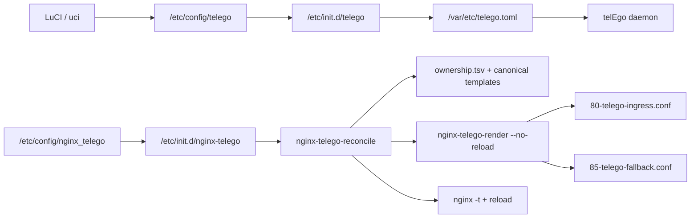

# telEgo Configuration on OpenWrt

[Русский](CONFIGURATION.md) · [**English**](CONFIGURATION_EN.md)

`telEgo-openwrt` uses OpenWrt UCI as the operator-facing source of truth:

```text
/etc/config/telego
```

The init script converts UCI into the runtime TOML file:

```text
/var/etc/telego.toml
```

The generated TOML belongs to `telego:telego`, uses mode `0600`, and is replaced atomically when configuration is applied. **Do not edit it by hand**: UCI wins again on the next reload.

Nginx integration has a separate opt-in UCI package:

```text
/etc/config/nginx_telego
```

It controls only managed Nginx ingress profiles and enables nothing by default.

---

## Configuration architecture



The two control planes are intentionally separate. `telego` describes the proxy daemon runtime. `nginx_telego` describes only the Nginx edge around WEB Proxy. The reconciliation engine does **not** rewrite `/etc/config/telego`; it validates the required telEgo contract and refuses an incompatible desired state. The renderer is an internal generated-state component, not the operator-facing apply path.

---

# LuCI

Open:

```text
Services → telEgo
```

The page contains **Configuration** and **Status** tabs.

# 1. MTProxy

## Enable MTProxy — `general.enabled`

Controls the whole telEgo procd instance. When disabled, the daemon is not running, so the WEB listener and Middle-End runtime in that process are also absent.

Default: `off`.

## Listen Address — `general.bind_to`

Default:

```text
0.0.0.0:443
```

This is telEgo's public TCP listener. A direct MTProxy deployment may use another port. Native shared-port WEB deployment requires telEgo to own public `:443`.

## Log Level — `general.log_level`

`trace`, `debug`, `info`, `warn`, or `error`. Use `info` for normal operation.

## Advanced MTProxy controls

These settings are now exposed in LuCI and map directly to the pinned upstream configuration:

| Field | UCI | Default | Purpose |
|---|---|---:|---|
| Accept Incoming PROXY Protocol | `proxy_protocol` | `0` | Trust inbound PROXY protocol only from a controlled TCP proxy |
| Max Connections per IP | `max_connections_per_ip` | `100` | Connection-flood limit; `0` disables it |
| Max IPs per User | `max_ips_per_user` | `10` | Per-secret IP limit; `0` disables it |
| IP Block Timeout | `ip_block_timeout` | `5m` | How long an evicted IP remains blocked |
| Handshake Timeout | `handshake_timeout` | `5s` | Maximum authentication-handshake time |
| Clock Sync URL | `clock_sync_url` | empty | Optional one-shot correction for large clock skew using an HTTP `Date` header |

Do not enable `proxy_protocol` on an Internet-reachable listener unless a trusted network boundary exists directly in front of telEgo.

---

# 2. TLS Fronting / FakeTLS

## Mask Domain — `tls_fronting.mask_host`

Default:

```text
www.google.com
```

This controls FakeTLS SNI/certificate-profile behavior. In a normal direct MTProxy deployment it may be an external mask host. In **native shared-port WEB deployment**, it must match the hostname on the real WEB TLS certificate because ordinary TLS is spliced back to local Nginx.

## Mask Port — `mask_port`

Default `443`.

## Certificate Host / Port — `cert_host`, `cert_port`

Optional certificate-chain source for FakeTLS. The LuCI fields accept a hostname **or an IP address**, allowing the local shared-port topology to use:

```text
Certificate Host = 127.0.0.1
Certificate Port = 8444
```

## Fallback Host / Port — `splice_host`, `splice_port`

Defines where telEgo sends TLS connections that are not authenticated MTProxy sessions.

Native shared-port topology:

```text
Fallback Host = 127.0.0.1
Fallback Port = 8443
Fallback PROXY Protocol = v2
```

## Fake Certificate Size — `fake_cert_size`

- `0` selects automatic matching and is the recommended default;
- an explicit override must be within `256..16384` bytes.

LuCI validates this range before saving.

## Mask SNI Safelist

Exact hostnames that may use SNI-following probe forwarding. An empty list disables the feature.

## DRS and Split TLS

Both are enabled by default and match the upstream anti-fingerprint record shaping. They normally should remain unchanged unless you have a specific compatibility reason.

---

# 3. Users / Secrets

Every **Users** row becomes an entry in the runtime `[secrets]` table.

| Field | Requirement |
|---|---|
| Username | UCI-safe name |
| Secret | exactly 32 hexadecimal characters |

The **Generate** button creates 16 random bytes with browser Web Crypto and renders them as 32 hexadecimal characters.

> [!IMPORTANT]
> A secret is a credential. Do not publish `uci show telego`, `/var/etc/telego.toml`, or screenshots that contain real secrets.

---

# 4. WEB Proxy

WEB Proxy is a private HTTP frontend for Telegram Desktop. It **does not terminate TLS itself**. Nginx, Cloudflare, or another reviewed edge must sit in front of it and implement the full fallback contract.

## Enable WEB Proxy — `web_proxy.enabled`

Default `off`.

## Carrier Mode — `carrier`

| Value | Meaning |
|---|---|
| `https` | one serialized fetch/long-poll carrier |
| `https-lanes` | one HTTP lane for each Telegram stream |
| `websocket` | one multiplexed WebSocket |
| `websocket-lanes` | one WebSocket per stream |

The OpenWrt default is `https-lanes`, matching the pinned upstream conservative recommendation for a new deployment with public HTTP/2. This is not a claim that it is always faster than every other carrier.

## Bind Address — `bind_to`

Default:

```text
127.0.0.1:8080
```

This is a private HTTP/1.1 listener. Do not expose it directly to the WAN.

## Hostname — `hostname`

Required while WEB Proxy is enabled. It must match the public TLS hostname or Cloudflare Published Application.

## Trusted Proxy CIDRs

Default:

```text
127.0.0.1/32
```

Only these Nginx/proxy peers may supply a forwarded client address to telEgo.

## Compatibility Backend — `backend`

This advanced option is now visible in LuCI.

An empty value is the normal and preferred path: WEB streams enter the shared MTProxy core inside the same process without an extra TCP/Unix hop.

An explicit backend is only for compatibility topologies, for example:

```text
127.0.0.1:9443
```

or a supported local Unix socket.

## WEB Event Loops — `num_event_loops`

`0` selects the automatic gnet event-loop count. Change it only after measurement.

---

# 5. Nginx deployment profiles

`nginx-telego` installs the final P6/P7 managed layout:

```text
/etc/nginx/conf.d/20-telego-core.conf
/etc/nginx/snippets/telego.locations
/usr/share/nginx-telego/ownership.tsv
/usr/libexec/nginx-telego-files
/usr/libexec/nginx-telego-render
/usr/libexec/nginx-telego-reconcile
```

`20-telego-core.conf` defines the shared `telego_web → 127.0.0.1:8080` upstream and the Nginx maps used by the integration. Its canonical repair source is stored under `/usr/share/nginx-telego/templates/20-telego-core.conf`.

`telego.locations` is a reusable HTTP/WebSocket/fallback snippet for a normal Nginx TLS server. It is **not an MTProto handler**. Direct HTTPS includes it on Nginx `:18443`; Native Shared-Port includes it on the private TLS listener `:8443` after telEgo has separated MTProxy from ordinary TLS.

The opt-in managed profiles use:

```text
/etc/config/nginx_telego
/etc/nginx/conf.d/80-telego-ingress.conf
/etc/nginx/conf.d/85-telego-fallback.conf
```

`80-telego-ingress.conf` exists only while Direct HTTPS, Cloudflare, or Native Shared-Port managed ingress is enabled. `85-telego-fallback.conf` exists only while a managed profile is enabled and `fallback.manage=1`. Generated files carry both the common nginx-telego marker and a role-specific marker so content copied to the wrong reserved path is not silently adopted.

All three managed profiles are disabled by default and are **mutually exclusive**.

All managed profiles use the same hostname contract: an empty profile hostname inherits `telego.web_proxy.hostname`; a non-empty override must match the WEB hostname exactly. This keeps the normal configuration single-source while preserving an explicit override for controlled migrations.

The historical `/etc/nginx/conf.d/telego.conf` and `/etc/nginx/conf.d/zz-telego-managed.conf` are migration-only paths. Reconciliation removes them automatically only when package ownership can be proven; changed/foreign regular files are preserved rather than silently discarded.

See **[Nginx file ownership and reconciliation](NGINX_FILES_EN.md)** for the exact state machine and rollback rules.

## 5.1 Direct HTTPS profile

Direct HTTPS uses a dedicated topology: Nginx owns TCP/443 directly on both LAN and WAN. `nginx-telego-firewall` does not DNAT/REDIRECT; it owns only the package-managed WAN `INPUT ACCEPT` rule for TCP/443. If uhttpd/LuCI occupied HTTPS `:443`, `nginx-telego-platform` transactionally moves only those HTTPS listeners to `luci_https_port` (default `:10443`). **Plain HTTP LuCI (`listen_http`, commonly `:80`) is neither changed nor disabled by the package.**

```text
LAN WEB ────────────────> Nginx :443 ──> telego.locations ──> telEgo WEB :8080
LAN administrator ──────> uhttpd / LuCI :10443
LAN administrator ──────> uhttpd / LuCI :80      # when retained by the administrator

WAN :443 → firewall.telego_direct_https (INPUT ACCEPT)
         └──────────────────────────────> Nginx :443
```

The profile requires `telego.general.enabled=1`; an MTProxy listener other than TCP/443 such as `0.0.0.0:9443`; WEB Proxy on `127.0.0.1:8080`; matching hostname; trusted loopback proxy; a real certificate/key; one active `wan` zone with input other than `ACCEPT`; no foreign WAN TCP/443 owner; and free local TCP/443 for Nginx.

Managed Nginx creates `0.0.0.0:443` and `[::]:443`. The legacy `:18443` listener and `443 → 18443` redirect do not exist in the current topology. Test AAAA separately on a real WAN path.

P12.7 adds TLS/HTTPS hardening: explicit `TLSv1.2 TLSv1.3`, unknown-SNI rejection, `server_tokens off`, staged HSTS with `hsts_max_age=604800` and no `includeSubDomains`/`preload`, no OCSP stapling, and no global hand-written cipher list. CSP/Permissions-Policy are not imposed on the WEB carrier. The managed fallback remains `200 OK` and receives only `X-Content-Type-Options: nosniff`, `Referrer-Policy: no-referrer`, and `Cache-Control: no-store`.

After hardware/reboot/ACME-renewal acceptance, HSTS may be raised to `31536000`. A value of `0` sends `max-age=0` for controlled rollback.

```sh
uci set nginx_telego.direct_https.hsts_max_age='31536000'
uci commit nginx_telego
/etc/init.d/nginx-telego reload
```

The apply path preflights platform/firewall ownership, reconciles Nginx, and publishes WAN TCP/443 only after `nginx -t` succeeds. Leaving Direct HTTPS removes WAN exposure first, then releases Nginx `:443`, then restores only package-owned HTTPS/split-DNS state. `listen_http` is outside this state machine.

Read-only checks:

```sh
/usr/libexec/nginx-telego-platform status
/usr/libexec/nginx-telego-platform preflight
/usr/libexec/nginx-telego-firewall status
/usr/libexec/nginx-telego-firewall preflight
/usr/libexec/nginx-telego-cert status
/usr/libexec/nginx-telego-cert preflight
```

Certificate guide: **[TLS certificate / ACME DNS-01](TLS_CERTIFICATE_EN.md)**. Full acceptance: **[Direct HTTPS hardware test](DIRECT_HTTPS_TEST_EN.md)**.

## 5.2 Cloudflare profile

See the full **[Cloudflare Tunnel guide](CLOUDFLARE_EN.md)**.

In short:

```sh
uci set nginx_telego.cloudflare.enabled='1'
uci set nginx_telego.cloudflare.hostname='web.example.com'
uci set nginx_telego.direct_https.enabled='0'
uci set nginx_telego.shared.enabled='0'
uci commit nginx_telego
/etc/init.d/nginx-telego reload
```

It creates the loopback `127.0.0.1:18080` ingress, restores the client address from `CF-Connecting-IP`, and implements the `418/419` fallback contract.

The Cloudflare profile **does not use `telego.locations`** because it needs Cloudflare-specific client-IP handling.

## 5.3 Native shared-port profile

This mode lets telEgo MTProxy and WEB Proxy share public TCP/443:

```text
                    ┌─ authenticated MTProxy ──> Telegram
                    │
Internet → telEgo :443
                    │
                    └─ ordinary TLS
                           ↓ PROXY v2
                    Nginx TLS :8443
                           ↓ decrypted HTTP/1.1
                    telego.locations
                           ↓
                    telEgo WEB :8080
```

Separate control path:

```text
telEgo certificate fetcher → Nginx TLS :8444
```

### Requirements

- public `:443` belongs to telEgo;
- the WEB hostname has a real TLS certificate and private key on OpenWrt;
- `mask_host` equals the WEB/certificate hostname;
- WEB listener is `127.0.0.1:8080`;
- `trusted_proxy_cidrs` contains `127.0.0.1/32`;
- Nginx private ports `8443`, `8444`, and managed fallback `8090` are free;
- `https-lanes` requires HTTP/2; the standard OpenWrt 25.12 `nginx-ssl` configuration enables HTTP/2 by default.

### Configure telEgo

Example for `proxy.example.com`:

```sh
uci set telego.general.bind_to='0.0.0.0:443'

uci set telego.tls_fronting.mask_host='proxy.example.com'
uci set telego.tls_fronting.cert_host='127.0.0.1'
uci set telego.tls_fronting.cert_port='8444'
uci set telego.tls_fronting.splice_host='127.0.0.1'
uci set telego.tls_fronting.splice_port='8443'
uci set telego.tls_fronting.splice_proxy_protocol='2'

uci set telego.web_proxy.enabled='1'
uci set telego.web_proxy.hostname='proxy.example.com'
uci set telego.web_proxy.bind_to='127.0.0.1:8080'
uci -q delete telego.web_proxy.trusted_proxy_cidrs
uci add_list telego.web_proxy.trusted_proxy_cidrs='127.0.0.1/32'

uci commit telego
/etc/init.d/telego reload
```

### Configure managed Nginx

The package **does not issue a certificate**. Point it at certificate/key files managed by your chosen certificate workflow:

```sh
uci set nginx_telego.shared.enabled='1'
uci set nginx_telego.shared.hostname='proxy.example.com'
uci set nginx_telego.shared.certificate='/etc/ssl/example/fullchain.pem'
uci set nginx_telego.shared.certificate_key='/etc/ssl/example/privkey.pem'
uci set nginx_telego.cloudflare.enabled='0'
uci set nginx_telego.fallback.manage='1'
uci commit nginx_telego

/etc/init.d/nginx-telego reload
```

The reconciler checks ownership/drift, the renderer validates the telEgo contract, port conflicts, and certificate readability, and the outer transaction performs a final `nginx -t` before reload. A render, validation, or reload failure restores managed files to their pre-transaction state.

Verify:

```sh
/usr/libexec/nginx-telego-files status
/usr/sbin/nginx -T -c /etc/nginx/uci.conf 2>&1 | \
    grep -nE '8443|8444|8090|telego.locations|telego_web'
netstat -lntp 2>/dev/null | grep -E ':443|:8080|:8090|:8443|:8444'
```

> [!IMPORTANT]
> Do not enable native shared-port casually on a working production router. It intentionally changes ownership of public `:443`, the mask/certificate topology, and the TLS splice path. A Cloudflare WEB deployment may continue to operate independently instead.

---

# 6. Telegram Middle-End

Middle-End (ME) is an **opt-in outbound transport** selected after authentication. It is `off` by default, so package upgrades keep the existing direct Telegram DC route.

## What changes when it is enabled

ME maintains persistent gnet links to Telegram Middle-End endpoints, bounded queues, artifact refresh, STUN/NAT discovery, and direct fallback whenever the active generation is not ready.

Before enabling it, make sure the router:

- can fetch Telegram artifacts over HTTPS;
- can open TCP connections to the signed ME endpoints;
- can use UDP STUN for private direct sockets or has a correct `nat_ip` override;
- has enough file descriptors and memory for the selected load.

## LuCI fields

| Field | Default | Validation |
|---|---:|---|
| Enable Middle-End | `off` | operator opt-in only |
| Proxy Tag | empty | empty or exactly 32 hex characters |
| SOCKS5 Proxy | empty | optional ME egress |
| SOCKS5 Username / Password | empty | SOCKS5 credentials |
| Artifact Proxy | empty | optional artifact-only proxy |
| STUN NAT IP | empty | literal IP; normally unnecessary |
| Max Connections | `0` | `0` or `1..10000` |
| Queue Budget (MB) | `0` | `0` or `2..32` |

`0` for max connections selects the upstream default of `10000`. For queue budget, `0` keeps upstream defaults: request/frontend-input budgets remain about `32 MiB` each, while the shared response/frontend-output pool is about `66 MiB` on the 64-bit build. Explicit `N` (`2..32`) sets `N MiB` request/frontend-input budgets and a `2×N MiB` shared response/output pool, including the processing reserve.

A proxy tag is **not required** to enable Middle-End. Leave it empty if Telegram did not issue one.

## Controlled enablement

Enable metrics first so the runtime can be observed. Then:

```sh
uci set telego.middle_end.enabled='1'
uci commit telego
/etc/init.d/telego reload
```

Watch the **Status** tab and `logread -e telego`.

Rollback:

```sh
uci set telego.middle_end.enabled='0'
uci commit telego
/etc/init.d/telego reload
```

After it is disabled, new authenticated connections use the normal direct DC path again.

---

# 7. Performance

| LuCI | UCI | Default | Guidance |
|---|---|---:|---|
| TCP Buffer (KB) | `tcp_buffer_kb` | `128` | change only with measurements |
| Event Loops | `num_event_loops` | `0` | automatic |
| IP Preference | `prefer_ip` | `prefer-ipv4` | depends on IPv4/IPv6 path quality |
| Idle Timeout | `idle_timeout` | `5m` | avoid overly short values |
| Max Write Buffer (MB) | `max_write_buffer_mb` | `0` | upstream-derived default |
| Client Silence Close | `client_silence_close` | `0s` | diagnostic recovery option, disabled by default |

---

# 8. Generic Upstream SOCKS5

`upstream.socks5` affects ordinary Telegram DC connections and is separate from the Middle-End-specific SOCKS5 settings.

Leave it empty for direct routing.

---

# 9. Metrics and Diagnostics

Default endpoint:

```text
127.0.0.1:9090/metrics
```

LuCI Status deliberately permits its rpcd backend to read metrics only from literal loopback `127.0.0.1` or `::1`, preventing the status RPC from becoming a generic HTTP fetcher.

**Enable Diagnostics** exposes private runtime profiling endpoints on the same loopback metrics server. Do not publish them through Nginx, Cloudflare, or WAN.

Check metrics locally:

```sh
uclient-fetch -q -T 2 -O - http://127.0.0.1:9090/metrics | head
```

---

# 10. Status

The **Status** tab now presents three groups.

## Service and MTProxy

- service state / PID / uptime;
- active connections;
- active / tracked / blocked IPs;
- received / sent traffic.

## WEB Proxy Runtime

- enabled state and carrier;
- active WEB sessions/streams/WebSockets;
- active backend dials;
- pending bytes/items;
- sessions created/closed;
- carrier retries;
- backpressure events.

## Middle-End Runtime

- enabled state;
- admission readiness;
- repair state;
- physical links;
- active bindings;
- active slot repairs / failures;
- artifact applied/pending state;
- artifact refresh failures.

These values are read from telEgo's local Prometheus endpoint through a read-only rpcd backend.

---

# 11. UCI → TOML reference

| UCI section | Main options | Runtime section |
|---|---|---|
| `general` | `bind_to`, `log_level`, limits/timeouts | `[general]` |
| `tls_fronting` | mask/cert/splice/DRS/Split TLS | `[tls-fronting]` |
| `secret` | `name`, `secret` | `[secrets]` map |
| `web_proxy` | enabled/carrier/bind/hostname/backend/trusted/loops | `[web-proxy]` |
| `middle_end` | enabled/tag/proxies/NAT/limits | `[middle-end]` |
| `performance` | buffers/loops/IP/timeouts | `[performance]` |
| `upstream` | `socks5` | `[upstream]` |
| `metrics` | bind/path/diagnostics | `[metrics]` |

Inspect runtime state without publishing secrets:

```sh
ls -l /var/etc/telego.toml
/etc/init.d/telego status
ubus call telego status
```

---

# 12. Reload semantics

**Save & Apply** updates UCI and rebuilds the procd instance. If runtime TOML changes, the process is restarted; listener, secret, WEB, and ME topology changes are not treated as hot reloads inside the running process.

`nginx_telego` is applied separately:

```sh
/etc/init.d/nginx-telego reload
```

The init helper invokes `nginx-telego-reconcile`. Reconciliation serializes changes with a lock, repairs safe package drift, migrates proven legacy package state, delegates generated-file rendering with reload suppressed, performs a final `nginx -t`, then reloads Nginx only if the complete managed filesystem state changed. Renderer, final validation, and reload failures all trigger filesystem rollback.

When managed profiles are disabled, nginx-telego removes only its own generated files and leaves administrator-owned Nginx files untouched.

---

## Sources

- [Pinned telEgo configuration example](https://github.com/Scratch-net/telego/blob/d9e74017e5f6c8ede4e3ef633646b15ac26abb30/config.example.toml)
- [Pinned telEgo WEB Proxy design](https://github.com/Scratch-net/telego/blob/d9e74017e5f6c8ede4e3ef633646b15ac26abb30/docs/web-proxy.md)
- [Pinned Telegram Middle-End design](https://github.com/Scratch-net/telego/blob/d9e74017e5f6c8ede4e3ef633646b15ac26abb30/docs/middle-end.md)
- [OpenWrt Nginx](https://openwrt.org/docs/guide-user/services/webserver/nginx)

[← Documentation](README_EN.md) · [TLS certificate](TLS_CERTIFICATE_EN.md) · [Direct HTTPS test](DIRECT_HTTPS_TEST_EN.md) · [Cloudflare Tunnel](CLOUDFLARE_EN.md) · [Русский →](CONFIGURATION.md)
