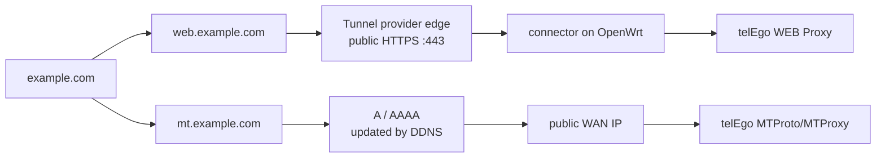
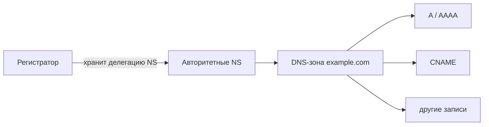
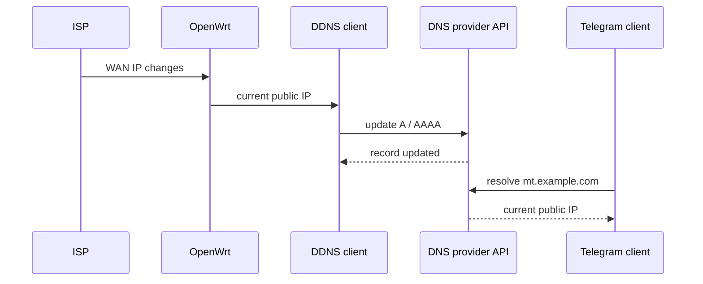

<div align="center">

# Домен и DNS

**Публичные имена для WEB Proxy и MTProto/MTProxy на OpenWrt**

[](https://openwrt.org/)
[](#что-настраиваем)
[](#как-устроен-dns)
[](#dynamic-dns-ddns)
[](#источники)

**Домен · DNS · DDNS · DNSSEC · динамический публичный IP · порт 443**

[Русский](DOMAIN.md) · [English](DOMAIN_EN.md) · [Документация](README.md)

</div>

`telEgo-openwrt` может использовать домен сразу для двух независимых задач. WEB Proxy получает постоянный HTTPS-адрес, а direct MTProto/MTProxy — стабильное имя, которое можно автоматически привязывать к меняющемуся публичному IP через DDNS.

При использовании Tunnel для WEB Proxy внешний HTTPS работает на стандартном порту `443`, но сам OpenWrt не обязан принимать входящие соединения на WAN TCP/443. Это позволяет не конфликтовать с HTTPS-интерфейсом роутера или другим локальным сервисом.

> [!IMPORTANT]
> Домен и DDNS не заменяют публичный IP. Для прямого MTProto/MTProxy нужен маршрутизируемый адрес провайдера либо другой способ входящей доступности. Если OpenWrt находится за CGNAT, одна DNS-запись проблему не решит.

> [!NOTE]
> Условия регистрации доменов, цены и региональные ограничения меняются. Факты, зависящие от провайдеров и правил доменных зон, повторно проверены **14 сентября 2026 года**.

---

## Что настраиваем

Обычно достаточно одного домена и двух поддоменов:

```text
example.com
├── web.example.com   WEB Proxy
└── mt.example.com    direct MTProto/MTProxy
```

### Два разных сетевых пути



| Сценарий | Что даёт домен | Нужен публичный WAN IP | Что происходит с `443` |
|---|---|---:|---|
| **WEB Proxy через Tunnel** | Постоянный HTTPS-адрес | Нет | Публичный `443` завершается у Tunnel-провайдера |
| **Direct MTProto/MTProxy** | Постоянное имя для роутера | **Да** | Используется выбранный входящий порт OpenWrt |
| **Direct MTProto/MTProxy + DDNS** | То же имя при смене IP | **Да** | DDNS меняет только DNS-запись, а не сетевой порт |

> [!TIP]
> Если WAN TCP/443 на OpenWrt уже занят, direct MTProto/MTProxy можно запустить на другом свободном порту. Tunnel-схема WEB Proxy от этого ограничения не зависит.

---

## Быстрый маршрут

| Шаг | Результат |
|---:|---|
| **1** | Выбрать доменную зону и регистратора |
| **2** | Зарегистрировать домен и защитить аккаунт |
| **3** | Решить, где будет обслуживаться DNS |
| **4** | При необходимости сменить NS-серверы |
| **5** | Создать имена для WEB Proxy и MTProto/MTProxy |
| **6** | Для динамического публичного IP включить DDNS |
| **7** | Проверить DNS и только затем включить DNSSEC |

Если домен уже зарегистрирован, начинайте с раздела **[Как устроен DNS](#как-устроен-dns)**.

---

# 1. Выбор домена

## Выберите доменную зону

Доменная зона — часть имени после последней точки: `.com`, `.net`, `.org`, `.ru` и т. д.

Для технического сервиса нет универсально лучшей зоны. Смотрите прежде всего на долгосрочную эксплуатацию, а не на рекламную цену первого года.

| Что проверить | Почему это важно |
|---|---|
| **Цена продления** | Обычно важнее стартовой скидки |
| **Правила зоны** | Некоторые ccTLD требуют местного адреса, статуса или идентификации |
| **Доступность из вашей страны** | Регистратор или платёжный провайдер может иметь региональные ограничения |
| **Перенос домена** | Должна быть понятна процедура смены регистратора |
| **DNSSEC** | Нужен для криптографической проверки DNS |
| **Управление NS** | Необходимо, если DNS будет обслуживаться отдельно от регистратора |

Для международных проектов обычно подходят generic TLD вроде `.com`, `.net` или `.org`. Национальный ccTLD тоже нормальный выбор, если его правила подходят владельцу.

## Выберите регистратора

**Регистратор** — компания, через которую домен оформляется, продлевается и переносится. Это не обязательно та же компания, которая будет обслуживать DNS.

Перед покупкой проверьте:

- стоимость регистрации **и** обычного продления;
- способы оплаты, доступные в вашей стране;
- возможность менять NS-серверы;
- поддержку DNSSEC;
- MFA/2FA для аккаунта;
- процедуру переноса домена к другому регистратору;
- требования к данным владельца и подтверждению личности.

Для международных зон можно рассматривать Cloudflare Registrar, Namecheap, Porkbun или другого ICANN-аккредитованного регистратора. Это примеры, а не требование проекта.

> [!TIP]
> Для инфраструктурного домена хороший регистратор — тот, у которого вы уверенно сможете **продлить домен, восстановить доступ и перенести имя** через несколько лет. Цена первого года здесь вторична.

<details>
<summary><b>Термины: регистратор, реестр и DNS-провайдер</b></summary>

<br>

| Роль | За что отвечает |
|---|---|
| **Регистратор** | Оформление домена, продление, данные владельца, перенос |
| **Реестр доменной зоны** | Ведёт саму зону верхнего уровня, например `.ru` или `.com` |
| **Авторитетный DNS-провайдер** | Хранит рабочие DNS-записи домена |
| **DDNS-клиент** | Автоматически обновляет `A` / `AAAA`, когда меняется WAN IP |

Один сервис может совмещать несколько ролей, но технически это разные части системы.

</details>

---

# 2. Регистрация домена

Интерфейс у каждого регистратора свой, но последовательность почти всегда одинакова:

1. Создайте аккаунт и сразу включите MFA/2FA.
2. Найдите свободное доменное имя.
3. Выберите нужную TLD.
4. Укажите настоящие данные владельца или администратора домена.
5. Пройдите идентификацию, если этого требует выбранная зона.
6. Проверьте цену регистрации и последующего продления.
7. Уберите ненужные дополнительные услуги — хостинг, конструктор сайтов, почту и сертификаты можно подключить отдельно.
8. Оплатите регистрацию.
9. После появления домена в панели проверьте владельца, срок действия и настройки автоматического продления.

### Перед оплатой

- [ ] Имя написано без ошибки.
- [ ] Цена продления известна заранее.
- [ ] Вы понимаете требования выбранной TLD.
- [ ] У регистратора доступна MFA/2FA.
- [ ] Можно менять NS-серверы.
- [ ] Доступен рабочий способ оплаты на будущее.
- [ ] Дополнительные услуги не добавлены случайно.

---

## Пользователям из России

Для российских пользователей стоит отдельно проверить две вещи: **доступность нужной зоны** и **возможность оплаты**. Международный регистратор может не продавать `.ru/.рф/.su`, ограничивать часть услуг для российских аккаунтов или не принимать доступный пользователю способ оплаты.

Для `.ru` и `.рф` часто проще использовать российского регистратора, а DNS при желании вынести к отдельному международному или локальному провайдеру.

> [!IMPORTANT]
> С **1 сентября 2026 года** операции с `.RU`, `.РФ` и `.SU` требуют идентификации администратора через ЕСИА («Госуслуги»). Timeweb указывает, что это относится в том числе к регистрации, продлению, смене регистратора, смене администратора и **смене NS-серверов**.

Для `.ru/.рф` можно рассматривать Timeweb, Рег.ру, RU-CENTER и других аккредитованных регистраторов. Для `.su` заранее проверьте особенности конкретного регистратора и процедуру идентификации.

<details>
<summary><b>Практический пример: регистрация .ru через Timeweb</b></summary>

<br>

Ниже используется только обезличенный пример:

```text
<имя>.ru
```

**1. Подготовьте администратора домена**

В Timeweb откройте:

**Домены и SSL → Администраторы**

Для `.ru/.рф` создайте администратора и пройдите идентификацию через Госуслуги. Данные должны совпадать с подтверждённой учётной записью ЕСИА.

**2. Найдите домен**

Откройте:

**Домены и SSL → Купить домен**

Введите желаемое имя и убедитесь, что оно свободно.

**3. Проверьте заказ**

Перед оплатой проверьте администратора, срок регистрации, цену первого периода и цену продления. Хостинг или VPS для этой схемы покупать не требуется.

**4. Оплатите и проверьте результат**

После обработки регистрации убедитесь, что домен появился в панели, указан правильный администратор и дата окончания соответствует заказу.

> Timeweb предупреждает, что регистрация и обновление DNS могут стать видны не мгновенно; в справочном центре указан ориентир до 3–24 часов.

</details>

---

# 3. Как устроен DNS

После регистрации домен должен быть делегирован **авторитетным DNS-серверам**. Именно они отвечают на запросы о `A`, `AAAA`, `CNAME` и других записях.



### Вариант A — DNS остаётся у регистратора

Ничего менять в NS не нужно. Все записи создаются в панели регистратора.

```text
A       mt.example.com        203.0.113.10
AAAA    mt.example.com        2001:db8::10
CNAME   www.example.com       example.com
```

`203.0.113.0/24` и `2001:db8::/32` — специальные документационные диапазоны, а не реальные адреса для настройки.

### Вариант B — отдельный DNS-провайдер

1. Добавьте домен у выбранного DNS-провайдера.
2. Получите выданный им набор NS-серверов.
3. В панели регистратора замените старые NS на новые.
4. Сохраните изменение и дождитесь обновления делегирования.
5. Проверьте результат до удаления старой DNS-конфигурации.

> [!WARNING]
> Не копируйте NS-серверы из чужих инструкций. Используйте только те значения, которые DNS-провайдер назначил **вашей** зоне.

---

# 4. Проверка DNS

Проверка NS:

```sh
nslookup -type=NS example.com
```

Проверка IPv4 и IPv6:

```sh
nslookup -type=A mt.example.com
nslookup -type=AAAA mt.example.com
```

Смена делегации не всегда видна сразу. На результат влияют реестр доменной зоны, регистратор, TTL и кэши DNS-резолверов.

> [!NOTE]
> Если сразу после смены NS вы ещё видите старые серверы, это не обязательно ошибка. Подождите распространения изменений и проверьте повторно.

---

# 5. Dynamic DNS (DDNS)

DDNS нужен только тогда, когда провайдер выдаёт **публичный, но меняющийся** WAN IP.



Для такого сценария DNS-провайдер должен иметь API или штатную поддержку Dynamic DNS. Cloudflare — один из вариантов, но не единственный.

> [!CAUTION]
> **DDNS ≠ обход CGNAT.** Если WAN-интерфейс OpenWrt не получает маршрутизируемый публичный адрес, корректно обновлённая `A`/`AAAA` запись всё равно не создаст входящий маршрут к роутеру.

---

# 6. DNSSEC

DNSSEC позволяет резолверам криптографически проверить, что DNS-ответ относится к вашей зоне и не был подменён по пути.

Для нового домена порядок простой:

1. Сначала завершите обычную настройку DNS.
2. Убедитесь, что домен и нужные поддомены разрешаются корректно.
3. Затем включайте DNSSEC по инструкции выбранного DNS-провайдера и регистратора.

При переносе уже защищённой зоны нужно действовать аккуратнее: старая DS-запись вместе с новыми NS может сделать домен недоступным для резолверов, проверяющих DNSSEC.

> [!WARNING]
> Не оставляйте старую DS-запись при смене DNS-провайдера, если процедура миграции явно не предусматривает такой порядок.

---

# 7. Защита домена

Домен — часть сетевой инфраструктуры. Потеря аккаунта регистратора может быть серьёзнее потери отдельного сервера.

- [ ] MFA/2FA включена.
- [ ] Используется уникальный пароль.
- [ ] Резервный e-mail и телефон актуальны.
- [ ] Registrar Lock включён, если доступен.
- [ ] Настройки Auto-Renew проверены.
- [ ] Способ оплаты будет работать к моменту продления.
- [ ] Резервные коды MFA сохранены отдельно.
- [ ] DNSSEC включён после стабилизации DNS.

> [!CAUTION]
> Никогда не публикуйте документы владельца домена, данные ЕСИА/Госуслуг, платёжные реквизиты, резервные коды MFA, API-токены и cookies сессии регистратора.

---

# 8. Cloudflare как пример DNS/DDNS

Cloudflare здесь **не является обязательным компонентом**. Это один из возможных DNS-провайдеров, удобный тем, что authoritative DNS доступен на бесплатном плане, а записями можно управлять через API.

### Подключить существующий домен

1. Добавьте домен в Cloudflare Dashboard.
2. Проверьте импортированные DNS-записи.
3. Cloudflare выдаст два NS-сервера для зоны.
4. У регистратора замените текущие NS на эту пару.
5. Дождитесь статуса **Active**.
6. Проверьте делегирование:

```sh
nslookup -type=NS example.com
```

### Использовать Cloudflare для DDNS

Для direct MTProto/MTProxy DDNS-клиент на OpenWrt может через Cloudflare API обновлять `A`/`AAAA` запись `mt.example.com` после смены публичного WAN IP.

Подробная настройка Cloudflare Tunnel, `cloudflared` и публикация WEB Proxy вынесены отдельно: **[Cloudflare Tunnel на OpenWrt](CLOUDFLARE.md)**.

<details>
<summary><b>Почему Cloudflare не обязателен</b></summary>

<br>

Для `telEgo-openwrt` важен не бренд DNS-провайдера, а набор возможностей:

| Возможность | Когда нужна |
|---|---|
| Надёжный authoritative DNS | Всегда |
| Управление `A` / `AAAA` / `CNAME` | Всегда |
| API | Для автоматизации и DDNS |
| DNSSEC | Для проверки целостности DNS |
| Dynamic DNS | При динамическом публичном WAN IP |
| Доступность в вашей стране | Всегда |

Можно использовать DNS регистратора или любого отдельного провайдера, который закрывает эти требования.

</details>

---

# Источники

Актуальность внешних требований проверена **14 сентября 2026 года**.

| Тема | Официальный источник |
|---|---|
| ICANN-аккредитованные регистраторы | [ICANN — Accredited Registrars](https://www.icann.org/en/accredited-registrars) |
| Регистрация домена в Timeweb | [Timeweb — регистрация и продление](https://timeweb.com/ru/docs/domeny/registraciya-i-prodlenie/registraciya-i-prodlenie-domena/) |
| Администратор `.RU/.РФ` | [Timeweb — администраторы доменов](https://timeweb.com/ru/docs/domeny/administratory-domenov/sozdanie-i-redaktirovanie-persony-administratora-domena/) |
| ЕСИА для `.RU/.РФ/.SU` | [Timeweb — идентификация через ЕСИА](https://timeweb.com/ru/docs/domeny/identifikaciya-cherez-esia/) |
| Cloudflare authoritative DNS | [Cloudflare DNS](https://developers.cloudflare.com/dns/) |
| Cloudflare Free / Primary DNS | [Primary DNS setup](https://developers.cloudflare.com/dns/zone-setups/full-setup/) |
| Cloudflare Registrar TLD | [Supported TLDs](https://developers.cloudflare.com/registrar/top-level-domains/) |

---

<div align="center">

**Дальше:** [Cloudflare Tunnel](CLOUDFLARE.md) · [Конфигурация telEgo](CONFIGURATION.md) · [Документация](README.md)

</div>
