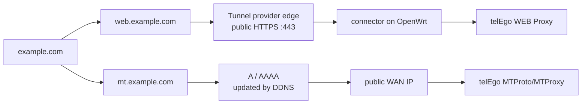
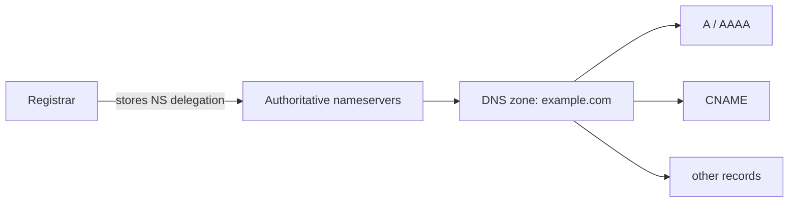
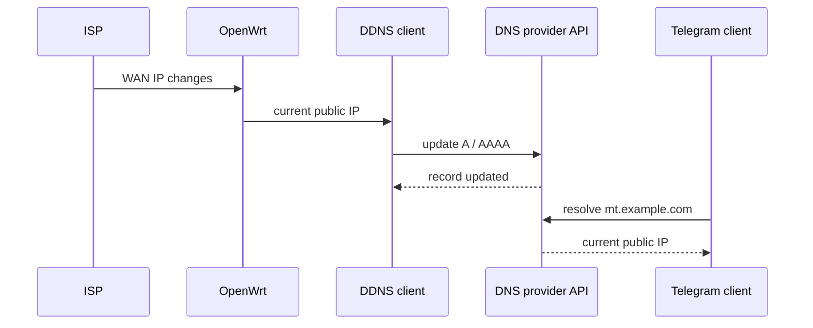

<div align="center">

# Domain and DNS

**Public hostnames for WEB Proxy and MTProto/MTProxy on OpenWrt**

[](https://openwrt.org/)
[](#what-we-are-setting-up)
[](#how-dns-fits-together)
[](#dynamic-dns-ddns)
[](#sources)

**Domain · DNS · DDNS · DNSSEC · dynamic public IP · port 443**

[Русский](DOMAIN.md) · [English](DOMAIN_EN.md) · [Documentation](README_EN.md)

</div>

`telEgo-openwrt` can use one domain for two separate jobs. The WEB Proxy gets a stable HTTPS hostname, while direct MTProto/MTProxy gets a stable name that can follow a changing public IP through DDNS.

When the WEB Proxy is published through a Tunnel, clients still use standard HTTPS on port `443`, but OpenWrt does not need to accept inbound WAN TCP/443 itself. That avoids a collision with the router's own HTTPS interface or another local service.

> [!IMPORTANT]
> A domain name and DDNS do not replace a public IP address. Direct MTProto/MTProxy still needs a routable address from the ISP, or another way to provide inbound connectivity. If OpenWrt is behind CGNAT, changing DNS alone will not make it reachable from the Internet.

> [!NOTE]
> Domain pricing, registration rules, and regional restrictions change over time. Provider- and registry-dependent facts in this guide were re-checked on **September 14, 2026**.

---

## What we are setting up

One domain and two subdomains are usually enough:

```text
example.com
├── web.example.com   WEB Proxy
└── mt.example.com    direct MTProto/MTProxy
```

### Two different traffic paths



| Scenario | What the domain gives you | Public WAN IP required | What happens to `443` |
|---|---|---:|---|
| **WEB Proxy through a Tunnel** | Stable HTTPS hostname | No | Public `443` terminates at the Tunnel provider |
| **Direct MTProto/MTProxy** | Stable name for the router | **Yes** | OpenWrt listens on the inbound port you choose |
| **Direct MTProto/MTProxy + DDNS** | The same hostname after an IP change | **Yes** | DDNS changes DNS, not the network port |

> [!TIP]
> If WAN TCP/443 is already in use on OpenWrt, direct MTProto/MTProxy can use another available port. A Tunnel-based WEB Proxy does not have that limitation on the router side.

---

## Fast path

| Step | Outcome |
|---:|---|
| **1** | Choose a TLD and registrar |
| **2** | Register the domain and secure the account |
| **3** | Decide where authoritative DNS will live |
| **4** | Change nameservers if you use a separate DNS provider |
| **5** | Create hostnames for WEB Proxy and MTProto/MTProxy |
| **6** | Enable DDNS if the public WAN IP changes |
| **7** | Verify DNS, then enable DNSSEC |

If you already own a domain, skip ahead to **[How DNS fits together](#how-dns-fits-together)**.

---

# 1. Choose the domain

## Choose a TLD

The TLD is the part after the final dot: `.com`, `.net`, `.org`, `.ru`, and so on.

There is no universally best TLD for a technical service. Long-term ownership matters more than a heavily discounted first year.

| Check | Why it matters |
|---|---|
| **Renewal price** | Usually more important than the registration discount |
| **Registry rules** | Some ccTLDs require local presence, status, or identity verification |
| **Availability in your country** | The registrar or payment provider may apply regional restrictions |
| **Transfer policy** | You should understand how to move the domain elsewhere |
| **DNSSEC** | Needed for cryptographic validation of DNS |
| **Nameserver control** | Required if DNS will be hosted away from the registrar |

For international deployments, generic TLDs such as `.com`, `.net`, or `.org` are common choices. A country-code TLD is equally valid if its registration rules suit the owner.

## Choose a registrar

A **registrar** is the company through which you register, renew, and transfer the domain. It does not have to be the company that hosts your DNS.

Before paying, check:

- the registration **and** normal renewal price;
- payment methods available in your country;
- whether you can change authoritative nameservers;
- DNSSEC support;
- MFA/2FA for the account;
- the transfer-out procedure;
- identity and registrant-data requirements.

For international TLDs, examples include Cloudflare Registrar, Namecheap, Porkbun, or another ICANN-accredited registrar. These are examples, not project requirements.

> [!TIP]
> For infrastructure, the best registrar is the one you expect to be able to **renew, recover, and transfer away from** years later. The first-year price is secondary.

<details>
<summary><b>Terminology: registrar, registry, DNS provider, DDNS client</b></summary>

<br>

| Role | Responsibility |
|---|---|
| **Registrar** | Registration, renewal, registrant data, transfers |
| **Registry** | Operates the top-level domain itself, such as `.com` or `.ru` |
| **Authoritative DNS provider** | Stores the live DNS zone and answers for its records |
| **DDNS client** | Updates `A` / `AAAA` automatically when the WAN IP changes |

A single company may provide several of these services, but they are separate roles in the DNS system.

</details>

---

# 2. Register the domain

Registrar interfaces differ, but the registration flow is broadly the same:

1. Create an account and enable MFA/2FA immediately.
2. Search for the domain name you want.
3. Select the TLD.
4. Enter accurate registrant or administrator details.
5. Complete identity verification if the TLD requires it.
6. Check the registration price and the normal renewal price.
7. Remove extras you do not need. Hosting, site builders, mail, and certificates can be added separately later.
8. Complete payment.
9. Once the domain appears in the control panel, verify the registrant, expiration date, and Auto-Renew settings.

### Before you pay

- [ ] The domain name is spelled correctly.
- [ ] You know the renewal price.
- [ ] You understand the selected TLD's requirements.
- [ ] MFA/2FA is available at the registrar.
- [ ] You can change nameservers.
- [ ] You have a payment method that should remain usable for renewal.
- [ ] No unwanted add-on services were included.

---

## Notes for users in Russia

Users in Russia should check two things independently: **whether the TLD is available** and **whether payment is possible**. An international registrar may not sell `.ru/.рф/.su`, may restrict some products for Russian accounts, or may not support a payment method available to you.

For `.ru` and `.рф`, a Russian registrar is often operationally simpler, while authoritative DNS can still be hosted with a separate local or international provider.

> [!IMPORTANT]
> From **September 1, 2026**, operations involving `.RU`, `.РФ`, and `.SU` require administrator identity verification through Russia's ESIA/Gosuslugi system. Timeweb explicitly lists registration, renewal, registrar transfer, administrator changes, and **nameserver changes** among the affected operations.

For `.ru/.рф`, providers such as Timeweb, Reg.ru, RU-CENTER, and other accredited registrars are possible options. For `.su`, check the registrar-specific identity process before purchasing.

<details>
<summary><b>Practical example: registering a .ru domain with Timeweb</b></summary>

<br>

The walkthrough uses a generic placeholder only:

```text
<your-domain>.ru
```

**1. Prepare the domain administrator**

In Timeweb, open:

**Домены и SSL → Администраторы**

For `.ru/.рф`, create the administrator and complete Gosuslugi identity verification. The details must match the verified ESIA account.

**2. Find the domain**

Open:

**Домены и SSL → Купить домен**

Enter the name you want and confirm that it is available.

**3. Review the order**

Before paying, verify the administrator, registration term, first-period price, and renewal price. Hosting or a VPS is not required for this setup.

**4. Pay and verify**

After processing, confirm that the domain appears in the account, the correct administrator is assigned, and the expiration date matches the order.

> Timeweb notes that registration and DNS updates are not necessarily visible immediately; its documentation gives a typical window of up to 3–24 hours.

</details>

---

# 3. How DNS fits together

After registration, the domain is delegated to **authoritative DNS servers**. Those servers answer for `A`, `AAAA`, `CNAME`, and the rest of the zone.



### Option A — keep DNS at the registrar

Leave the nameservers unchanged and create records in the registrar's DNS panel.

```text
A       mt.example.com        203.0.113.10
AAAA    mt.example.com        2001:db8::10
CNAME   www.example.com       example.com
```

`203.0.113.0/24` and `2001:db8::/32` are documentation ranges, not real addresses to copy into your setup.

### Option B — use a separate DNS provider

1. Add the domain to the DNS provider.
2. Copy the authoritative nameservers assigned to your zone.
3. Replace the old nameservers at the registrar.
4. Save the change and wait for delegation to propagate.
5. Verify the new DNS before removing the old configuration.

> [!WARNING]
> Never copy nameservers from somebody else's guide or screenshot. Use only the nameservers assigned to **your** zone.

---

# 4. Verify DNS

Check nameserver delegation:

```sh
nslookup -type=NS example.com
```

Check IPv4 and IPv6 records:

```sh
nslookup -type=A mt.example.com
nslookup -type=AAAA mt.example.com
```

Delegation changes are not always visible immediately. Registry processing, registrar updates, TTLs, and resolver caches can all affect how quickly the change appears.

> [!NOTE]
> Seeing the old nameservers immediately after a change does not necessarily mean the change failed. Allow time for propagation, then check again.

---

# 5. Dynamic DNS (DDNS)

DDNS is useful when the ISP gives you a **public but changing** WAN IP.



The DNS provider needs an API or built-in Dynamic DNS support. Cloudflare is one option, not the only one.

> [!CAUTION]
> **DDNS is not a CGNAT bypass.** If OpenWrt does not receive a routable public address on WAN, a perfectly updated `A`/`AAAA` record still does not create an inbound path to the router.

---

# 6. DNSSEC

DNSSEC lets resolvers verify cryptographically that DNS data belongs to your zone and was not replaced in transit.

For a new domain, keep the order simple:

1. Finish the normal DNS setup first.
2. Confirm that the domain and required hostnames resolve correctly.
3. Enable DNSSEC using the DNS provider's and registrar's instructions.

Migrating an already signed zone needs more care. Leaving an old DS record in place after changing nameservers can make the domain fail for validating resolvers.

> [!WARNING]
> Do not leave the old DS record active during a DNS-provider migration unless the provider's documented migration procedure explicitly requires it.

---

# 7. Protect the domain

A domain is part of your network infrastructure. Losing the registrar account can be more disruptive than losing one server.

- [ ] MFA/2FA is enabled.
- [ ] The account uses a unique password.
- [ ] Recovery email and phone details are current.
- [ ] Registrar Lock is enabled where available.
- [ ] Auto-Renew settings are intentional.
- [ ] The renewal payment method is likely to remain usable.
- [ ] MFA recovery codes are stored separately.
- [ ] DNSSEC is enabled after DNS is stable.

> [!CAUTION]
> Never publish registrant identity documents, ESIA/Gosuslugi data, payment details, MFA recovery codes, API tokens, or registrar session cookies.

---

# 8. Cloudflare as one DNS/DDNS example

Cloudflare is **not required** for this design. It is one practical DNS provider because authoritative DNS is available on the Free plan and records can be managed through an API.

### Connect an existing domain

1. Add the domain to Cloudflare Dashboard.
2. Review the DNS records Cloudflare imports.
3. Cloudflare will assign two authoritative nameservers to the zone.
4. Replace the current nameservers at the registrar with that pair.
5. Wait for the zone to become **Active**.
6. Verify delegation:

```sh
nslookup -type=NS example.com
```

### Use Cloudflare for DDNS

For direct MTProto/MTProxy, a DDNS client on OpenWrt can update the `A`/`AAAA` record for `mt.example.com` through the Cloudflare API whenever the public WAN IP changes.

Cloudflare Tunnel, `cloudflared`, and WEB Proxy publishing are covered separately in **[Cloudflare Tunnel on OpenWrt](CLOUDFLARE_EN.md)**.

<details>
<summary><b>Why Cloudflare is optional</b></summary>

<br>

For `telEgo-openwrt`, the provider's brand is not the requirement. The capabilities are:

| Capability | When it matters |
|---|---|
| Reliable authoritative DNS | Always |
| `A` / `AAAA` / `CNAME` control | Always |
| API access | Automation and DDNS |
| DNSSEC | DNS integrity validation |
| Dynamic DNS | Dynamic public WAN IP |
| Availability in your country | Always |

The registrar's DNS or any separate provider that meets these requirements can be used instead.

</details>

---

# Sources

External requirements were re-checked on **September 14, 2026**.

| Topic | Official source |
|---|---|
| ICANN-accredited registrars | [ICANN — Accredited Registrars](https://www.icann.org/en/accredited-registrars) |
| Timeweb domain registration | [Timeweb — registration and renewal](https://timeweb.com/ru/docs/domeny/registraciya-i-prodlenie/registraciya-i-prodlenie-domena/) |
| `.RU/.РФ` administrator setup | [Timeweb — domain administrators](https://timeweb.com/ru/docs/domeny/administratory-domenov/sozdanie-i-redaktirovanie-persony-administratora-domena/) |
| ESIA for `.RU/.РФ/.SU` | [Timeweb — ESIA verification](https://timeweb.com/ru/docs/domeny/identifikaciya-cherez-esia/) |
| Cloudflare authoritative DNS | [Cloudflare DNS](https://developers.cloudflare.com/dns/) |
| Cloudflare Free / Primary DNS | [Primary DNS setup](https://developers.cloudflare.com/dns/zone-setups/full-setup/) |
| Cloudflare Registrar TLDs | [Supported TLDs](https://developers.cloudflare.com/registrar/top-level-domains/) |

---

<div align="center">

**Next:** [Cloudflare Tunnel](CLOUDFLARE_EN.md) · [telEgo configuration](CONFIGURATION_EN.md) · [Documentation](README_EN.md)

</div>
