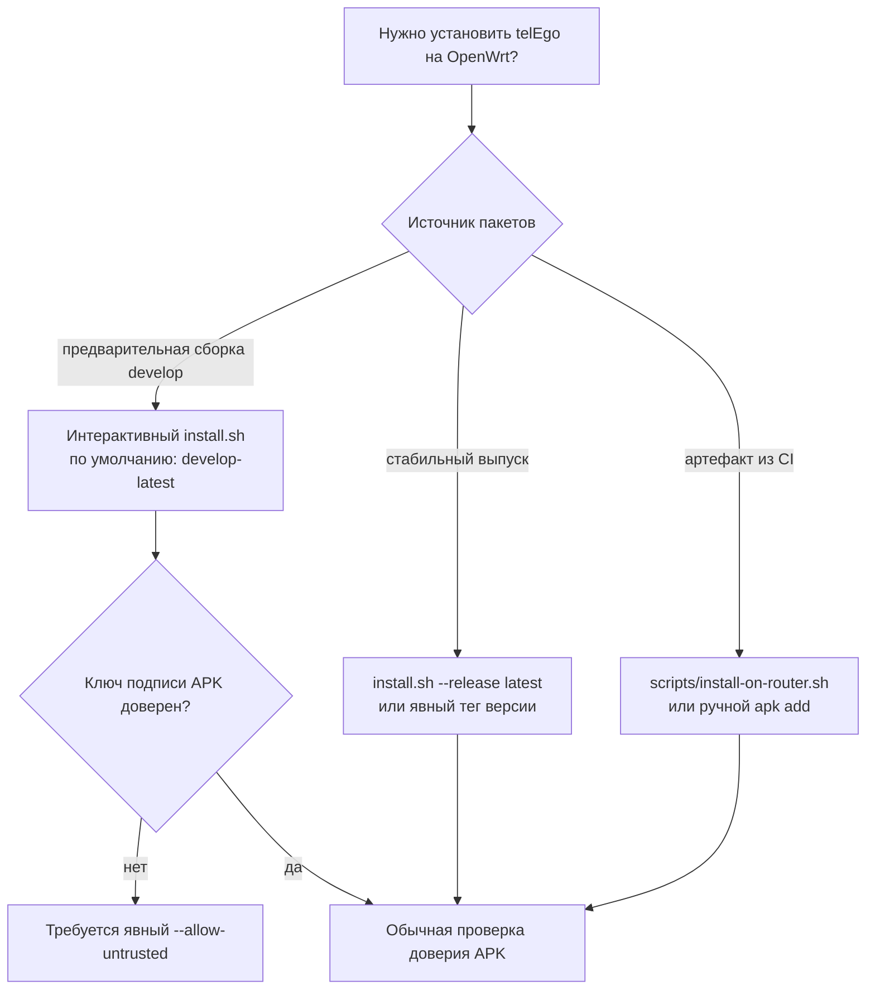

# Установка

[**Русский**](INSTALL.md) · [English](INSTALL_EN.md)

В этом руководстве описаны поддерживаемые способы установки `telEgo-openwrt` на OpenWrt.

## Требования

- OpenWrt `25.12.x` на архитектуре `x86_64`.
- Доступ с правами `root`.
- Рабочие репозитории пакетов OpenWrt и пакетный менеджер `apk`.
- Не менее 32 MiB свободного места в `/tmp` и `/` для предварительной проверки интерактивного установщика.
- `uclient-fetch`, `wget` или `curl` для загрузки файлов.
- Свободный TCP-порт для MTProxy; по умолчанию проект использует `0.0.0.0:443`.
- Настроенные правила WAN firewall/NAT, если к роутеру должны подключаться клиенты из Интернета.

Для WEB Proxy дополнительно требуются DNS, публичный TLS-сертификат и конфигурация Nginx. Эти компоненты настраивает администратор; пакеты проекта не создают их автоматически.

## Выбор способа установки



## Рекомендуемый способ: интерактивный установщик

Запустите на роутере от имени `root`:

```sh
wget -O /tmp/telego-install.sh \
  https://raw.githubusercontent.com/Ra1nek/telEgo-openwrt/develop/install.sh
sh /tmp/telego-install.sh
```

Установщик написан для стандартного POSIX/OpenWrt `sh`; Bash и `jq` на роутере не требуются.

Он всегда устанавливает:

```text
telego-pkg
luci-app-telego
nginx-telego
nginx-ssl
```

Русский перевод LuCI `luci-i18n-telego-ru` устанавливается по желанию.

### Параметры установщика

```text
--lang ru|en         язык интерфейса установщика
--ru                 установить русский перевод LuCI
--no-ru              не устанавливать русский перевод LuCI
--release TAG        тег выпуска; по умолчанию develop-latest
                     latest = последний стабильный выпуск
--allow-untrusted    явно разрешить установку APK без доверенного ключа подписи
--yes                подтвердить установку без дополнительных запросов
-h, --help           показать справку
```

Примеры:

```sh
# Русский интерфейс + перевод LuCI, неинтерактивная установка develop-сборки
sh /tmp/telego-install.sh \
  --lang ru --ru --yes --allow-untrusted

# Английский интерфейс без русского перевода LuCI
sh /tmp/telego-install.sh \
  --lang en --no-ru --yes --allow-untrusted

# Последний стабильный выпуск — после публикации и настройки доверенного ключа подписи
sh /tmp/telego-install.sh \
  --lang en --no-ru --release latest --yes
```

> [!CAUTION]
> `--yes` **не включает** `--allow-untrusted`. Если ключ подписи предварительной сборки не считается доверенным на роутере, разрешение на такую установку нужно указать отдельно.

## Что проверяет установщик

Для выбранного канала выпуска установщик:

1. проверяет версию OpenWrt `25.12.x` и архитектуру `x86_64`;
2. проверяет наличие необходимых утилит и свободного места;
3. загружает `telego-install.sha256`;
4. выбирает ровно один подходящий APK для каждого запрошенного пакета проекта;
5. проверяет целостность файлов по SHA-256;
6. выполняет предварительную проверку установки средствами `apk`;
7. устанавливает весь комплект пакетов одной операцией;
8. сохраняет существующий `/etc/config/telego` при обновлении;
9. при необходимости перезапускает связанные системные службы.

Манифест `develop-latest` публикуется только после успешной сборки соответствующего коммита ветки `develop`. Файлы пакетов загружаются раньше манифеста, поэтому установщик, запущенный во время обновления канала, завершится с ошибкой проверки целостности вместо того, чтобы незаметно установить пакеты из разных ревизий.

## Доверие к пакетам

Следует различать два независимых свойства:

- **Целостность по SHA-256** показывает, совпадают ли загруженные файлы с опубликованным манифестом.
- **Доверие к подписи APK** показывает, доверяет ли роутер ключу, которым подписан пакет.

Совпадение контрольной суммы само по себе не подтверждает подлинность издателя.

Для стабильных выпусков устанавливайте открытый ключ подписи APK через доверенный канал и независимо проверяйте его отпечаток, прежде чем полагаться на проверку подписи. Закрытый ключ подписи никогда не должен распространяться или устанавливаться на роутер.

Для тестовой сборки, происхождению которой вы осознанно доверяете, флаг `--allow-untrusted` явно отключает проверку доверия к ключу подписи. По умолчанию этот режим не используется.

## Установка артефакта CI с компьютера

Артефакт CI содержит репозиторий пакетов проекта. Укажите каталог, в котором находится ровно одна версия каждого APK проекта:

```bash
bash scripts/install-on-router.sh 192.168.1.1 ./x86_64/telego
```

Для тестовой сборки, которой вы осознанно доверяете:

```bash
bash scripts/install-on-router.sh \
  --allow-untrusted 192.168.1.1 ./x86_64/telego
```

Вспомогательный скрипт:

- проверяет, что для каждого из четырёх пакетов проекта присутствует ровно один APK;
- создаёт на роутере временный каталог с ограниченным доступом;
- копирует в него только эти APK;
- выполняет `apk update` и устанавливает все четыре пакета одной операцией;
- перезапускает `rpcd`;
- удаляет временные файлы.

## Ручная установка

Скопируйте только четыре APK проекта в отдельный каталог с ограниченным доступом, например `/tmp/telego-install`:

```sh
cd /tmp/telego-install
apk update
apk add \
  ./telego-pkg-*.apk \
  ./luci-app-telego-*.apk \
  ./luci-i18n-telego-ru-*.apk \
  ./nginx-telego-*.apk
/etc/init.d/rpcd restart
```

Для неподписанной или недоверенной тестовой сборки, происхождению которой вы осознанно доверяете:

```sh
apk add --allow-untrusted \
  ./telego-pkg-*.apk \
  ./luci-app-telego-*.apk \
  ./luci-i18n-telego-ru-*.apk \
  ./nginx-telego-*.apk
```

Системные зависимости должны устанавливаться из репозиториев OpenWrt, настроенных на самом роутере. Не добавляйте в каталог установки случайные APK из посторонних каталогов `base`, `luci` или `packages` артефакта CI.

## Первая настройка

1. Откройте **Services → telEgo** в LuCI.
2. Добавьте хотя бы одного пользователя с секретом из 32 шестнадцатеричных символов.
3. Убедитесь, что адрес и порт MTProxy не конфликтуют с другим локальным сервисом.
4. Настройте TLS Fronting в соответствии с вашей схемой подключения.
5. Оставьте WEB Proxy выключенным, пока не будут подготовлены Nginx и TLS.
6. Включите MTProxy.
7. Нажмите **Save & Apply**.

После этого сервис создаст `/var/etc/telego.toml` и запустится через procd/ujail от имени непривилегированного пользователя `telego`.

## Проверка работы сервиса

```sh
/etc/init.d/telego status
ubus call telego status
logread -e telego
```

Проверить владельца и права доступа сгенерированного файла, не раскрывая секреты:

```sh
ls -l /var/etc/telego.toml
```

При настроенном и запущенном сервисе ожидаются владелец `telego:telego` и права доступа `0600`.

## Требования WEB Proxy

`nginx-telego` устанавливает готовые файлы интеграции, но не создаёт полноценный публичный TLS-сайт:

```text
/etc/nginx/conf.d/telego.conf
/etc/nginx/snippets/telego.locations
```

Добавьте в управляемый вами TLS-блок `server {}`:

```nginx
include /etc/nginx/snippets/telego.locations;
```

Администратор по-прежнему отвечает за:

- DNS для настроенного имени хоста WEB Proxy;
- TLS-сертификат и закрытый ключ;
- схему публичных и внутренних слушающих адресов Nginx, подходящую для выбранной топологии;
- внутренний обработчик обычного сайта, который ожидает `telego.locations`, если используется этот сценарий;
- правила WAN firewall/NAT.

См. [ARCHITECTURE.md](ARCHITECTURE.md#native-web-proxy-и-nginx).

## Поведение при обновлении

Интерактивный установщик сохраняет существующий `/etc/config/telego` и создаёт его резервную копию с ограниченным доступом в `/etc/telego-backups/`. Если telEgo работал до обновления, после замены пакетов установщик может восстановить штатную работу сервиса.

Параметры UCI преобразуются в сгенерированный TOML, поэтому основным источником конфигурации остаётся UCI. Не сохраняйте и не редактируйте `/var/etc/telego.toml` как основной конфигурационный файл.

## Удаление

Удалите пакеты проекта средствами OpenWrt `apk` в соответствии с тем, какие компоненты вам больше не нужны. Например:

```sh
apk del luci-i18n-telego-ru luci-app-telego nginx-telego telego-pkg
```

Перед удалением отдельно проверьте `/etc/config/telego`, резервные копии и созданную администратором конфигурацию Nginx/TLS: они могут содержать настройки, которые требуется сохранить.

## Что читать дальше

- [Конфигурация](CONFIGURATION.md)
- [Архитектура](ARCHITECTURE.md)
- [Диагностика](TROUBLESHOOTING.md)
- [Модель безопасности](SECURITY.md)
