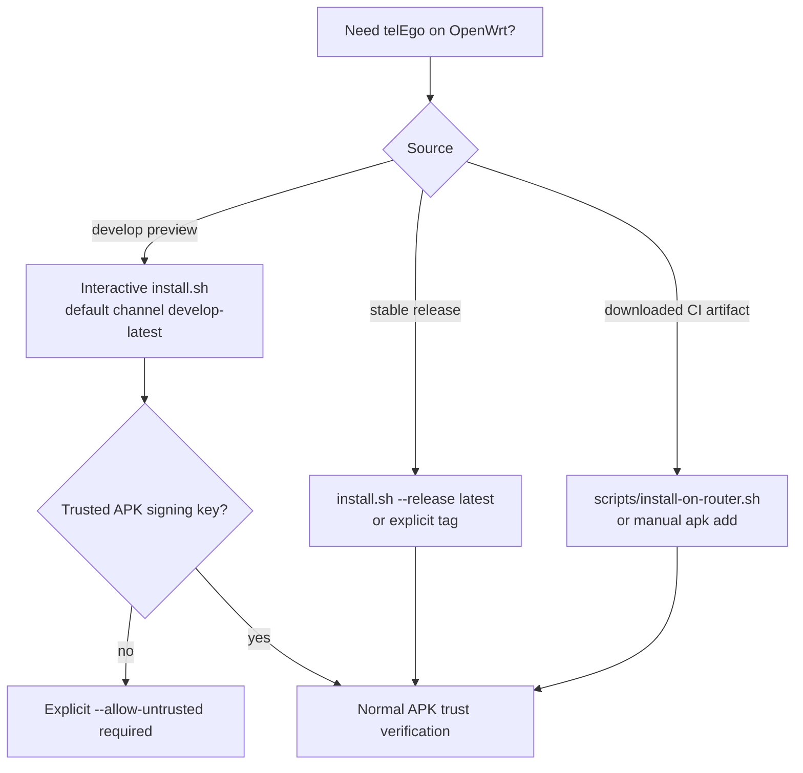

# Installation

This guide covers the supported OpenWrt installation paths for `telEgo-openwrt`.

## Requirements

- OpenWrt `25.12.x` on `x86_64`.
- `root` access.
- Working OpenWrt package repositories and `apk`.
- At least 32 MiB free on `/tmp` and `/` for the interactive installer preflight.
- `uclient-fetch`, `wget` or `curl` for downloads.
- A free TCP port for MTProxy; the default project configuration is `0.0.0.0:443`.
- For ordinary MTProxy, a suitable WAN firewall rule for the selected MTProxy port. Direct HTTPS manages only its own WAN TCP/443 redirect automatically.

WEB Proxy needs a public hostname. Managed Direct HTTPS and Native Shared-Port generate their Nginx TLS configuration, but the certificate remains a separate deployment asset: provide it yourself or use the optional OpenWrt ACME DNS-01 add-on.

## Choose an installation path



## Recommended: interactive installer

Run on the router as `root`:

```sh
wget -O /tmp/telego-install.sh \
  https://raw.githubusercontent.com/Ra1nek/telEgo-openwrt/develop/install.sh
sh /tmp/telego-install.sh
```

The installer is POSIX/OpenWrt `sh`; Bash and `jq` are not required on the router.

For a new installation, the wizard initially selects the complete telEgo component set but lets the operator change it before the APK transaction:

| Component | Purpose | Default |
|---|---|---|
| `telego-pkg` | daemon, UCI, procd/ujail | selected |
| `luci-app-telego` | LuCI and local rpcd | selected |
| `nginx-telego` | managed WEB ingress plus firewall/certificate helpers | selected, but **all ingress profiles remain disabled** |
| `luci-i18n-telego-ru` | Russian translation | follows language/operator choice |
| OpenWrt ACME DNS-01 | `acme-acmesh + acme-acmesh-dnsapi + luci-app-acme` | **not selected** |

`nginx-ssl` is resolved as a system dependency when `nginx-telego` is selected. Installing `nginx-telego` alone does not publish anything: Direct HTTPS, Cloudflare, and Native Shared-Port all start with `enabled=0`.

The ACME packages are not project APKs and are not owned by telEgo. The installer may add them from the configured OpenWrt repositories, but never removes them automatically when telEgo is removed.

If those ACME packages are already present for another service, a normal telEgo upgrade **does not adopt them as a selected telEgo component** and does not install `nginx-telego` merely because ACME exists. The telEgo ACME integration is requested only through the explicit ACME menu choice or `--acme`.

### Installer options

```text
--lang ru|en         UI language
--ru                 install Russian LuCI translation
--no-ru              skip Russian LuCI translation
--acme               add OpenWrt ACME DNS-01 support (off by default)
--no-acme            do not add the optional ACME packages
--release TAG        release tag; default develop-latest
                     use latest for the latest stable release
--allow-untrusted    explicitly bypass APK signing-key trust checks
--yes                noninteractive confirmation
-h, --help           show help
```

Examples:

```sh
# Russian UI + translation, noninteractive preview install
sh /tmp/telego-install.sh \
  --lang ru --ru --yes --allow-untrusted

# English UI, no Russian translation
sh /tmp/telego-install.sh \
  --lang en --no-ru --yes --allow-untrusted

# Develop preview + optional ACME DNS-01 support
sh /tmp/telego-install.sh \
  --lang en --no-ru --acme --yes --allow-untrusted

# Latest stable release, once published with a trusted signing path
sh /tmp/telego-install.sh \
  --lang en --no-ru --release latest --yes
```

> [!CAUTION]
> `--yes` does **not** imply `--allow-untrusted`. Preview packages without a trusted signing key require a separate explicit trust bypass.

## What the installer verifies

For the selected release channel it:

1. verifies OpenWrt `25.12.x` and `x86_64`;
2. checks required local tools and free space;
3. downloads `telego-install.sha256`;
4. selects exactly one matching APK for every requested project package;
5. verifies SHA-256 integrity;
6. performs an APK simulation/preflight;
7. adds system dependencies for the selected components; optional ACME is added only when explicitly selected;
8. installs the selected set in one APK transaction;
9. preserves existing `/etc/config/telego` through the upgrade flow;
10. restarts required integration services without enabling a managed ingress profile automatically.

The `develop-latest` manifest is published only after the matching develop build succeeds. The preview publisher uploads the manifest after package assets so a racing installer fails integrity validation instead of silently mixing revisions.

## Package trust

There are two separate properties:

- **SHA-256 integrity** answers whether the downloaded bytes match the published manifest.
- **APK signature trust** answers whether the package signer is trusted by the router.

A matching checksum does not authenticate the publisher by itself.

For stable releases, install the publisher's APK public key through a trusted channel and verify its fingerprint independently before relying on signature trust. Never distribute or install the private signing key.

For a development artifact you have deliberately chosen to trust, `--allow-untrusted` is an explicit bypass. It is not the default.

## Install a downloaded artifact from your computer

The CI artifact contains the project feed. Pass the directory containing exactly one version of each project APK:

```bash
bash scripts/install-on-router.sh 192.168.1.1 ./x86_64/telego
```

For a deliberately trusted development artifact:

```bash
bash scripts/install-on-router.sh \
  --allow-untrusted 192.168.1.1 ./x86_64/telego
```

The helper:

- validates that exactly one APK exists for each of the four project packages;
- creates a private temporary directory on the router;
- copies only those APKs;
- runs `apk update` and installs all four together;
- restarts rpcd;
- removes the temporary files.

This CI helper installs only the four project APKs. Add the optional ACME system add-on through the main `install.sh --acme` path or directly from the OpenWrt repositories:

```sh
apk add acme-acmesh acme-acmesh-dnsapi luci-app-acme
```

## Manual installation

Copy only the four project APKs into a private directory such as `/tmp/telego-install`:

```sh
cd /tmp/telego-install
apk update
apk add \
  ./telego-pkg-*.apk \
  ./luci-app-telego-*.apk \
  ./luci-i18n-telego-ru-*.apk \
  ./nginx-telego-*.apk
/etc/init.d/rpcd restart
```

For an explicitly trusted unsigned/untrusted development build:

```sh
apk add --allow-untrusted \
  ./telego-pkg-*.apk \
  ./luci-app-telego-*.apk \
  ./luci-i18n-telego-ru-*.apk \
  ./nginx-telego-*.apk
```

System dependencies should be resolved from the router's configured OpenWrt repositories; do not mix unrelated `base`, `luci`, `packages` feed APKs into the project install directory.

## First configuration

1. Open **Services → telEgo** in LuCI.
2. Add at least one user with a 32-hex-character secret.
3. Choose the MTProxy port. With **Direct HTTPS**, do not use `:443` (for example use `0.0.0.0:9443`); WAN TCP/443 belongs to WEB/Nginx in that mode. Use **Native Shared-Port** when WEB and MTProxy must share public `:443`.
4. Configure TLS fronting for the selected topology.
5. Leave WEB Proxy disabled until Nginx/TLS is prepared.
6. Enable MTProxy.
7. Click **Save & Apply**.

The service then generates `/var/etc/telego.toml` and starts under procd/ujail as the unprivileged `telego` user.

## Recommended path: Direct HTTPS + ACME DNS-01

This order keeps WAN TCP/443 unpublished until the backend and certificate have passed their checks.

1. Install telEgo. If OpenWrt should manage the certificate, select **OpenWrt ACME DNS-01** in the installer or pass `--acme`.
2. In **Services → telEgo → Configuration**:
   - enable telEgo;
   - put MTProxy on a separate port such as `0.0.0.0:9443`;
   - if MTProxy itself must be Internet-reachable, create the ordinary WAN TCP/9443 allow rule yourself; `nginx-telego-firewall` deliberately owns only the Direct WEB WAN TCP/443 → :18443 redirect;
   - add a user/secret;
   - enable WEB Proxy;
   - keep WEB bind on `127.0.0.1:8080`;
   - set the public hostname;
   - keep `127.0.0.1/32` in Trusted Proxy CIDRs;
   - **Save & Apply**.
3. If the ACME add-on is installed, open **Services → ACME** and configure DNS-01 for the WEB hostname. Start with the staging CA. DNS API credentials belong to ACME, never to `telego` or `nginx_telego`.
4. After a production certificate is issued, use the stable paths:
   ```text
   /etc/ssl/acme/<hostname>.fullchain.crt
   /etc/ssl/acme/<hostname>.key
   ```
5. Open **Services → telEgo → WEB Ingress**, choose **Direct HTTPS**, enter hostname/certificate/key, then run **Certificate Preflight** and **Firewall Preflight** before applying.
6. Only after both checks pass, **Save & Apply**. The safe apply order is firewall check → Nginx reconcile/`nginx -t` → package-owned WAN TCP/443 redirect.
7. Complete the [Direct HTTPS hardware test](DIRECT_HTTPS_TEST_EN.md): LAN :443 → LuCI, WAN :443 → Nginx, WAN :18443 not directly reachable, HTTP/2, Telegram Desktop, reboot, and rollback.

> [!IMPORTANT]
> Direct HTTPS is not the mode for sharing public TCP/443 between MTProxy and WEB. Use **Native Shared-Port (Advanced)** for that topology.

## Verify the service

```sh
/etc/init.d/telego status
ubus call telego status
logread -e telego
```

Check the generated file metadata without exposing secrets:

```sh
ls -l /var/etc/telego.toml
```

Expected security properties are owner `telego:telego` and mode `0600` while the service is configured/running.

## WEB Proxy prerequisites

`nginx-telego` installs the package-owned core/snippet plus the reconciliation engine. The final P6/P7 managed layout is:

```text
/etc/nginx/conf.d/20-telego-core.conf
/etc/nginx/snippets/telego.locations
/etc/nginx/conf.d/80-telego-ingress.conf      # conditional generated
/etc/nginx/conf.d/85-telego-fallback.conf     # conditional generated
/usr/share/nginx-telego/ownership.tsv
/usr/libexec/nginx-telego-reconcile
```

The `80-*` and `85-*` files exist only when the corresponding managed profile/fallback is enabled. Apply normal changes through:

```sh
/etc/init.d/nginx-telego reload
```

Do not invoke the renderer directly for normal administration. The init script delegates to the reconciler, which validates ownership/drift, performs safe migration/repair, uses the renderer as an internal generator, runs the final `nginx -t`, and rolls the managed filesystem back on failure.

When using an administrator-managed TLS `server {}` with the generic snippet, include:

```nginx
include /etc/nginx/snippets/telego.locations;
```

You are still responsible for:

- DNS for the configured WEB Proxy hostname;
- TLS certificate/private key;
- the public/private Nginx listener arrangement appropriate to your deployment;
- the ordinary-site fallback listener expected by the snippet if you use that path;
- WAN firewall/NAT rules.

See [ARCHITECTURE_EN.md](ARCHITECTURE_EN.md#native-web-proxy-and-nginx) and [NGINX_FILES_EN.md](NGINX_FILES_EN.md).

## Upgrade behavior

The interactive installer preserves existing `/etc/config/telego` and keeps a private backup under `/etc/telego-backups/`. If telEgo was running before an upgrade, the installer can restore normal service operation after package replacement.

Because runtime settings are converted to generated TOML, configuration ownership stays with UCI. Do not preserve/edit `/var/etc/telego.toml` as the source of configuration.

## Uninstall

Remove project packages with OpenWrt `apk` according to your desired component set. For example:

```sh
apk del luci-i18n-telego-ru luci-app-telego nginx-telego telego-pkg
```

Review `/etc/config/telego`, backups and any administrator-created Nginx/TLS configuration separately before deleting them; those may contain configuration you want to keep.

## Next steps

- [Configuration reference](CONFIGURATION.md)
- [Architecture](ARCHITECTURE.md)
- [Troubleshooting](TROUBLESHOOTING.md)
- [Security model](SECURITY.md)
