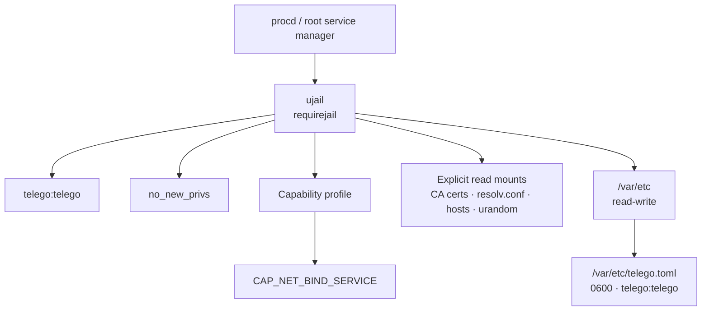
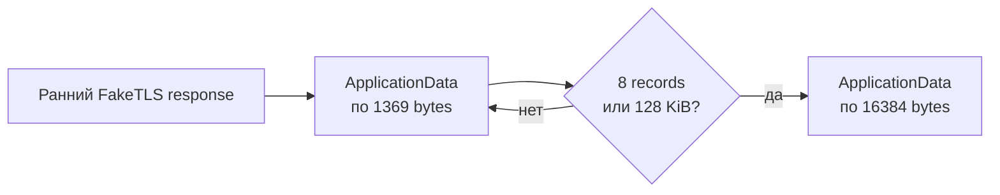
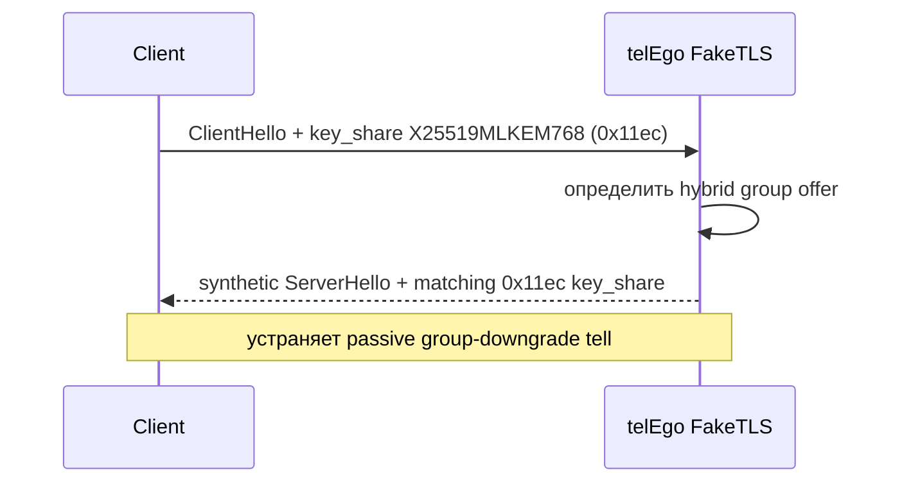
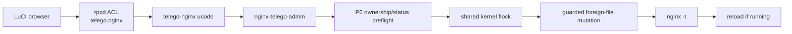
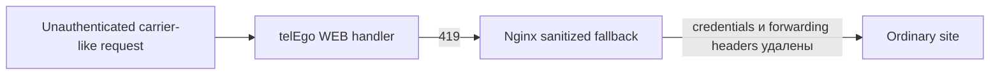

# Модель безопасности

[**Русский**](https://github.com/Ra1nek/telEgo-openwrt/blob/develop/docs/SECURITY.md) · [English](https://github.com/Ra1nek/telEgo-openwrt/blob/develop/docs/SECURITY_EN.md)

Этот документ описывает security boundaries, реализованные OpenWrt integration, а также network-hardening mechanisms, унаследованные от pinned core `Scratch-net/telego`. Это не утверждение, что protocol, deployment, router или network path полностью лишены риска.

> [!IMPORTANT]
> OpenWrt layer уменьшает privilege и exposure на хосте. Upstream FakeTLS layer уменьшает устойчивые passive/active fingerprints. Ни один из этих уровней не является математической гарантией невидимости для любого DPI или active-probing system.

## Milestone 2 — Security Hardening

Hardened OpenWrt runtime строится вокруг нескольких независимых controls:

| Control | Что делает | Security value |
|---|---|---|
| Dedicated `telego:telego` account | Запускает daemon без постоянных root privileges | Снижает blast radius при compromise daemon |
| `ujail` + `procd_add_jail ... requirejail` | Запускает service внутри OpenWrt jail boundary | Не позволяет незаметно перейти к unjailed service |
| Только `CAP_NET_BIND_SERVICE` | Позволяет non-root process слушать low ports, например `443` | Не выдаёт полный root capability set |
| `no_new_privs` | Блокирует получение дополнительных privileges при последующих `exec` | Фиксирует reduced privilege model |
| Atomic runtime TOML `0600` | Generated credentials читаются только service identity | Снижает риск раскрытия secrets через filesystem |



### Почему port 443 не требует root daemon

Capability profile package содержит только `CAP_NET_BIND_SERVICE` в bounding, effective, ambient, permitted и inheritable sets. Этого узкого privilege достаточно, чтобы непривилегированный daemon мог bind'иться к low-numbered listener, например TCP `443`, не получая полный root capability set.

<details>
<summary><b>⚡ Capability profile (нажмите, чтобы раскрыть)</b></summary>

```json
{
  "bounding": ["CAP_NET_BIND_SERVICE"],
  "effective": ["CAP_NET_BIND_SERVICE"],
  "ambient": ["CAP_NET_BIND_SERVICE"],
  "permitted": ["CAP_NET_BIND_SERVICE"],
  "inheritable": ["CAP_NET_BIND_SERVICE"]
}
```

</details>

## Upstream anti-DPI и probe-resistance layer

Pinned telEgo core добавляет transport shaping поверх host security boundary OpenWrt. Эти механизмы работают на FakeTLS path proxy→client и управляются секцией OpenWrt `tls_fronting`.

### Dynamic Record Sizer (DRS)

При включённом `enable_drs` исходящий TLS `ApplicationData` начинается с records по **1369 bytes** и переходит к полному размеру **16384 bytes** после **8 records** или **128 KiB** переданных данных — в зависимости от того, что наступит раньше.



**Зачем это нужно:** статичный размер records — удобный признак для passive classifier. Probe-then-ramp pattern делает early flight отличным от fixed-size tunnel, а затем возвращается к эффективным full-size records для продолжительного трафика.

> [!NOTE]
> DRS уменьшает устойчивый record-size fingerprint; он не делает encrypted traffic принципиально неотличимым от любого обычного HTTPS implementation.

### Split-TLS

При включённом `enable_split_tls` первый outbound TLS `ApplicationData` отправляется отдельным record размером **1 byte**, после чего продолжаются обычные payload records.

| Механизм | Эффект на wire | Defensive purpose |
|---|---|---|
| Split-TLS | Первый outbound `ApplicationData` = 1 byte | Ломает простые signatures, привязанные к первому application record |
| DRS | Ramp `1369 → 16384` | Убирает один фиксированный early-record profile |
| Profile-matched certificate record | При automatic sizing размер fake certificate record следует mask backend | Уменьшает различия accept-path и splice-path по record length |

> [!CAUTION]
> Эти функции нельзя описывать как «полностью побеждающие DPI/ТСПУ». Это fingerprint-hardening mechanisms. Реальная детектируемость зависит от наблюдателя, traffic corpus, deployment и будущих protocol changes.

### Post-quantum key-share parity

FakeTLS parser определяет, предложил ли client в `key_share` hybrid TLS named group **`X25519MLKEM768` (`0x11ec`)**.

Если такой offer присутствует, synthetic `ServerHello` отвечает matching group `0x11ec`, а не незаметно откатывается к classical X25519. Classical clients продолжают получать обычную X25519 group (`0x001d`).



> [!IMPORTANT]
> В этом контексте функция прежде всего обеспечивает **fingerprint parity** synthetic FakeTLS handshake. Она не является доказательством end-to-end post-quantum confidentiality всей MTProxy session за счёт telEgo.

### Replay и probe handling

Upstream core также содержит:

- replay protection для FakeTLS handshakes;
- SNI validation относительно configured mask host;
- optional SNI-following safelist для выбранных domains;
- splice/fallback handling для unauthenticated или unrecognized clients;
- certificate-profile и first-flight shaping, уменьшающие различия accepted traffic и mask path.

Эти механизмы дополняют host-level sandbox OpenWrt, но решают другую задачу: `ujail` защищает router, FakeTLS hardening изменяет network fingerprint.

## Почему не включён `ronly`

CI собирает telEgo с `CGO_ENABLED=0` как static PIE. Dependency discovery `ujail ronly` ожидает dynamic ELF metadata и не может корректно обнаружить dependencies для такого binary layout. Поэтому service не запрашивает именно эту feature.

Это **не отключает** остальные элементы jail setup: `requirejail`, namespace/filesystem isolation, UID/GID drop, explicit mounts, `no_new_privs` и capability bounding profile остаются активными.

## Secrets конфигурации

User secret — ровно **32 hexadecimal characters = 16 bytes = 128 bits**.

LuCI generator использует browser `window.crypto.getRandomValues()`, генерирует 16 random bytes и кодирует их в 32 hex characters. Init script повторно проверяет UCI value перед генерацией runtime TOML.

Sensitive locations:

```text
/etc/config/telego
/var/etc/telego.toml
```

Runtime TOML создаётся как:

```text
owner: telego:telego
mode:  0600
```

Сначала файл записывается во temporary path, затем атомарно перемещается на место.

> [!CAUTION]
> `uci show telego`, generated TOML, screenshots секции LuCI **Users** и часть debug output могут раскрывать secrets. Перед публикацией logs/issues обязательно делайте redaction.

## Lifecycle service account

На уровне package/runtime integration:

- package metadata объявляет `telego:telego`;
- init script использует native OpenWrt account helpers как fallback для старых revisions;
- daemon запускается с явными `user` и `group` parameters;
- fallback account использует `/bin/false` как shell.

## Metrics и telemetry

Default metrics endpoint:

```text
127.0.0.1:9090/metrics
```

LuCI rpcd adapter намеренно строже generic HTTP client. Он получает metrics только с literal loopback address и проверяет path до запуска `uclient-fetch`.

Это не позволяет administrator-controlled metrics setting превратить LuCI status RPC в generic server-side URL fetch primitive.

Метод `telego.status` остаётся read-only. Обычная запись LuCI configuration выполняется через UCI под application ACL. Отдельные P8 Nginx write operations находятся в другом ubus object — `telego.nginx` — и имеют собственную filesystem security boundary, описанную ниже.

## P8 Nginx administration privilege boundary

P8 намеренно **не** превращает rpcd в generic root file API. LuCI вызывает отдельный локальный object `telego.nginx`, а backend делегирует privileged filesystem operation только фиксированному helper:

```text
/usr/libexec/nginx-telego-admin
```



Security properties этой boundary:

- read и write RPC методы разделены в LuCI ACL;
- browser/rpcd передаёт logical file name/role, а не произвольный absolute filesystem path;
- foreign/quarantine targets ограничены безопасными direct-child `*.conf` names;
- symlink, directory и другие unsupported path types не принимаются как mutation target;
- package-owned paths нельзя quarantine/delete/overwrite через P8;
- active occupant на generated reserved path `80/85` можно менять только если P6 классифицирует его как `foreign`;
- restore на generated reserved path разрешён только при текущем state `absent`, без overwrite существующего target;
- quarantine хранится вне active Nginx include tree в `/etc/nginx-telego/quarantine/` и создаётся по необходимости с restrictive permissions;
- P7 reconciler и P8 admin helper используют один kernel `flock(2)` lock file, поэтому два writer path не меняют Nginx tree одновременно;
- active-tree mutation завершается только после успешного `nginx -t` и reload-if-running; при failure filesystem state откатывается;
- `repair` делегируется `/usr/libexec/nginx-telego-reconcile apply`, а не реализует второй ownership/repair engine.

RPC backend shell-quotes method arguments перед запуском helper, но это не заменяет helper-side validation: security boundary должна оставаться двухслойной — constrained RPC contract плюс root-side path/ownership checks.

> [!IMPORTANT]
> Не переносите `rm`, `mv`, arbitrary file read/write или path construction из `nginx-telego-admin` напрямую в browser/rpcd. Такой shortcut обошёл бы P6 ownership, shared lock, `nginx -t` и rollback boundary.

Полный method/response contract описан в [API.md](API.md), а ownership state machine — в [NGINX_FILES.md](NGINX_FILES.md).

## Private listener WEB Proxy

Default WEB Proxy listener:

```text
127.0.0.1:8080
```

Оставляйте его private. Публичный TLS должен проходить через Nginx integration, а не через прямую публикацию plain HTTP carrier listener в Internet.

## Sanitization запросов Nginx

Reusable snippet `telego.locations` обрабатывает два private fallback status из WEB handler:

| Status | Значение | Действие Nginx |
|---:|---|---|
| `418` | Обычный website request | Сохранить request и передать ordinary site |
| `419` | Carrier-shaped request, не прошедший authentication | Удалить carrier credentials/body metadata и отправить безопасный `GET` ordinary site |



Path `419` удаляет request body/content metadata и carrier-sensitive headers, включая authorization, cookies, carrier sequencing/session headers, WebSocket headers и forwarded-address headers.

> [!IMPORTANT]
> Не обходите `419` sanitization ради упрощения custom Nginx deployment. Это часть privacy boundary между WEB carrier и decoy/ordinary site.

## Direct HTTPS firewall boundary

Direct HTTPS напрямую использует Nginx listeners `0.0.0.0:443` и `[::]:443`. `nginx-telego-firewall` владеет только именованной секцией:

```text
firewall.telego_direct_https
```

Секция является WAN TCP/443 `INPUT ACCEPT` rule с `family=any`; DNAT/REDIRECT и private backend `:18443` в текущей topology отсутствуют. Manager отказывается включать профиль при чужом WAN/443 owner, reserved foreign-section, незакоммиченных firewall UCI changes или WAN input policy `ACCEPT`.

Если uhttpd занимал HTTPS `:443`, platform reconciler переносит только эти HTTPS listeners на management port. **LuCI plain HTTP `listen_http` (обычно `:80`) не входит в ownership nginx-telego, не отключается и не получает package-owned WAN allow-rule.** Его доступность определяется конфигурацией uhttpd и firewall администратора.

Direct HTTPS требует, чтобы telEgo MTProxy не слушал TCP/443. Для совместного WEB+MTProxy public `:443` используйте Native Shared-Port.

### P12.7 TLS/HTTPS hardening

Managed Direct HTTPS разрешает только TLS 1.2/1.3, отклоняет unknown SNI, использует `server_tokens off` и staged HSTS. Значение `nginx_telego.direct_https.hsts_max_age` по умолчанию `604800`; `includeSubDomains` и `preload` не генерируются. После аппаратной, reboot и renewal-приёмки значение можно увеличить до `31536000`.

Пакет намеренно не включает OCSP stapling для Let's Encrypt, не закрепляет большой ручной cipher-list и не добавляет глобальные CSP/Permissions-Policy поверх WEB carrier. Managed ordinary fallback остаётся `200 OK`; дополнительные headers ограничены `X-Content-Type-Options: nosniff`, `Referrer-Policy: no-referrer` и `Cache-Control: no-store`.

> [!IMPORTANT]
> HSTS — состояние браузера, а не исправление сертификата. Увеличивайте `max-age` только после проверки hostname, certificate renewal, reboot и rollback. `max-age=0` доступен как контролируемый способ снять HSTS для будущих ответов.

## TLS certificates и ответственность deployment

`nginx-telego` **не поставляет** реальный certificate, private key или public hostname. Эти deployment assets принадлежат администратору либо OpenWrt ACME.

При включённом managed Direct HTTPS или Native Shared-Port пакет генерирует Nginx TLS `server {}` из явно настроенных путей certificate/key. Перед apply/renewal выполняются certificate/key/hostname checks и `nginx -t`; сами secret key bytes пакет не генерирует и не сохраняет в UCI.

Для OpenWrt ACME используйте стабильные symlink-пути и DNS-01 из [инструкции TLS-сертификата](TLS_CERTIFICATE.md). Защищайте private keys согласно обычной практике OpenWrt/Nginx и не помещайте их в репозиторий.

## APK integrity и signing trust

Installer намеренно разделяет file integrity и доверие к signer.

### SHA-256 integrity

`telego-install.sha256` обнаруживает повреждённые или несоответствующие release assets.

### APK signing trust

Trusted APK signature аутентифицирует package signer для роутера. Preview artifacts могут не иметь key, которому target device уже доверяет.

Поэтому `--allow-untrusted` является явным и отдельным от `--yes`.

Никогда не:

- commit'ьте `OPENWRT_APK_PRIVATE_KEY`;
- публикуйте private signing key;
- считайте checksum verification самостоятельной publisher authentication;
- добавляйте `--allow-untrusted` молча в stable installation instructions.

## CI и supply-chain controls

Workflows используют pinned action versions/commits для критичных build components, валидируют integration до release и завершаются ошибкой при отсутствии любого ожидаемого project APK или `packages.adb`.

Stable release tag должен совпадать с `PKG_VERSION`. Release workflow получает APK private key через GitHub Actions secret, а не из repository content.

## Checklist перед публикацией в Internet

- [ ] Проверить нужный MTProxy bind address/port; для Direct HTTPS MTProxy не должен использовать TCP/443.
- [ ] Проверить, что firewall публикует только необходимые ports; Direct HTTPS должен иметь только managed WAN TCP/443 INPUT allow, а LuCI management/:80 не должны публиковаться пакетом.
- [ ] Оставить private listeners WEB Proxy и metrics на loopback, если нет отдельно reviewed причины менять это.
- [ ] Использовать валидный administrator/ACME-managed TLS certificate и выполнить certificate preflight.
- [ ] Убедиться, что Nginx включает project snippet и сохраняет sanitized `419` path.
- [ ] Оставить DRS и Split-TLS включёнными, кроме controlled compatibility test.
- [ ] Использовать уникальные random secrets и ротировать любой раскрытый secret.
- [ ] Не публиковать ubus/rpcd в Internet.
- [ ] Проверить source/signing trust packages перед stable deployment.

## Reporting и incident response

Если secret или signing key раскрыт, считайте его compromised и rotate/revoke вместо надежды на удаление из Git history или issue comment.

При подозрении на vulnerability не публикуйте рабочие credentials, private keys или user secrets в public issue. Используйте private maintainer/security channel, если он доступен.

## Связанные документы

- [Архитектура](ARCHITECTURE.md)
- [Конфигурация](CONFIGURATION.md)
- [Установка](INSTALL.md)
- [Local integration / API](API.md)
- [Nginx ownership / administration](NGINX_FILES.md)
- [TLS-сертификат / ACME DNS-01](TLS_CERTIFICATE.md)
- [Проверка Direct HTTPS](DIRECT_HTTPS_TEST.md)
