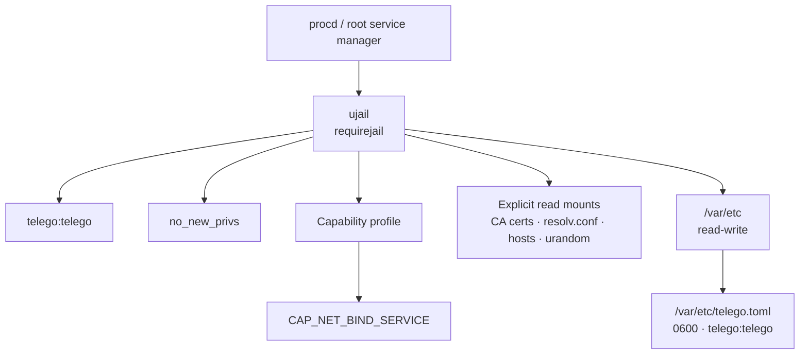
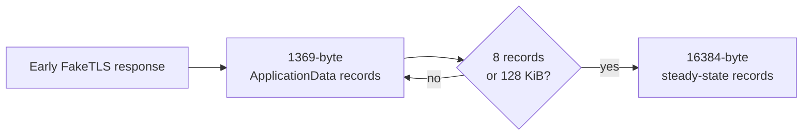
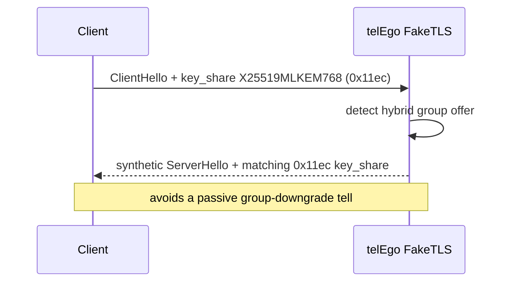
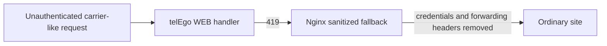

# Security Model

This document describes the security boundaries implemented by the OpenWrt integration and the network-hardening mechanisms inherited from the pinned `Scratch-net/telego` core. It is not a claim that the protocol, deployment, router, or network path is risk-free.

> [!IMPORTANT]
> The OpenWrt layer reduces host privilege and exposure. The upstream FakeTLS layer reduces stable passive/active fingerprints. Neither is a mathematical guarantee of invisibility against every DPI or active-probing system.

## Milestone 2 — Security Hardening

The hardened OpenWrt runtime is built around three independent controls:

| Control | What it does | Security value |
|---|---|---|
| Dedicated `telego:telego` account | Runs the daemon without persistent root privileges | Reduces blast radius after daemon compromise |
| `ujail` + `procd_add_jail ... requirejail` | Starts the service inside the OpenWrt jail boundary | Prevents silent fallback to an unjailed service |
| `CAP_NET_BIND_SERVICE` only | Allows a non-root process to bind low ports such as `443` | Avoids granting the full root capability set |
| `no_new_privs` | Prevents privilege gain across later `exec` transitions | Locks the process into its reduced privilege model |
| Atomic `0600` runtime TOML | Keeps generated credentials readable only by the service identity | Reduces secret disclosure through filesystem permissions |



### Why port 443 does not require a root daemon

The package capability profile contains only `CAP_NET_BIND_SERVICE` in the bounding, effective, ambient, permitted, and inheritable sets. This gives the daemon the narrow privilege required to bind a low-numbered listener such as TCP `443` while keeping the process identity unprivileged.

<details>
<summary><b>⚡ Capability profile (click to expand)</b></summary>

```json
{
  "bounding": ["CAP_NET_BIND_SERVICE"],
  "effective": ["CAP_NET_BIND_SERVICE"],
  "ambient": ["CAP_NET_BIND_SERVICE"],
  "permitted": ["CAP_NET_BIND_SERVICE"],
  "inheritable": ["CAP_NET_BIND_SERVICE"]
}
```

</details>

## Upstream anti-DPI and probe-resistance layer

The pinned telEgo core adds transport shaping on top of the OpenWrt runtime boundary. These mechanisms operate on the proxy-to-client FakeTLS path and are enabled through the OpenWrt `tls_fronting` section.

### Dynamic Record Sizer (DRS)

When `enable_drs` is enabled, outbound TLS `ApplicationData` begins with **1369-byte records** and ramps to the full **16384-byte** record size after either **8 records** or **128 KiB** of transferred data.



**Why it exists:** static record lengths are easy inputs for passive classifiers. A probe-then-ramp pattern gives the first flight a different shape from a fixed-size tunnel and then returns to efficient full-size records for sustained traffic.

> [!NOTE]
> DRS reduces a stable record-size fingerprint; it does not make encrypted traffic intrinsically indistinguishable from all ordinary HTTPS implementations.

### Split-TLS

With `enable_split_tls`, the first outbound TLS `ApplicationData` record is emitted as a **1-byte record** before normal payload records continue.

| Mechanism | Wire effect | Defensive purpose |
|---|---|---|
| Split-TLS | First outbound `ApplicationData` = 1 byte | Breaks simple signatures keyed to the first application record |
| DRS | `1369 → 16384` ramp | Avoids one fixed early-record profile |
| Profile-matched certificate record | Fake certificate record size follows the mask backend when automatic sizing is used | Reduces accept-path vs splice-path length differences |

> [!CAUTION]
> Do not describe these features as “fully defeating DPI/TSPU.” They are fingerprint-hardening mechanisms. Real detection capability depends on the observer, traffic corpus, deployment, and future protocol changes.

### Post-quantum key-share parity

The FakeTLS parser detects whether the client offered the hybrid TLS named group **`X25519MLKEM768` (`0x11ec`)** in `key_share`.

When that offer is present, the synthetic `ServerHello` returns a matching `0x11ec` key-share group instead of silently falling back to classical X25519. Classical clients still receive the normal X25519 (`0x001d`) group.



> [!IMPORTANT]
> In this context the feature is primarily **fingerprint parity** for the synthetic FakeTLS handshake. It must not be marketed as proof that the entire MTProxy session obtains end-to-end post-quantum confidentiality from telEgo itself.

### Replay and probe handling

The upstream core also includes:

- replay protection for FakeTLS handshakes;
- SNI validation against the configured mask host;
- optional SNI-following safelist behavior for selected domains;
- splice/fallback handling for unauthenticated or unrecognized clients;
- certificate-profile and first-flight shaping intended to reduce differences between accepted traffic and the mask path.

These mechanisms complement the host-level OpenWrt sandbox. They solve different problems: `ujail` protects the router, while FakeTLS hardening changes the network fingerprint.

## Why `ronly` is not enabled

CI builds telEgo with `CGO_ENABLED=0` as a static PIE. ujail's `ronly` dependency discovery expects dynamic ELF metadata and cannot discover dependencies for this binary layout. The service therefore does not request that specific feature.

This does **not** disable the rest of the jail setup: `requirejail`, namespace/filesystem isolation, UID/GID dropping, explicit mounts, `no_new_privs`, and the capability bounding profile remain in use.

## Configuration secrets

User secrets are exactly **32 hexadecimal characters = 16 bytes = 128 bits**.

The LuCI generator uses browser `window.crypto.getRandomValues()` to generate 16 random bytes and encodes them as 32 hex characters. The init script validates the final UCI value again before generating runtime TOML.

Sensitive locations include:

```text
/etc/config/telego
/var/etc/telego.toml
```

The runtime TOML is created with:

```text
owner: telego:telego
mode:  0600
```

It is written to a temporary file and atomically moved into place.

> [!CAUTION]
> `uci show telego`, the generated TOML, screenshots of the LuCI **Users** section, and some debugging output can expose secrets. Redact them before publishing logs or issues.

## Service account lifecycle

At package/runtime integration level:

- package metadata declares `telego:telego`;
- the init script uses native OpenWrt account helpers as a fallback for older revisions;
- the daemon process is launched with explicit `user` and `group` parameters;
- the fallback account uses `/bin/false` as its shell.

## Metrics and telemetry

The default metrics endpoint is:

```text
127.0.0.1:9090/metrics
```

The LuCI rpcd adapter is deliberately stricter than a generic HTTP client. It only fetches metrics from a literal loopback address and validates the path before invoking `uclient-fetch`.

This prevents an administrator-controlled metrics setting from turning the LuCI status RPC into a generic server-side URL-fetch primitive.

The `telego.status` method is read-only. LuCI configuration writes are performed through UCI under the application ACL.

## WEB Proxy private listener

The default WEB Proxy listener is:

```text
127.0.0.1:8080
```

Keep it private. Public TLS exposure should go through the Nginx integration rather than exposing the plain HTTP carrier listener directly to the Internet.

## Nginx request sanitization

The reusable `telego.locations` snippet handles two private fallback statuses from the WEB handler:

| Status | Meaning | Nginx action |
|---:|---|---|
| `418` | Ordinary website request | Preserve the request and send it to the ordinary site |
| `419` | Carrier-shaped request that failed authentication | Strip carrier credentials/body metadata and send a safe `GET` to the ordinary site |



The `419` path removes request body/content metadata and carrier-sensitive headers including authorization, cookies, carrier sequencing/session headers, WebSocket headers, and forwarded-address headers.

> [!IMPORTANT]
> Do not bypass the `419` sanitization to simplify a custom Nginx deployment. It is part of the privacy boundary between the WEB carrier and the decoy/ordinary site.

## TLS certificates and deployment ownership

`nginx-telego` does not ship a real certificate, private key, public hostname, or complete TLS `server {}`. Those remain administrator-managed deployment assets.

Protect private keys according to normal OpenWrt/Nginx practice and avoid placing them in this repository.

## APK integrity and signing trust

The installer deliberately separates file integrity from signer trust.

### SHA-256 integrity

`telego-install.sha256` detects corrupted or mismatched release assets.

### APK signing trust

A trusted APK signature authenticates the package signer to the router. Preview artifacts may not have a trusted key on the target device.

`--allow-untrusted` is therefore explicit and separate from `--yes`.

Never:

- commit `OPENWRT_APK_PRIVATE_KEY`;
- publish the private signing key;
- treat checksum verification alone as publisher authentication;
- silently add `--allow-untrusted` to stable installation instructions.

## CI and supply-chain controls

The workflows use pinned action versions/commits for critical build components, validate integration before release, and fail if any expected project APK or `packages.adb` is absent.

Stable release tags must match `PKG_VERSION`. The release workflow supplies the APK private key through a GitHub Actions secret rather than repository content.

## Exposure checklist

Before exposing telEgo to the Internet:

- [ ] Confirm the intended MTProxy bind address/port.
- [ ] Confirm firewall/NAT rules expose only required ports.
- [ ] Keep WEB Proxy and metrics private listeners on loopback unless you have a reviewed reason to change them.
- [ ] Use a valid administrator-managed TLS certificate for the public Nginx side.
- [ ] Confirm Nginx includes the project snippet without removing the sanitized `419` path.
- [ ] Keep DRS and Split-TLS enabled unless you are performing a controlled compatibility test.
- [ ] Use unique random secrets and rotate any secret that was disclosed.
- [ ] Do not expose ubus/rpcd to the Internet.
- [ ] Verify package source/signing trust before stable deployment.

## Reporting and incident response

If a secret or signing key is exposed, treat it as compromised and rotate/revoke it rather than relying on deletion from Git history or an issue comment.

For a suspected vulnerability, avoid posting working credentials, private keys, or user secrets in a public issue. Prefer a private maintainer/security channel when available.

## Related documents

- [Architecture](ARCHITECTURE.md)
- [Configuration](CONFIGURATION.md)
- [Installation](INSTALL.md)
- [Local telemetry API](API.md)
